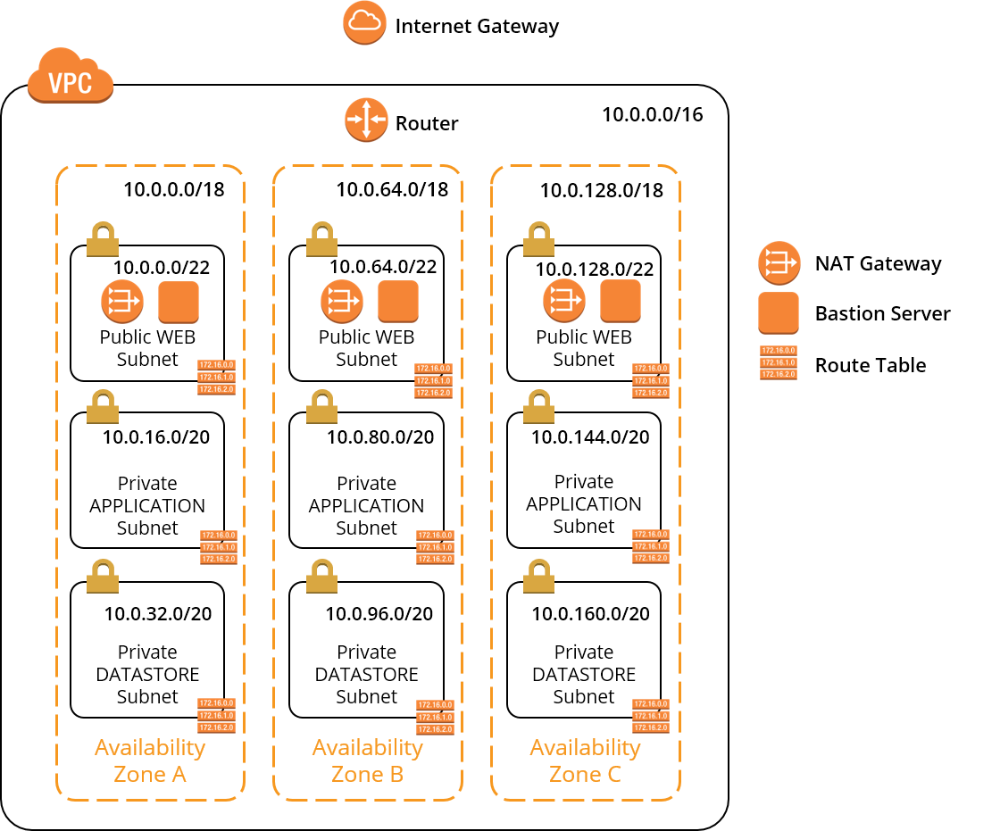

# AWS VPC Blueprint

Der hier erwähnte Blueprint für ein VPC bei AWS soll als Vorlage für eigene VPC dienen. Selbstverständlich steht es dir frei, den Blueprint auf deine eigenen Anforderungen zuzuschneiden.

## Überblick



### VPC überspannt alle Availability Zonen

Das VPC hat einen /16'er CIDR-Block
Das VPC hat Subnetzen in alle verfügbaren Availability Zones

### Traffic aus dem VPC heraus wird über Internet Gateway geleitet

Dem VPC ist für die Kommunikation mit dem Internet ein Internet Gateway zugeordnet.
Über die öffentliche Route Table an den öffentlichen Subnetzen ist sichergestellt, dass jeder Traffic aus dem VPC heraus über das Internet Gateway geleitet wird.

### Subnetze unterteilen jede Availability Zone in Schichten
 
Jede Availability Zone enthält drei Subnetze, jedes Subnetz repräsentiert dabei eine logische Schicht (von oben nach unten):

* __Web Layer__: Das erste öffentliche Subnetz beinhaltet alle Instanzen, die direkt über das Internet erreichbar sein müssen.
* __Application Layer__: Das zweite private Subnetz beinhaltet alle Instanzen, die Applikationen hosten sollen.
* __Datastore Layer__: Das dritte private Subnetz beinhaltet alle Instanzen, die Datenbanken oder auch Messaging Systeme u.ä. hosten sollen.

!!! info "Abgewandeltes Schichtenmodell in AT.41"
    Viele werden sich jetzt wohl fragen, wo der __Internet Facing Layer__ mit dem VPN Gateway geblieben sind. Nun, darauf gibt es eine einfache Antwort: In AT.41 haben wir keine Direktverbindungen zwischen der AWS Cloud und dem msg-CIT-Netz untersucht. Deshalb haben wir auch keinen Internet Facing Layer und kein Customer VPN Gateway gebraucht.
    
### Redundante Bastion Server ermögliche Administration der Infrastruktur

In jeder Availability Zone existiert im öffentlichen Web-Layer-Subnetz ein Bastion-Server, auf den aus dem Internet über SSH zugegriffen werden kann. Administratoren können sich so von außen über SSH mit den Bastion-Servern verbinden, um dann auf die anderen Instanzen im VPC zugreifen zu können.

Der SSH-Zugriff auf die Bastion-Server wird über Security Groups so eingeschränkt, dass nur von bestimmten Quelladressen aus eine SSH-Verbindung aufgebaut werden kann (zum Beispiel von Rechnern dem msg CIT Netz). 

### Private Instanzen sind über redundante NAT Gateways geschützt

Pro Availability Zone existiert ein eigenes NAT Gateway im öffentlichen Web-Layer-Subnetz. Jedes NAT Gateway verfügt dabei über eine Elastische IP. Private Route Tables für die privaten Subnetze stellen sicher, dass sämtlicher Traffic aus den privaten Subnetzen heraus in das Internet über das NAT Gateway aus der gleichen Availability Zone geleitet wird.

## Provisionierung des VPC Blueprints

Ein VPC nach dem hier beschriebenen Blueprint lässt sich über ein im Rahmen von AT.41 erstelltes Terraform-Modul namens __vpc__ erstellen. Das Terraform Modul vpc ist im AT GIT Repository [msgoat/at41-terraform-aws-vpc](https://git.at.automotive.msg.team/msgoat/at41-terraform-aws-vpc) zu finden.

Hier ein Codeauszug aus einem Terraform-Skript, das über das Terraform-Modul __vpc__ ein VPC erzeugt:

```
# --- Network (VPC, Subnets, NATs, Gateways, etc.) ---------------------------

module "vpc" {
  source = "git::https://git.at.automotive.msg.team/msgoat/at41-terraform-aws-vpc.git"
  network_name = "myvpc"
  project_name = "myproject"
  with_bastion_instances = "true"
  inbound_traffic_cidr = "194.76.29.0/24"
}
```

Parameter | Wert | Beschreibung
--------- | ---- | ------------
source | git::https://[..]/at41-terraform-aws-vpc.git | Teilt Terraform mit, wo sich die Sourcen des Moduls __vpc__ befinden.
network\_name | myvpc | Name des VPC, wobei der vollqualifizierte Name des VPC den Präfix __vpc-${region}-__ erhält. Aus dem hier angegebenen Namen __vpc__ wird also der vollqualifizierte Name __vpc-eu-central-1-myvpc__.
project\_name | myproject | Name des Projektes, dem das VPC mit all seinen Komponenten gehört. Alle Komponenten des VPC und das VPC selber werden mit dem Projektnamen getaggt, sodass jede über das Modul erzeugte AWS-Ressource leicht einem Projekt zuzuordnen ist.
with\_bastion\_instances | true | Über dieses Flag kann gesteuert werden, ob Instanzen von Bastion Servern angelegt werden sollen oder nicht.
inbound\_traffic\_cidr | 192.76.29.0/24 | Gibt den CIDR-Block an, von dem das VPC Verbindungen aus dem Internet akzeptiert.

Nach der Eingabe des Befehls 
```
terraform plan
```
in dem Verzeichnis, wo sich eure Terraform-Datei befindet, plant Terraform, welche Änderungen es an den AWS Ressourcen in euren AWS Benutzerkonto vornehmen muss und zeigt euch diese an.

Über ein 
```
terraform apply
```
werden diese geplanten Änderungen dann tatsächlich angewendet und ihr erhaltet nach ca. 2 Minuten ein vollständig eingerichtetes VPC.

Das bestehende VPC lässt sich dann über 
```
terraform destroy
```
leicht wieder löschen.

Ein komplettes Sourcebeispiel für das Anlegen eines VPCs mit Terraform findet ihr im GIT Repo [msgoat/at41-terraform-aws-infrastructure](https://git.at.automotive.msg.team/msgoat/at41-terraform-aws-infrastructure). Mit diesem Terraform-Skript haben wir in AT.41 die komplette AWS-Infrastruktur für einen Amazon ECS Cluster verwaltet.

!!! info "AT unterstützt bei Fragen zu Terraform"
    Eine komplette Beschreibung von Terraform würde leider den Rahmen diese Projektberichtes sprengen. Ihr könnt euch bei Fragen zu Terraform aber gerne an uns wenden!