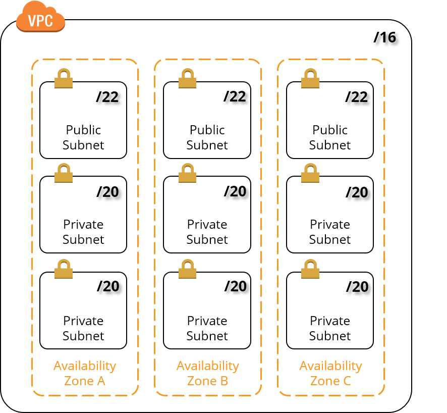
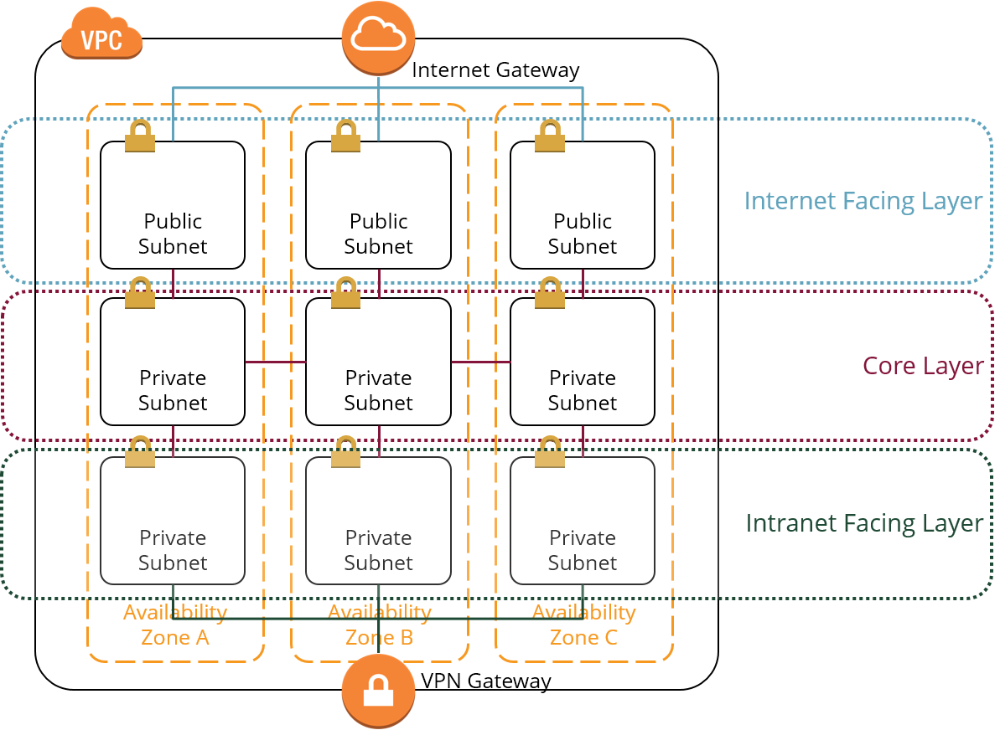

# AWS Best Practices

Here are a number of recommendations to keep in mind when using the AWS Cloud. The recommendations mentioned here come partly from our own experience or have been adopted from various sources by AWS.

## The Cloud is BIG, so it's time to think BIG!

You should always keep this in mind when planning IP address ranges for your VPC. 
We therefore always recommend starting at a VPC with a /16-CIDR block. 
This corresponds to over 65,000 possible IP addresses and should be sufficient for most scenarios.

The same applies if you go about setting up your subnets: 
a few subnets with large CIDR blocks make more sense than many subnets with small CIDR blocks. 
If you want to further subdivide your subnets, you can control this via security groups.

Here is a proposal for the distribution of CIDR blocks in VPCs and subnets [^1]:

* The VPC uses a /16-CIDR block, which corresponds to a maximum of 65534 IP addresses.
* There is 1 public subnet and 2 private subnets per Availability Zone.
* The public subnet uses a /22-CIDR block, which corresponds to a maximum of 1022 IP addresses.
* Each private subnet uses a /20 CIDR block, which corresponds to a maximum of 4094 IP addresses.

!!! tip "Calculating CIDR blocks"
    There are several online CIDR tools on the internet that you can use to calculate CIDR blocks in various ways. 
    The CIDR tool at [http://www.subnet-calculator.com/cidr.php](http://www.subnet-calculator.com/cidr.php) served us well. 
    This CIDR utility also helps you to understand which range corresponds to how many possible IP addresses.    

@see [Understanding IP Addresses, Subnets, and CIDR Notation for Networking](https://www.digitalocean.com/community/tutorials/understanding-ip-addresses-subnets-and-cidr-notation-for-networking)

## Subdivide your VPC into subnets

In order to simplify the administration while keeping a tight security, 
it is advisable to subdivide a VPC into subnets according to accessibility.

* __Web Layer__ or __Internet Facing Layer__: network traffic from the internet to the VPC and from the VPC to the internet 
runs through this public subnet.

* __Core Layer__: This private subnet contains all instances on which the cloud-operated applications and services run. 
Access to this subnet is only possible via the Internet Facing Layer or the Intranet Facing Layer.

* __Intranet Facing Layer__: all network traffic from the VPC into the corporate network or from the corporate network 
into the VPC runs through this private subnet.

## Manage your cloud infrastructure like code from day one

The AWS console offers all possibilities to set up any resources in AWS via its web UI. 
This sounds very appealing - especially for beginners - but it poses many problems in production use:

* More complex resources can only be created with great effort using the AWS console.
* Manual creation of more complex resources is cumbersome and error-prone.
* Changes to your own AWS infrastructure cannot be tracked.
* The current status of your own AWS infrastructure is not persisted anywhere and cannot be reproduced reliably.

That being said, we __urgently__ recommend using an infrastructure as code tool. Three tools are available for AWS:

* [AWS CloudFormation](https://aws.amazon.com/cloudformation/) is a common language for describing and 
provisioning all infrastructure resources in the AWS cloud.
* [AWS Cloud Development Kit (CDK)](https://aws.amazon.com/cdk/) allows you to code your infrastructure in your favourite programming language.
All code will be translated to CloudFormation templates when executed.
* [Terraform](https://www.terraform.io/) from [HashiCorp](https://www.hashicorp.com/) offers a common language for the 
description and provisioning of resources with practically all common cloud providers on. 
Unlike CloudFormation, Terraform focuses not only on _generating_ resources but also on _continuously changing_ resources.

Here is a simple comparison that should motivate you to use such a tool:

* To _manually_ set up a VPC spanning 3 Availability Zones with 2 subnets per Availability Zone and an Amazon ECS cluster (container service from AWS) you need at least __1 hour__ via the console.
* It takes about __5 minutes__ to set up the same infrastructure with Terraform automatically.
 
## Start production-ready

Setting up cloud infrastructure resources that can handle production workloads is only slightly more expensive than setting up a playground. 
That's why you should design and provision your cloud resources production-ready from the start so that they can meet 
the requirements of a production environment. This applies particularly to the security of your infrastructure.

In addition, with the consistent use of __Infrastructure as Code__ you can pull up your production-ready infrastructure 
when you actually need it and dismantle it when you are done with it. 
This way, the narrow cost differences between a production-ready environment and a "playground" can be optimized to zero.

Some characteristics of production readiness are:

* Resources are always distributed across all Availability Zones of a VPC: 
a VPC has subnets in all available Availability Zones; 
a container cluster spans all Availability Zones; 
each Availability Zone has its own NAT gateway.
* Each resource is running redundantly, i.e. each resource exists at least once in every availability zone.
* Expose only those resources to the internet that really need to be public.
* Consistently protect your private resources with NAT gateways.
* All databases are fail-safe, highly available and redundant. 
If AWS offers the database you need in a highly available package, then use it.
* All stored data (_data on rest_) is encrypted: AWS offers the encryption of your storage at no extra charge.
* All data is encrypted during transmission (_data in transit_): Always use TLS for all inbound connections from the internet into your VPC. 
Once you are inside the AWS network, AWS encrypts all traffic by default. 
If that's not good enough for you use TLS (HTTPS etc) for end-to-end encryption.
* Allow only the connections that you absolutely need at the instance level via security groups and at the subnet level via network ACLs.  
   
## Relentlessly discard unused resources

On AWS like on any public cloud, cost management can get quite challenging. In order to control your expenses continuously 
check all your provisioned resources if you actually still need them. If you do not need them anymore, get rid of them!

[^1]: see [AWS re:Invent 2016: From One to Many: Evolving VPC Design (ARC302)](https://youtu.be/3Gv47NASmU4?t=8m5s) 