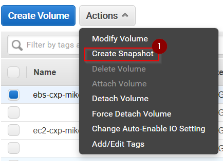
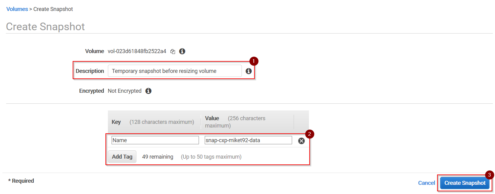
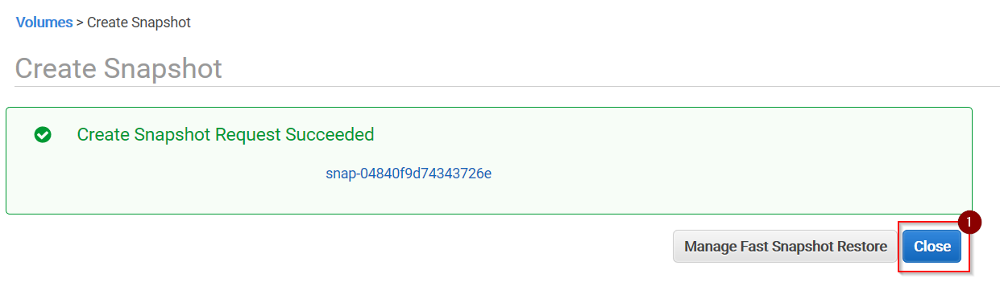
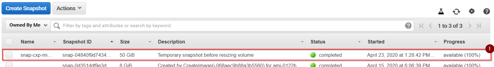

# Creating EBS Snapshots

## Open the Volumes Panel of the EBS Dashboard

1\. Open the __EC2 Dashboard__ by selecting __Services > Compute > EC2__ from the __Services__ menu or by entering URL __https://eu-central-1.console.aws.amazon.com/ec2/v2/home?region=eu-central-1__

2\. Select option __Volumes__ from the __Resources__ panel.

## Create a Snapshot

1\. Select the volume you want to create a snapshot of.

2\. Select option __Create Snapshot__ from menu button __Actions__:

3\. Enter a meaningful __Description__. Add at least a tag __Name__ with the name of the snapshot using the
recommended convention `snap-${volumeName}. Press __Create Snapshot__ to continue.

4\. Press __Close__ to finish.

5.\ Select __Elastic Block Store > Snapshots__ from the menu on the left.

6\. Make sure your newly created snapshot is listed with __Status__ `completed` before you continue.

 

