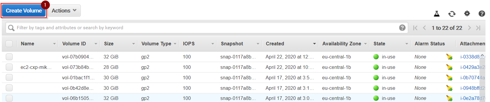
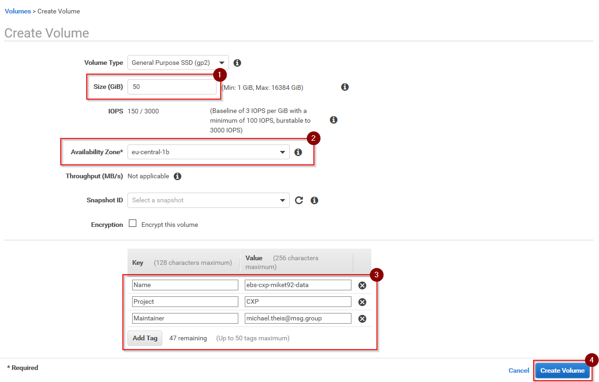
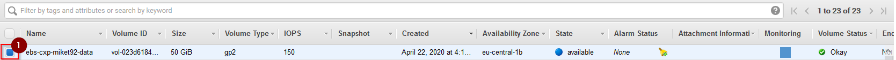
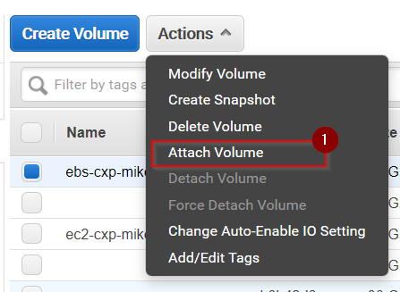
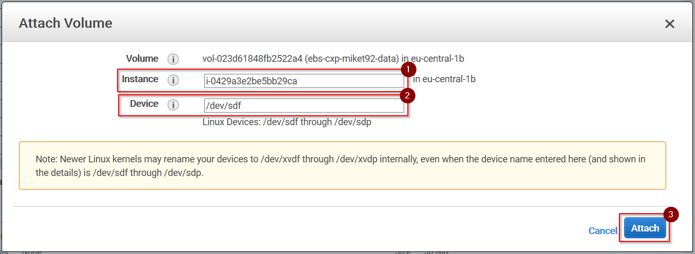
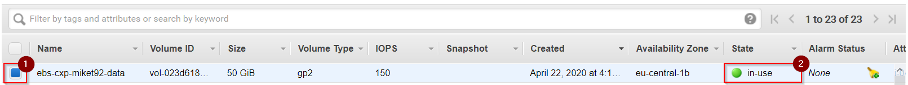

# Creating EBS Volumes

## Prerequisites

* You must have an activated AWS console user account to walk through the following instructions.
* You need to know the availability zone where the EC2 instance is running you want to attach the new volume to.

## Login to AWS console

1\. Login to the AWS console using your activated console user account.

## Open the Volumes Panel of the EBS Dashboard

1\. Open the __EC2 Dashboard__ by selecting __Services > Compute > EC2__ from the __Services__ menu or by entering URL __https://eu-central-1.console.aws.amazon.com/ec2/v2/home?region=eu-central-1__

2\. Select option __Volumes__ from the __Resources__ panel:

## Create a new EBS volume

1\. Press button __Create volume__:

2\. Enter 50 into __Size__ to request 50GB block storage.
Select the same __Availability Zone__ as your EC2 instance is running in.
Add tags __Name__ with value __ebs-${ec2InstanceName}__, __Project__ with value __CXP__, and optional __Maintainer__ 
with your user ID or email address. Press __Create Volume__ to continue.

3\. Press __Close__ on the confirmation page to return to the __Volumes__ panel.

## Attach an EBS volume to an EC2 instance

1\. Select your newly created volume from the list of available volumes.

2\. Select option __Attach Volume__ from the __Actions__ menu button.

3\. Enter the name of your EC2 instance into __Instance__. If you don't know it, simply click into the input field and select your EC2 instance from the provided EC2 instance list.
Enter a device name into __Device__ or keep the suggested device name. Press __Attach__ to continue.

4\. The selection box at the beginning of the row representing your volume is replaced by a rotating progress indicator. 
Wait until the progress indicator has vanished and the __State__ column has turned to __in-use__.

## Check if the EBS volume has been attached to the EC2 instance

1\. Switch back to the __Running instances__ view of the __EC2 Dashboard__.

2\. Select the EC2 instance you just attached the EBS volume to from the list of EC2 instances. Scroll down the details
panel below the list of EC2 instances until you see __Block devices__ on the right column. The field __Block devices__ 
now should list two devices including the newly attached EBS volume.

## What's next?

* Return to [Adding a new volume to CentOS](../../linux/centos8_add_volume.md) to learn how to use this newly attached EBS volume in Linux.

