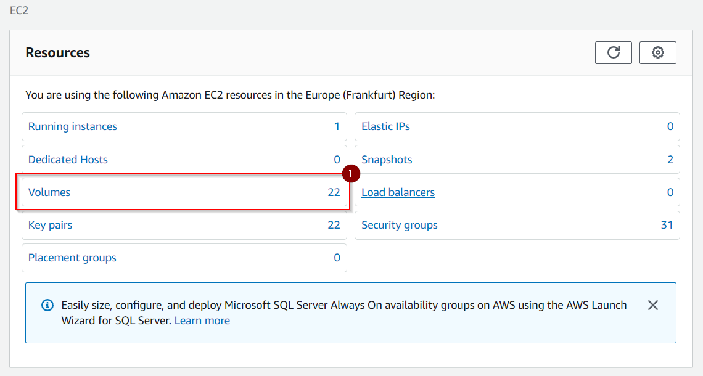
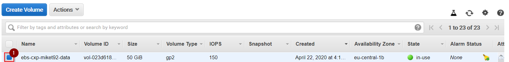
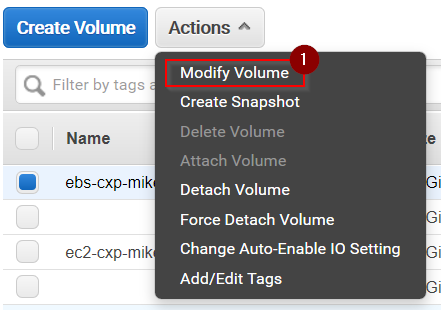
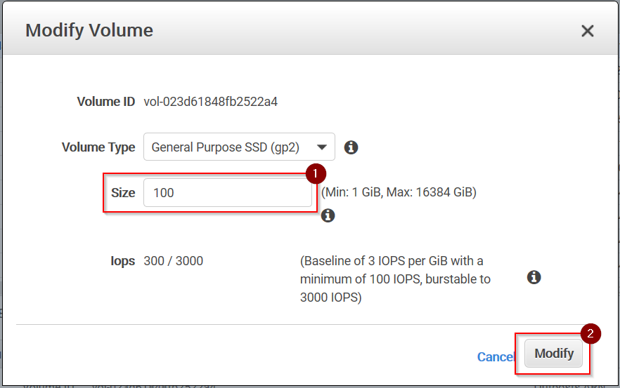
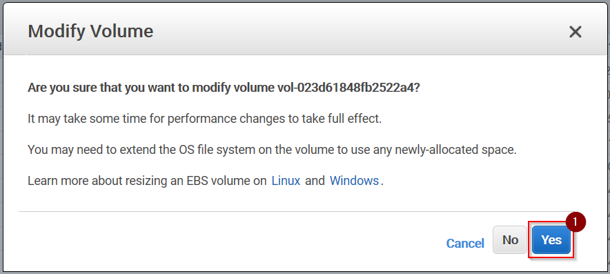
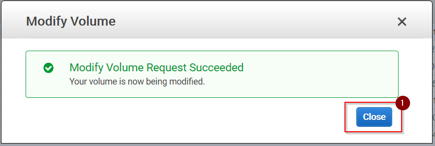
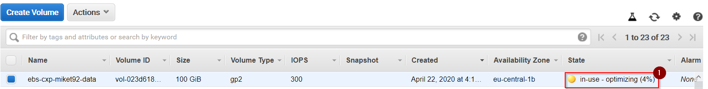

# Resizing an EBS Volume

## Prerequisites

* You must have an activated AWS console user account to walk through the following instructions.
* Your EC2 instance type must support AWS Elastic Volumes (which all contemporary EC2 instance types do).

## Login to AWS console

1\. Login to the AWS console using your activated console user account.

## Open the Volumes Panel of the EBS Dashboard

1\. Open the __EC2 Dashboard__ by selecting __Services > Compute > EC2__ from the __Services__ menu or by entering URL __https://eu-central-1.console.aws.amazon.com/ec2/v2/home?region=eu-central-1__

2\. Select option __Volumes__ from the __Resources__ panel.

## Create a Snapshot (optional)

Before you start to modify the settings of your volume it is recommended to create a snapshot you can fallback to.
Follow the instructions at [Creating EBS Snapshots](ebs_create_snapshot.md) to create a snapshot.

## Increase the Size of a Volume

1\. Select the volume you would like to modify.

2\. Select option __Modify Volume__ from menu button __Action__:

3\. Increase __Size__ to `100` GB. Press __Modify__ to apply your changes:

4\. Press __Yes__ to confirm:

5\. Press __Close to finish:

6\. Wait until the __State__ of your volume changes back to a green `in-use` state before you continue.

## What's next?

* Return to your Linux system to resize the partition on the block device you just changed.

