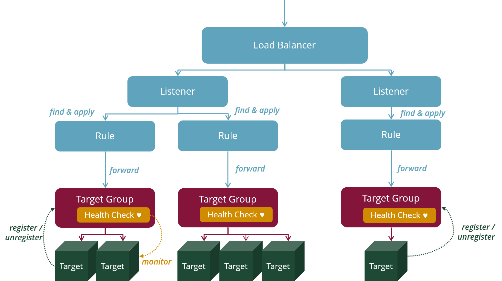
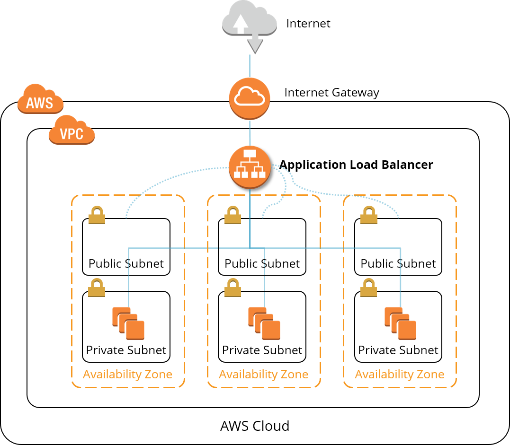

# AWS EC2 Basics

Here you will find a description of the most important terms and concepts to get you started quickly in the world of the AWS virtual machines.

Virtual machines and everything else you need to run them on AWS are covered by the __Amazon Elastic Compute Cloud (EC2)__ service (well, uhm except storage).

@see [Amazon Elastic Compute Cloud Documentation](https://docs.aws.amazon.com/ec2/index.html)

## Terms and Concepts

### EC2 Instance

An `EC2 instance` is a virtual machine that is started with a specific operating system image - an [Amazon Machine Image (AMI)](#amazon-machine-image-ami). 

The resource configuration of the EC2 instance is determined via a predefined instance types which act as a template for a EC2 configuration: 
each instance type represents a certain number of cores, a certain amount of RAM and a certain network capacity.
The configuration of the EC2 instance can be changed at any time by switching to another instance type.

So-called volumes are attached to EC2 instances - the Elastic Block Storage (EBS). 
By default, each EC2 instance always has a root volume which provides the operating system of the instance, but additional volumes can also be added.

EC2 instances can be started, paused, resumed and terminated (i.e. deleted). If you want to suspend an EC2 instance for a longer period of time,
you can hibernate it: Hibernation is similar to pause-resume, but persists a snapshot of the RAM as well between sessions.

Each EC2 instance must run in a subnet. 
The type of subnet determines whether the EC2 instance can be reached via a public IP address (public subnet) or only via a private IP address (private subnet).

If you want to access the EC2 instance using SSH, you have to attach a previously created SSH key pair to it upon creation time.

What an EC2 instance is allowed to do (meaning: which AWS services to call) can be controlled via IAM instance roles, which can be attached to any instance.
 
Security groups control inbound traffic to and outbound traffic from an EC2 instance.
 
Upon start time of an EC2 instance you can pass a set commands to be executed upon boot time. This so-called user data 
uses the [cloud-init](https://cloudinit.readthedocs.io/en/latest/) feature of modern Linux distributions.

There are various operating models when running EC2 instances:

* __On-demand__ instances are available when and as long as you request them. On-demand instances are available as bare-metal or 
as virtual machines running on dedicated or shared hardware. 
* __Reserved__ instances are ordered in advance in larger numbers, before they are actually used. Since you commit to
a certain number of instances in advance, they are offered for a lower price compared to on-demand instances.
* __Spot__ instances allow you to request spare EC2 computing capacity for up to 90% off the on-demand price which can
be reclaimed by AWS at any time.

> TODO: add dedicated E2C operating model page

@see [What is Amazon EC2?](https://docs.aws.amazon.com/AWSEC2/latest/UserGuide/concepts.html)

@see [Amazon EC2 Instance Types](https://aws.amazon.com/ec2/instance-types/)

### Amazon Machine Image (AMI)

An `Amazon Machine Image (AMI)` provides the information on how to start an [EC2 instance](#ec2-instance) in the Amazon Cloud and includes the following:

* A template for the root volume of the instance (operating system, pre-installed software like applications or application servers).
* Launch permissions that define who is allowed to start an EC2 instance with this particular AMI.
* A block device mapping that controls which volumes are to be attached to the EC2 instance.

AMIs are offered both by AWS and by third-party vendors. 
Because AWS has disclosed the process and tools for creating AMIs, 
you can build custom AMIs from scratch or from base AMIs. 
These AMIs can be shared with other customers freely or for a fee using the AWS AMI marketplace. 

AWS offers AMIs for most common operating systems. AWS even comes with an AWS-managed Linux distribution called Amazon Linux.

@see [Amazon Machine Image (AMI)](https://docs.aws.amazon.com/AWSEC2/latest/UserGuide/AMIs.html)

### Auto Scaling Group

An `Auto Scaling Group` represents a group of EC2 instances that have similar characteristics 
and are intended to form a logical group for scaling and management. 
The number of EC2 instances in an auto scaling group can be adjusted either manually or automatically.

The automatic adjustment usually takes place leveraging CloudWatch alarms, 
which are triggered when certain metrics such as CPU utilization exceed or fall below the limit values. 
For such a CloudWatch alarm, actions can be defined which should be carried out when the alarm is triggered. 
For example, the alarm "CPU utilization over 75% for the last minute" can lead to an increase in the number of instances in the Auto Scaling Group. 
The Auto Scaling Group then starts the additional instances on the basis of so-called launch configurations.

The type of EC2 instances managed by an auto scaling group is defined either by [launch templates](#launch-template) or by
[launch configurations](#launch-configuration).

@see [Auto Scaling Groups](https://docs.aws.amazon.com/autoscaling/latest/userguide/AutoScalingGroup.html)

### Launch Configuration

A `Launch Configuration` defines the characteristics of an EC2 instance to be started within an Auto Scaling Group. 
In addition to the instance type and the AMI, these characteristics also include the security group, 
an IAM instance role, a key pair for SSH access to the instant, etc.

@see [Launch Configuration](https://docs.aws.amazon.com/autoscaling/latest/userguide/LaunchConfiguration.html)

### Launch Template

A `Launch Template` are similiar to [launch configurations](#launch-configuration) but offer a version management 
and inheritance as well:
you can have multiple versions of launch templates which can extend a base template.

!!! tip "Favour launch templates over launch configurations"
    AWS recommends to use launch templates instead of launch configurations to get the latest features from AWS EC2.

@see [Launch Templates](https://docs.aws.amazon.com/autoscaling/latest/userguide/LaunchTemplate.html)

### Bastion Server

A `bastion server` is a simple EC2 instance with a public IP address that can be reached from the Internet via SSH. 
In general, the purpose of a bastion server is to administer the instances in your own VPC from outside the VPC 
or to install complete software packages into the VPC.

@see [Controlling Network Access to EC2 Instances Using a Bastion Server](https://aws.amazon.com/blogs/security/controlling-network-access-to-ec2-instances-using-a-bastion-server/)
@see [Linux Bastion Hosts on AWS](https://aws.amazon.com/quickstart/architecture/linux-bastion/)

### Application Load Balancer (ALB)

An __Application Load Balancer__ is a virtual redundant, highly available and horizontally scaling load balancer offered by AWS, 
which can be provisioned for a VPC. 

`Listener` are added to a load balancer. Each listener defines a protocol / port pair (e.g. HTTP: 80, HTTPS: 443) that the listener listens to.

Each listener has `rules` that determine which target group the incoming request should be forwarded to based on its URL. 
Both __path based routing__ and __host based routing__ are supported.

A `target group` now manages a group of targets to which it should forward incoming requests. 
Target must be explicitly registered to a target group in order to join it.
For each incoming request, only one target is picked to process the request using a configurable algorithm. 
For each target group, `health checks` can be defined. A health check controls how a target group can determine the status of registered instances. 
Only healthy targets receive requests for processing.

Finally, the `targets` are applications on EC2 instances that receive incoming requests from the target group. 
The applications must be registered explicitly to a target group with an IP address and a port number. 
An EC2 instance can appear several times in a target group if it hosts several applications of this target group.

There are two operating modes for an application load balancer:

* An __external__ application load balancer can forward requests from the Internet to instances in the VPC via an Internet gateway.
* An __internal__ application load balancer can only forward traffic within a VPC.

The application load balancer must be attached to a public subnet in each availability zone to which it should route traffic.

The targets themselves no longer need to be located in public subnets, but can also run in private subnets.

The Application Load Balancer receives requests from the Internet via the Internet gateway assigned to the VPC.

@see [What is an Application Load Balancer](http://docs.aws.amazon.com/elasticloadbalancing/latest/application/introduction.html)  