# Creating a new EC2 Instance on AWS

## Prerequisites

You must have an activated AWS console user account to walk through the following instructions.

## Login to AWS console

1\. Login to the AWS console using your activated console user account.

## Open the IAM Dashboard

1\. Open the __IAM Dashboard__ by selecting __Services > Security, Identity, & Compliance > IAM__ from the __Services__ menu or by entering URL __https://console.aws.amazon.com/iam/home?region=eu-central-1__

## Create a new IAM Instance Role

1\. Select option __Roles__ from menu on the left:

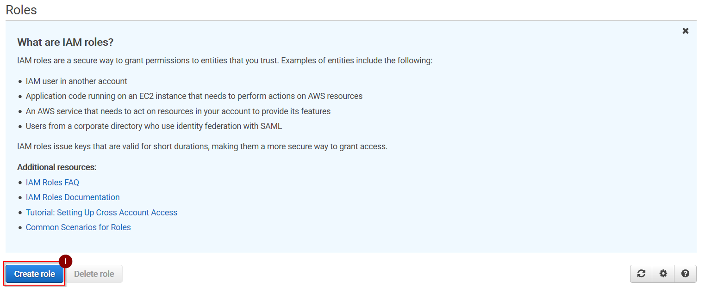

2\. Press __Create role__:

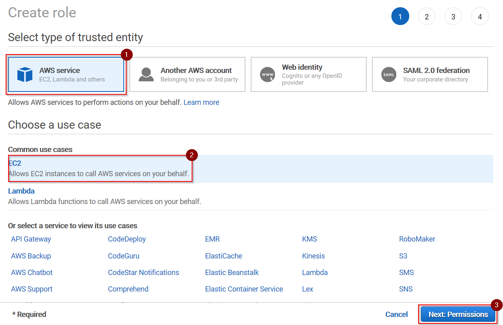

3\. Select option __AWS service__ from __Select type of trusted entity__.
Select option __EC2__ (or any other AWS service) from __Choose a use case__.
Press __Next:Permissions__.

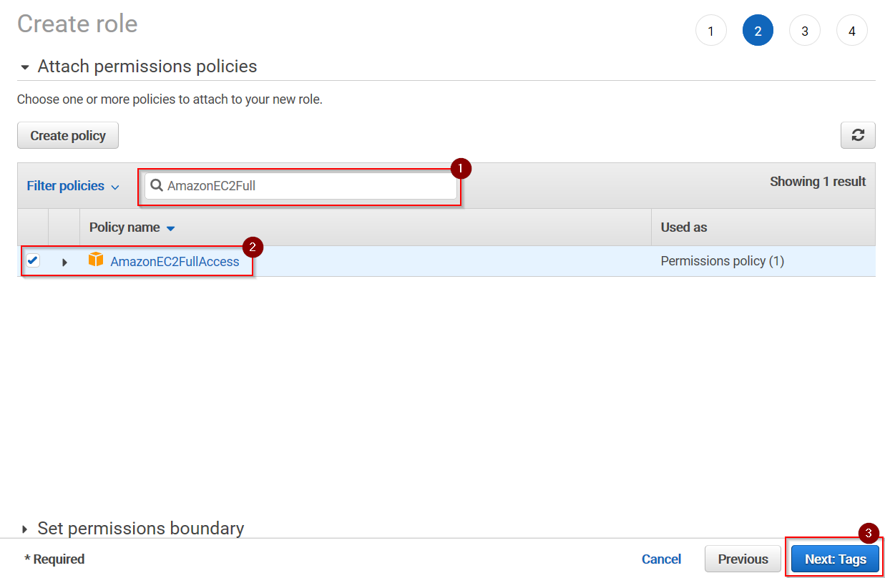

4\. Select all permissions you would like to add to the EC2 instance. For this use case we simply enter __AmazonEC2Full__ into __Filter policies__.
Select managed policy __AmazonEC2FullAccess__. Press __Next:Tags__.

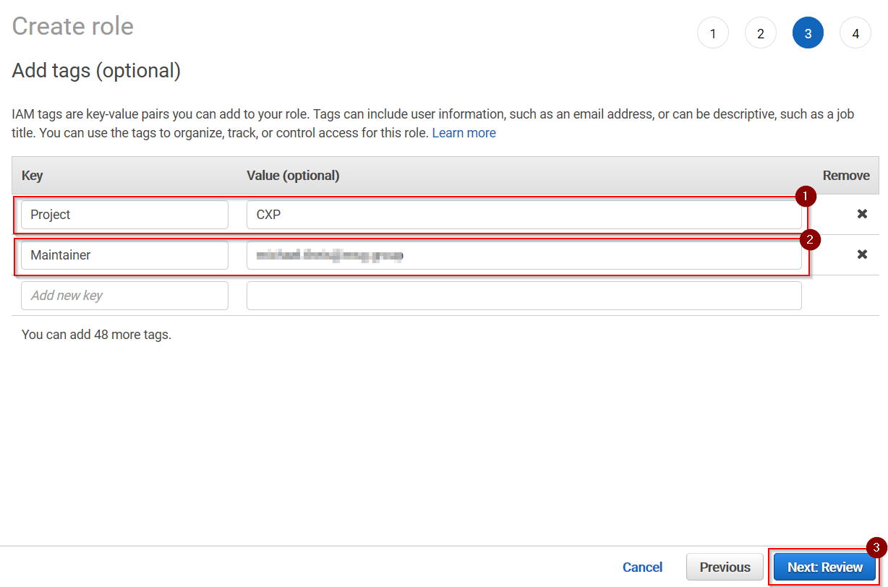

5\. Enter two tags: first __Project__ = __CXP__, second __Maintainer__ : __${userId|email}__. Press __Next:Review__.

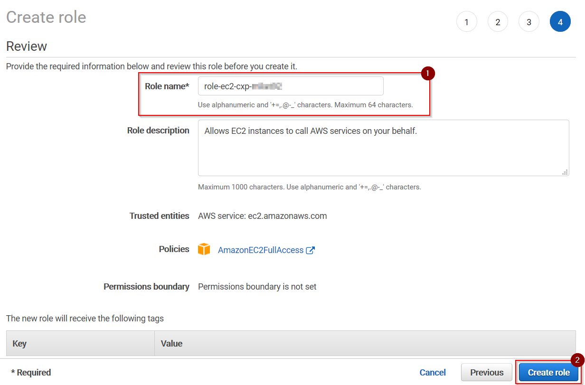

6\. Enter a meaningful self-explaining __Role name__ like __role-ec2-cxp-${userId}__. Press __Create role__.

7\. Switch to the __EC2 Dashboard__ to proceed.

## Open the EC2 Dashboard

1\. Open the __EC2 Dashboard__ by selecting __Services > Compute > EC2__ from the __Services__ menu or by entering URL __https://eu-central-1.console.aws.amazon.com/ec2/v2/home?region=eu-central-1__

## Create a new SSH key pair

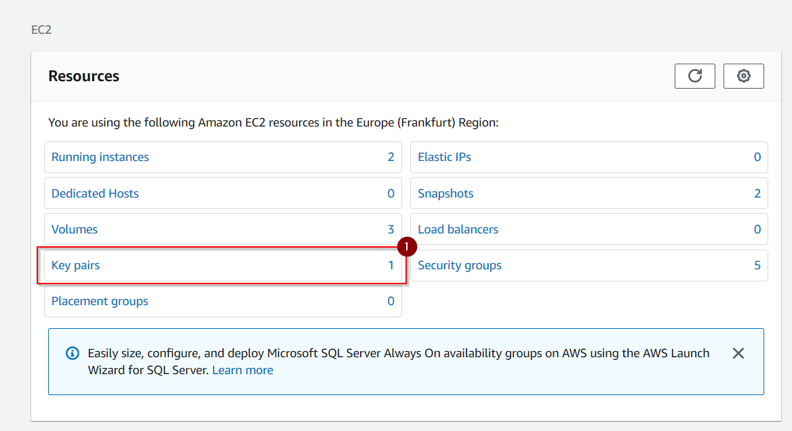

1\. Select option __Key Pairs__ from the __Resources__ panel:

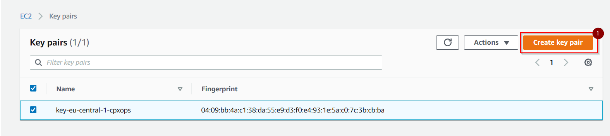

2\. Push button __Create key pair__:

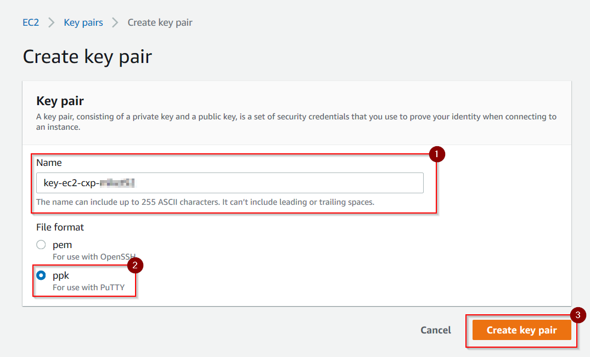

3\. Enter a __Name__ for your personal key pair like __key-ec2-cxp-${userId}__. 
Choose option __ppk__ if you are going to use PuTTY to connect to the EC2 instance or option __pem__ otherwise.
Press __Create key pair__ to continue:

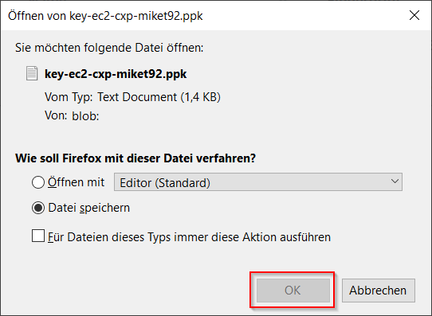

4\. Select option __Save file__ to save file __key-ec2-cxp-${userId}.ppk__ to your local __Downloads__ folder. Move the saved file to your local SSH key pair folder at __%USERPROFILE%\\.ssh__ (Windows) or __~/.ssh__ (Linux) afterwards.

!!! caution "Be careful with your personal SSH key file"
    You should be very careful with your local private SSH key file: it's the only way to connect to an EC2 instance!!!
    
5\. Select option __EC2 Dashboard__ at the top of the left menu to return to the __EC2 Dashboard__.     

## Create a new Security Group

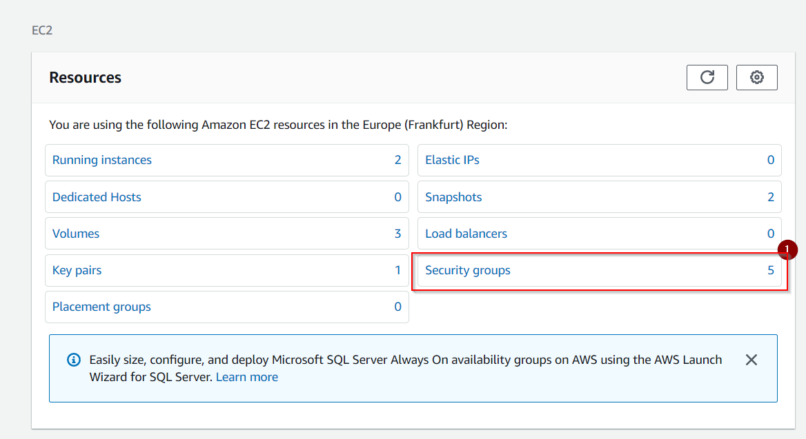

1\. Select option __Security groups__ from the __Resources__ panel:

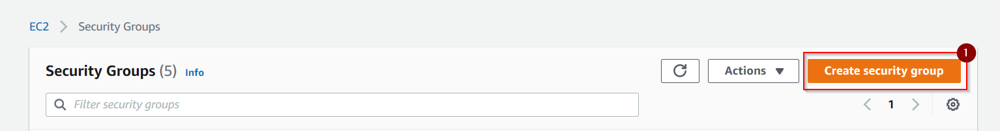

2\. Push button __Create security group__:

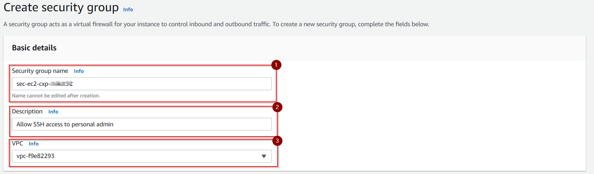

3\. Enter a __Security group name__ like __sec-ec2-cxp-${userId}__. 
Enter a meaningful __Description__, if you want to.
Select a target __VPC__ from the combo box.

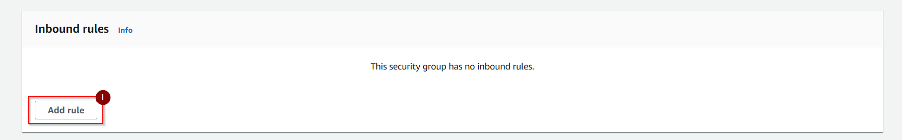

4\. Press __Add rule__ on __Inbound rules__:

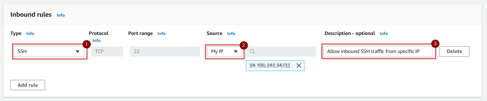

5\. Select __Type__ option __SSH__. Select __Source__ option __My IP__. Enter an optional __Description__.

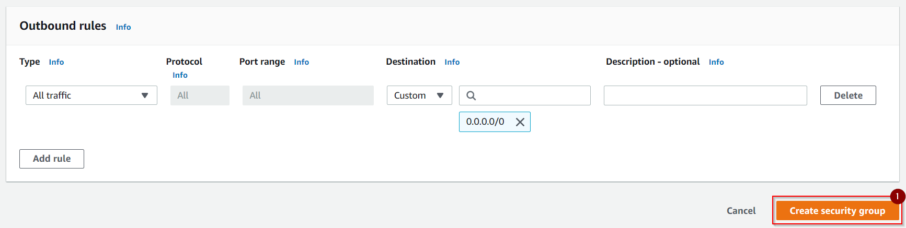

6\. Do not touch the __Outbound rules__. Press __Create security group__
    
7\. Select option __EC2 Dashboard__ at the top of the left menu to return to the __EC2 Dashboard__.     

## Create a new EC2 Instance

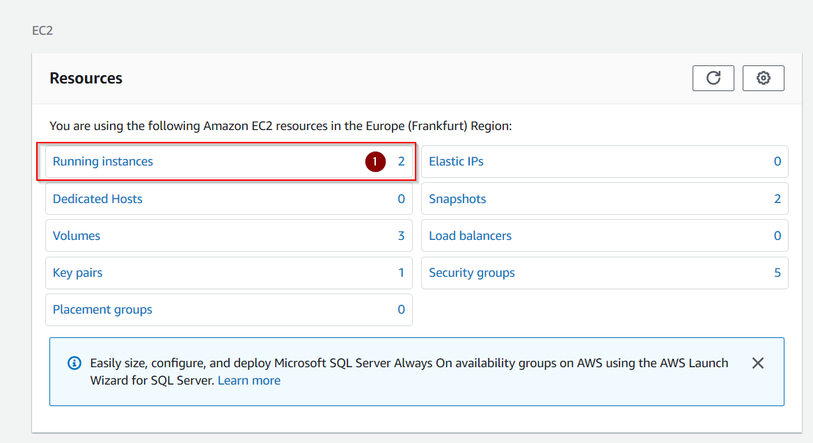

1\. Select option __Running instances__ from the __Resources__ panel:

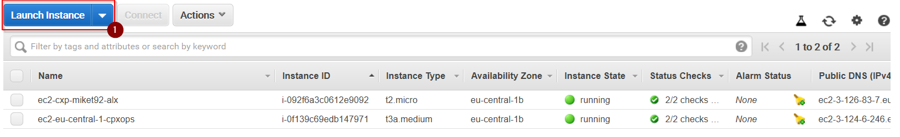

2\. Press __Launch instance__:

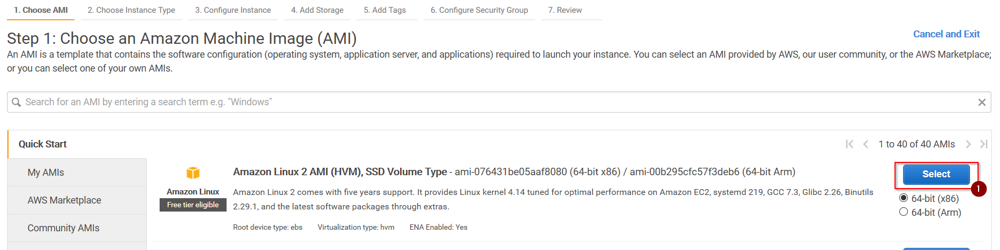

3\. Press __Select__ on the Linux Distro you would like to use (here __Amazon Linux 2__).

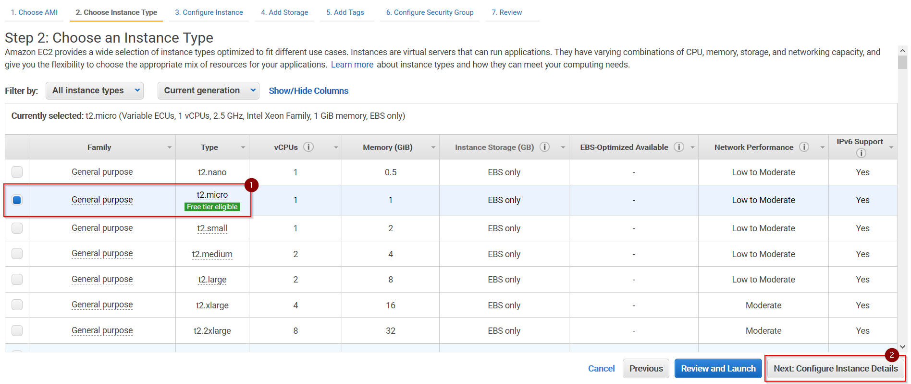

4\. Select __t2.micro__. Press __Next: Configure instance details__.

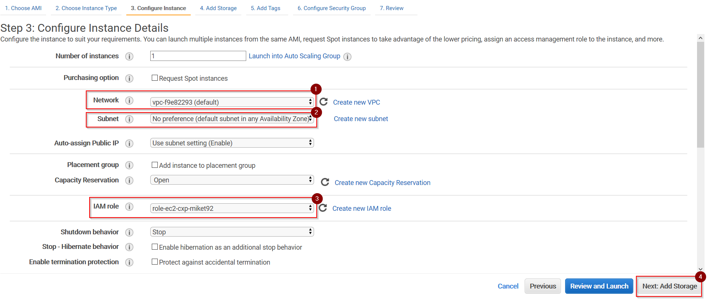

5\. Select a specific VPC in __Network__ (here: default) and a specific __Subnet__ (here: no preferences). Select the __IAM role__ you created previously.
Press __Next: Add Storage__.

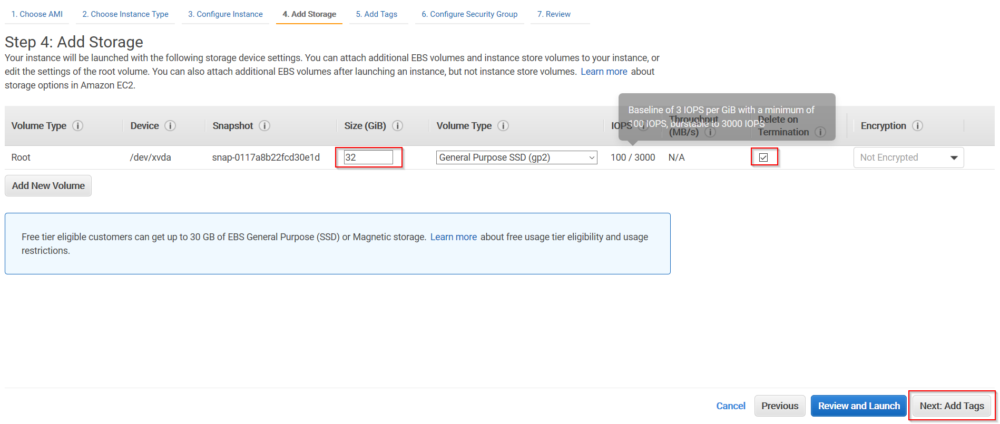

6\. Increase default __Size__ of 8 GB to __32 GB__. Make sure, __Delete on Termination__ is checked. Press __Next: Add Tags__.

7\. Enter two tags: first __Project__ = __CXP__, second __Maintainer__ : __${userId|email}__. Press __Next:Configure Security Group__.

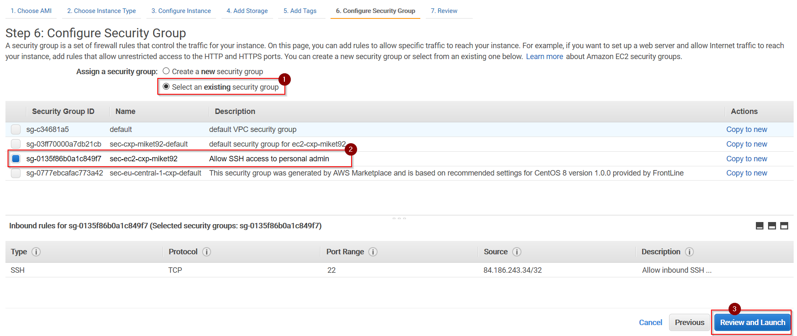

8\. Select option __Select an existing security group__. Select the security group you created previously. Press __Review and Launch__.

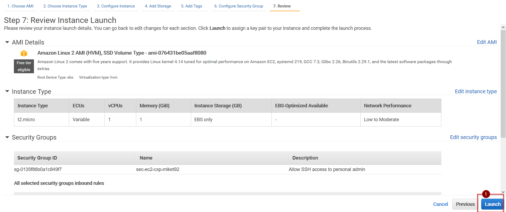

9\. Press __Launch__. Return to the __EC2 Dashboard__.

