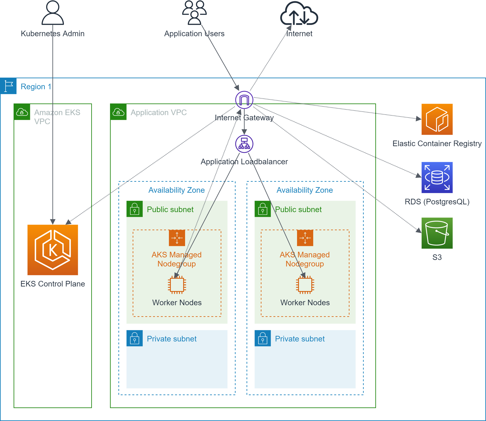
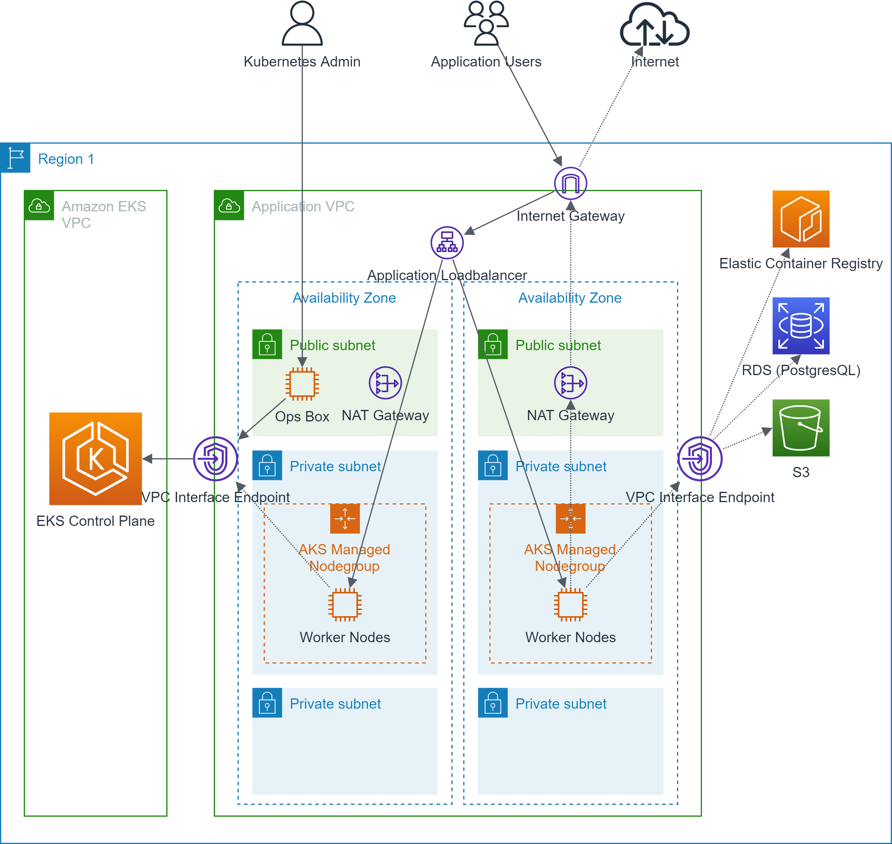

# Amazon EKS Reference Blueprints

The AWS EKS reference blueprints mentioned here should serve as a template for your own AWS EKS cluster.
Of course, you are free to tailor the blueprint to your own requirements.

## Amazon EKS simple blueprint

This blueprint is meant for simple development environments.

### One Worker Nodegroup in each Availability Zone

To avoid data loss after worker node crashes with stateful payload, provide one worker nodegroup in each
availability zone your cluster should span.

### Worker nodes in public Subnets

Worker nodes are exclusively hosted in public subnets.

!!! danger "Limit access to your worker nodes with Security Groups"
    All worker nodes hosted in public subnets will get public IP addresses. Since public IP addresses are 
    potentially visible to the internet, you will have to protect your publicly visible worker nodes with
    security groups. Your worker nodes should only allow inbound traffic either from the AWS EKS control plane
    or from the AWS Application Loadbalancer in front of the cluster.

### Public Access to the Kubernetes API

Kubernetes admins and the worker nodes itself can access the control plane through its public endpoint. 
Thus, there is no need for VPC Interface endpoints or extra opsboxes.

!!! danger "Limit access to the control plane"
    Since the Kubernetes API of your AWS EKS cluster is visible to the internet, you will have to make sure
    that only authorized personel can actually get through to the control plane.

### Extra private Subnets for AWS services

Some AWS service allow you to host the associated EC2 instances in your own VPC. Therefore, you should always
allocate some private networks for these machines.

## Amazon EKS enterprise blueprint

This blueprint is meant for production-ready AWS EKS setups in an enterprise environment.

### One Worker Nodegroup in each Availability Zone

To avoid data loss after worker node crashes with stateful payload, provide one worker nodegroup in each
availability zone your cluster should span.

### Worker nodes in private Subnets

Worker nodes are exclusively hosted in private subnets.

### Private endpoints to AWS EKS control plane and other AWS services

The worker nodes exclusively access the AWS EKS control plane and all other AWS service through private endpoints provided
via VPC interface endpoints and AWS PrivateLink.

### NAT Gateways for internet access from worker nodes

NAT gateways are provided in each availability zone. Outbound internet traffic from the worker nodes is routed
through the NAT gateway in the same availability zone.

### No public access to Kubernetes API

The Kubernetes API is only accessible through private endpoints. Thus, Kubernetes admins have to jump to 
opsboxes (EC2 instances for administrative purposes) to manage the AWS EKS cluster.

### Extra private Subnets for AWS services

Some AWS service allow you to host the associated EC2 instances in your own VPC. Therefore, you should always
allocate some private networks for these machines.

### Enforce encryption of data at rest with Customer Managed Keys (CMK)

Kubernetes Secrets, EBS volumes attached to the worker nodes, EBS volumes representing Kubernetes Persistent Volumes
should be encrypted with customer managed keys which are managed in AWS KMS and owned by you.

### Consider using End-2-End Encryption for all data in transit

To ensure the confidentiality and integrity of all data in transit from the application user to the 
application running as a Pod in your AWS EKS cluster, consider using service mesh middleware like [`Istio`](https://istio.io/)
to guarantee end-to-end encryption 
via [TLS](https://en.wikipedia.org/wiki/Transport_Layer_Security) 
or even [mTLS](https://www.cloudflare.com/learning/access-management/what-is-mutual-tls/).