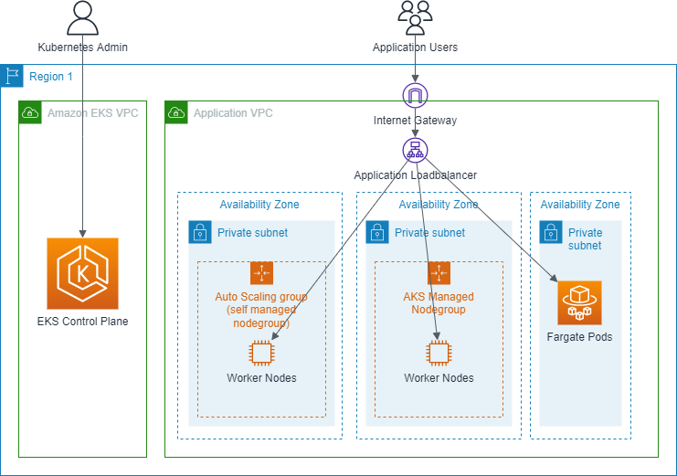

# Introducing Amazon EKS

The `Amazon Elastic Kubernetes Service` or `AWS EKS` is a service which provides fully managed Kubernetes cluster 
instances on AWS. 

More precise:
* the service provides a fully managed control plane of a Kubernetes cluster (i.e. the master nodes)
* the service user has to provision the worker nodes of a Kubernetes cluster.

@see: [What is Amazon EKS?](https://docs.aws.amazon.com/eks/latest/userguide/what-is-eks.html)

## EKS Overview

Here's a diagram which demonstrates the `shared responsibility model` of an AWS EKS cluster:

### EKS Control Plane

Whenever you provision an AWS EKS cluster, the control plane of the cluster is created in a separate
VPC (Amazon EKS VPC) managed by the AWS EKS service. This control plane includes all master nodes of your cluster.
Details regarding the master nodes like how many instances and which EC2 instance types to use are managed by the AWS EKS service.

AWS makes sure, that the control plane 

* adapts elastically to increasing or decreasing workload on the Kubernetes API 
* is highly available through distribution across multiple availability zones 

The control plane exposes the Kubernetes API endpoint, which Kubernetes admins can use to manage the cluster.

### EKS Node Groups

The worker nodes on the other hand have to be provided by you including the VPC, the subnets etc which host them.
Regarding the worker nodes you have three options to provide them.

* Via `Self-managed Node Groups` represented by auto scaling groups managed by you.
* Via `AKS-managed Node Groups` managed by the AWS EKS service.
* Via `Fargate Pods` managed by the AWS Fargate service.

Since the third option is only applicable if you use the AWS Fargate on EKS deployment model for AWS Fargate, 
this option will not be discussed further.

Regardless which option you choose, the applications deployed to the EKS cluster are usually accessed through an 
application loadbalancer in front of the node groups inside your VPC.

EKS node groups may be dynamically attached to or detached from the EKS cluster while the cluster is up and running.

#### Self-managed Node Groups

Self-managed node groups are represented by autoscaling groups with a specific set of EC2 instances exclusively
managed by you. The only thing which AWS provides is the EKS optimized AMI to be used for the EC2 instances 
plus some guidelines how to define the launch templates for the autoscaling groups.

Kubernetes version upgrades, EC2 AMI upgrades have to be managed by you. On the other hand, you have full control
about the type of EC2 instance you want to use, which mix of EC2 purchase options to use.

@see: [Self-managed Nodes](https://docs.aws.amazon.com/eks/latest/userguide/worker.html)

#### AKS-managed Node Groups

AKS-managed node groups are represented by managed node groups, which are a feature of the AWS EKS service.
You don't have to deal with autoscaling groups and launch templates to spin up your worker nodes.
Nevertheless, you are able to customize the underlying launch template regarding EC2 instance types,
EC2 purchase options etc.

Kubernetes version upgrades, fixes EC2 AMIs and Kubernetes add-ons are provided on a regular basis by AWS.
However, it's up to you to roll them out on your EKS cluster.

@see: [Managed Node Groups](https://docs.aws.amazon.com/eks/latest/userguide/managed-node-groups.html)