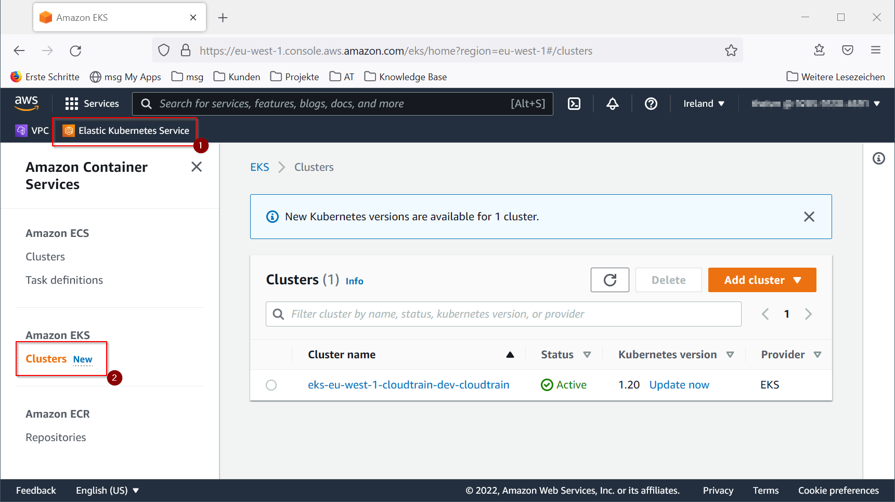

# Managing Amazon EKS clusters

There are various options how-to manage your AWS EKS clusters:

* The AWS Management Console
* The AWS CLI
* Weaveworks eksctl
* AWS CloudFormation
* HashiCorp Terraform

## AWS Management Console

AWS EKS comes with its own pages in the AWS Management Console.



Login to the AWS Management Console.
Choose `Elastic Kubernetes Service`.
Select `Amazon EKS > Clusters`.

Now you have access to all functions which help you to manage your EKS clusters.

!!! warning "Using AWS Manage Console to manage EKS Clusters is not a good idea"
    Managing EKS clusters through the AWS Management Console is strictly not recommended, since there are a lot of
    manual steps to follow which is quite time-consuming and error-prone from the start. Use some tool which
    supports automation instead.

## AWS CLI

The AWS command line interface offers a consistent set of commands to manage EKS clusters:

```shell
aws eks associate-encryption-config
aws eks associate-identity-provider-config
aws eks create-addon
aws eks create-cluster
aws eks create-fargate-profile
aws eks create-nodegroup
aws eks delete-addon
aws eks delete-cluster
aws eks delete-fargate-profile
aws eks delete-nodegroup
aws eks deregister-cluster
aws eks describe-addon
aws eks describe-addon-versions
aws eks describe-cluster
aws eks describe-fargate-profile
aws eks describe-identity-provider-config
aws eks describe-nodegroup
aws eks describe-update
aws eks disassociate-identity-provider-config
aws eks get-token
aws eks list-addons
aws eks list-clusters
aws eks list-fargate-profiles
aws eks list-identity-provider-configs
aws eks list-nodegroups
aws eks list-tags-for-resource
aws eks list-updates
aws eks register-cluster
aws eks tag-resource
aws eks untag-resource
aws eks update-addon
aws eks update-cluster-config
aws eks update-cluster-version
aws eks update-kubeconfig
aws eks update-nodegroup-config
aws eks update-nodegroup-version
```

Unfortunately, the sheer number of `aws eks` commands is a little overwhelming and confusing. 
Besides that, each command requires a lot of additional parameters you need to specify. 
That being said, using the AWS CLI is not a recommended approach to manage your EKS clusters.

## Weaveworks eksctl

`eksctl` is an open-source command line tool sponsored by Weaveworks and officially supported by AWS.
It offers a concise set of commands to manage an EKS clusters plus it supports specifying your EKS cluster in a YAML 
configuration file. It is written in GO and uses AWS CloudFormation under the hood.

Using eksctl is pretty easy since it comes with a lot of default configurations for your AWS EKS cluster which are based
on AWS best practices and recommendations for AWS EKS. It even creates a VPC supposed to host your AWS EKS on your behalf.

Here's the simplest way to create an AWS EKS cluster with eksctl:

```shell
eksctl create cluster
```

This will create a cluster with the following default parameters:

* an exciting auto-generated name, e.g., fabulous-mushroom-1527688624
* two m5.large worker nodes which suit most common use-cases
* the EC2 worker nodes use the latest version of the AWS EKS AMI
* the cluster will be hosted in the `us-west-2 region`
* the cluster is running within dedicated VPC (check your quotas)

!!! tip "Start with eksctl to manage your EKS clusters"
    eksctl is the right way to go if you are looking for a simple tool to manage a smaller set of AWS EKS clusters.

@see: [eksctl - The official CLI for Amazon EKS](https://eksctl.io)

## AWS CloudFormation

`AWS CloudFormation` is the official Infrastructure-as-Code tool provided by AWS as fully managed service.
Infrastructure like your AWS EKS cluster is defined in `AWS CloudFormation Templates`. 
Actually, AWS CloudFormation comes with pre-defined templates to create AWS EKS clusters which you can use off-the-shelf.

!!! info "eksctl uses AWS CloudFormation"
    The popular command line tool `eksctl` uses AWS CloudFormation to create and update AWS EKS clusters.

@see: [Amazon Elastic Kubernetes Service resource type reference](https://docs.aws.amazon.com/de_de/AWSCloudFormation/latest/UserGuide/AWS_EKS.html)

## Hashicorp Terraform

`Terraform` by Hashicorp provides full support of AWS EKS clusters through its AWS provider.

The advantage of Terraform compared to the other tools is that Terraform can handle all aspects of AWS EKS clusters

* plus management of other AWS services
* plus Helm deployments of Cluster Tool Stacks
* plus fine-tuning of Kubernetes clusters through Kubernetes manifests

!!! tip "Use Terraform to manage AWS EKS cluster including standard Cluster Tool Stacks"
    If you need to manage a lot of AWS EKS clusters with very strict security requirements or a predefined set of
    cluster tool stacks for cluster logging, cluster monitoring and cluster tracing, Terraform provides the richest
    set of features for you.
