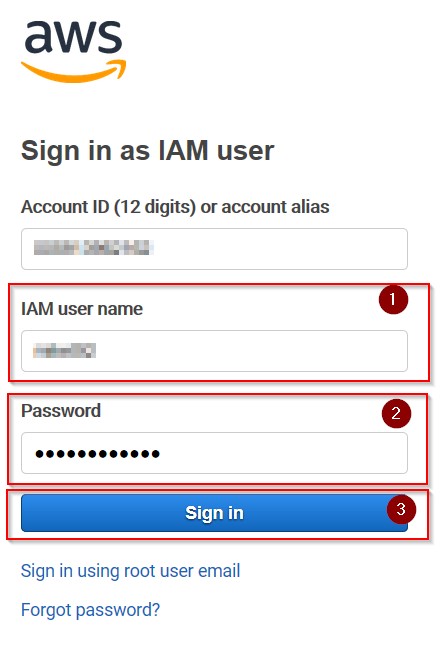
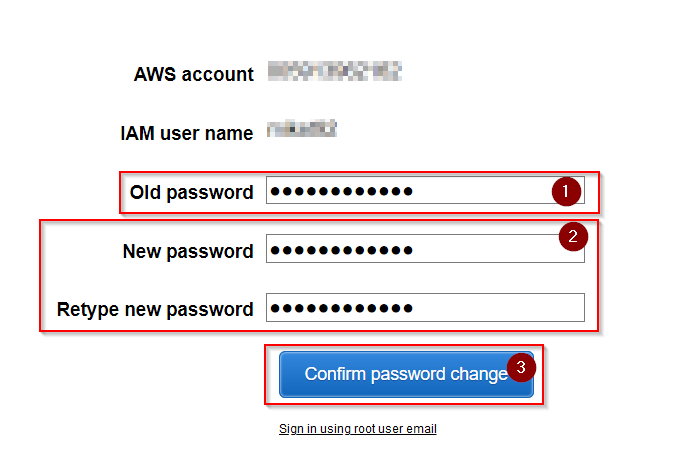
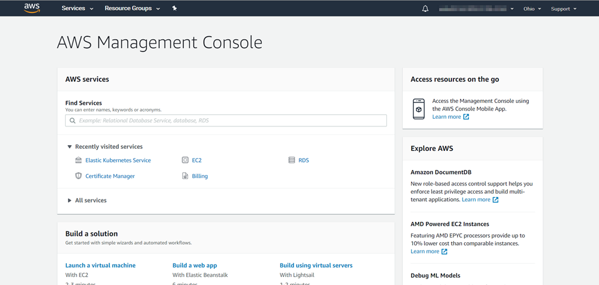

# Setting up a Console User Account

This pages contains all instructions on how to setup a console user account.

## Prerequisites

Before you continue, please make sure you have the following information:

* AWS login URL
* User ID of your console user 
* Initial password of your console user (which you need to change upon first login)

## Initial Login with Password Change

1\. Open your favourite browser with the given AWS login URL:

2\. Enter given user ID and password of your console user and press __Sign In__. Now you will have to change your initial password before you can continue:

!!! caution "New Password must match Password Policies"
    Check out the [Password Policies](aws_users.md#password-policies) which your new password will have to match!
    
3\. Enter your __Old password__ and enter and confirm your new password. Press __Confirm password change__ to move to AWS start page:

## Setup a MFA device

By default, you are not allowed to do anything in AWS console without setting up MFA first.

There's a excellent article about MFA setup in the offical AWS documentation: [Enabling a Virtual Multi-factor Authentication (MFA) Device (Console)](https://docs.aws.amazon.com/IAM/latest/UserGuide/id_credentials_mfa_enable_virtual.html).
Simply follow all instructions on section __Enable a Virtual MFA Device for an IAM User (Console)__.

!!! tip "Recommended MFA Apps for Android and iOS"
    The [Multi-factor Authentication](https://aws.amazon.com/iam/features/mfa/?audit=2019q1) page contains a list of 
    all supported MFA applications for mobile phones. Recommended ones are: __Microsoft Authenticator__ or __Google Authenticator__.

 

