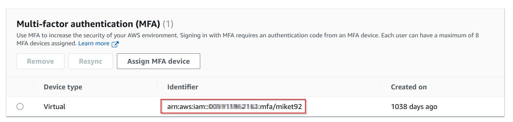

# Setting up a Programmatic User Account

This pages contains all instructions on how to setup a programmatic user account.

## Prerequisites

Before you continue, please make sure you have the following information:

* AWS CLI installed on your local machine
* Access key of your programmatic user 
* Secret key of your programmatic user

## Two ways to add Access Key and Secret Key to your local environment

There are two ways to add the access key and the secret key of your programmatic user to your AWS configuration:

* (A1) by editing AWS configuration files
* (A2) by running AWS CLI command __aws configure__

Both alternatives have one thing in common: they use the [Named Profile](https://docs.aws.amazon.com/cli/latest/userguide/cli-configure-profiles.html) __msgcxp__.

## A1 Add Access Key and Secret Key to your local AWS configuration files

1\. Ensure you have a sub-folder called __.aws__ in your user profile folder.

2\. Ensure your have a file named __config__ in your __.aws__ folder. If not, create a new one based on the following template:
```
[default]
region=eu-central-1

[profile msgcxp]
region=eu-central-1
```
3\. Ensure your have a file named __credentials__ in your __.aws__ folder. If not, create a new one based on the following template:
```
[default]

[msgcxp]
aws_access_key_id=${accessKey}
aws_secret_access_key=${secretKey}
```

4\. Add the provided access key and secret key to your __.aws/credentials__ file by replacing the placeholders in section __msgcxp__ with the actual values.

5\. Check if your local AWS configuration works by entering the command __aws iam get-user__ giving profile __msgcxp__ which should return the following output:

```
>aws iam get-user --profile msgcxp
{
    "User": {
        "Path": "/",
        "UserName": "**********",
        "UserId": "*********************",
        "Arn": "arn:aws:iam::************:user/**********",
        "CreateDate": "2020-04-14T15:28:07+00:00",
        "Tags": [
            {
                "Key": "Organization",
                "Value": "msg systems ag"
            },
            {
                "Key": "Department",
                "Value": "Automotive Technology"
            },
            {
                "Key": "Project",
                "Value": "CXP"
            },
            {
                "Key": "Maintainer",
                "Value": "***********************"
            }
        ]
    }
}
```

!!! info ""
    All sensitive information has been redacted with sequences of __*__

6\. Ensure that attribute values __User.UserName__ and __User.UserId__ match your personal values. 

## A2 Add Access Key and Secret Key using AWS CLI

If don't want to edit your local AWS configuration files, you can use AWS CLI to add the provided access key and secret key
to your local environment.

1\. Enter the command __aws configure --profile msgcxp__ in a Windows console and enter all requested values:

```
>aws configure --profile msgcxp
AWS Access Key ID [None]: ********************
AWS Secret Access Key [None]: ****************************************
Default region name [None]: eu-central-1
Default output format [None]: json
```

!!! info ""
    All sensitive information has been redacted with sequences of __*__

2\. Check if your local AWS configuration works by entering the command __aws iam get-user__ giving profile __msgcxp__ which should return the following output:

```
>aws iam get-user --profile msgcxp
{
    "User": {
        "Path": "/",
        "UserName": "**********",
        "UserId": "*********************",
        "Arn": "arn:aws:iam::123456789012:user/**********",
        "CreateDate": "2020-04-14T15:28:07+00:00",
        "Tags": [
            {
                "Key": "Organization",
                "Value": "msg systems ag"
            },
            {
                "Key": "Department",
                "Value": "Automotive Technology"
            },
            {
                "Key": "Project",
                "Value": "CXP"
            },
            {
                "Key": "Maintainer",
                "Value": "***********************"
            }
        ]
    }
}
```

!!! info ""
    All sensitive information has been redacted with sequences of __*__

3\. Ensure that attribute values __User.UserName__ and __User.UserId__ match your personal values. 

## Add a AWS profile to your environment

If you don't want to add the command line parameter __--profile__ to each AWS CLI command, you can set environment variable 
__AWS_PROFILE__ to the name of the profile you would like to use.

```
SETX AWS_PROFILE msgcxp
```

## Special case: HOW-TO setup a programmatic user with enforced MFA

When you have MFA enforced on your IAM user (which should always be the default),
you will notice that any access using your access key is denied by AWS.

This is actually the expected behaviour since MFA is applied to your programmatic access as well and you did not
send any MFA code. 

In order to be able to access AWS you'll need to walk through the following steps:

### Step 1: Remember the ARN of your configured MFA device

Open your user in IAM and switch to the `Security credentials` tab.
Remember the ARN shown in the `identifier` column in the `Multi-factor authentication (MFA)` panel:



### Step 2: Get a session token from AWS STS

Make sure you have access to your MFA device.
Open a console / terminal window.
Make sure you are using the profile of your programmatic user (here: msgcxp)
Run the following command:

```shell
aws sts get-session-token --serial-number arn:aws:iam::*************:mfa/miket92 --token-code ******
```
You'll need to add the following command line arguments:

* `serial-number` specifies the ARN of your MFA device.
* `token-code` is an MFA code as displayed on your MFA device. 
* `duration-seconds` optionally specify the expiration time of the session token (default: 12 hours)

The response from STS should look like this:

```json
{
    "Credentials": {
        "AccessKeyId": "ASI**************FCS",
        "SecretAccessKey": "k5y**********************************yxa",
        "SessionToken": "Fwo***[..]***G9z",
        "Expiration": "2023-02-17T21:20:11+00:00"
    }
}
```

### Step 3: Add a new profile section to your credentials file

Open the `credentials` in the `.aws` folder in your user home directory.
Add a new section to the file:

```text
[msgcxp-sts]
aws_access_key_id = ASI**************FCS
aws_secret_access_key = k5y**********************************yxa
aws_session_token = Fwo***[..]***G9z
```

The profile name enclosed in square brackets should be the name of the AWS profile you've just used to obtain the session token plus suffix `-sts`.

`aws_access_key_id` is set to the value of attribute AccessKeyId from the STS response.

`aws_secret_access_key` is set to the value of attribute SecretAccessKey from the STS response.

`aws_session_token` is set to the value of attribute SessionToken from the STS response.

> Attention: Remember to remove the enclosing double-quotes from the values you copied from the STS response!!!

### Step 4: Check your results

Open a console / terminal window. Switch to the new AWS profile you've just created. Enter any `aws` command which should complete
successful now without any `access denied` messages. If you still get `access denied` message you probably are not permitted
to access this AWS service!

## References

[Configuring the AWS CLI](https://docs.aws.amazon.com/cli/latest/userguide/cli-chap-configure.html) gives you more 
detailed information on how-to configure the AWS CLI.
