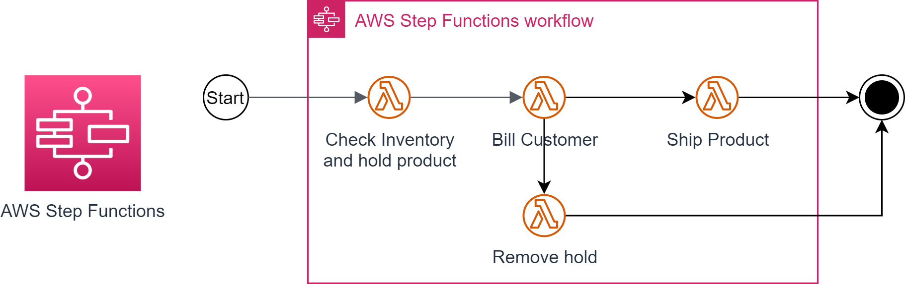
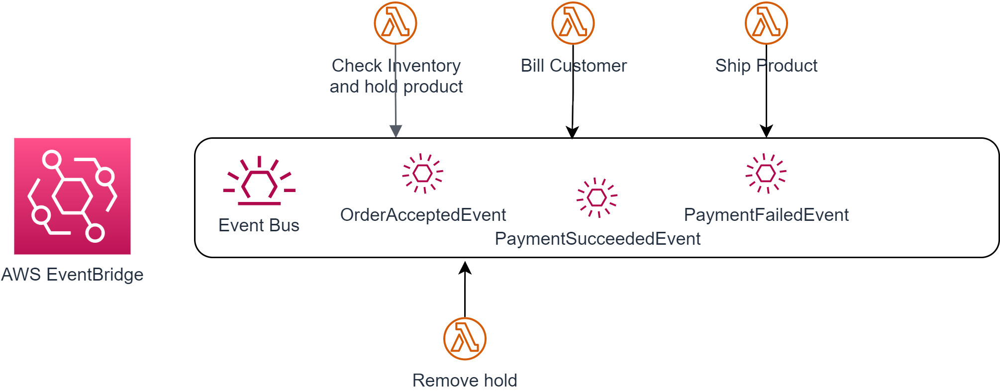
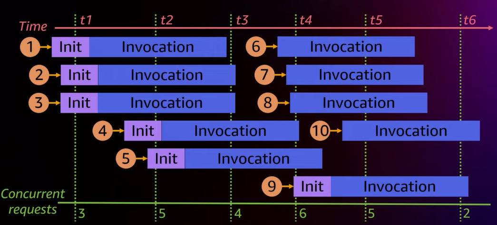
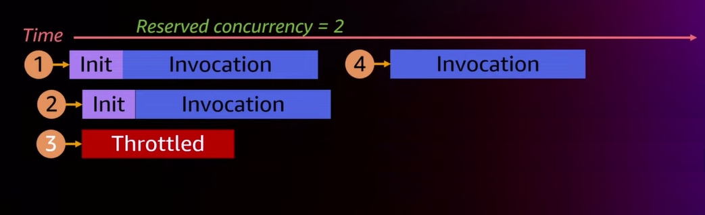
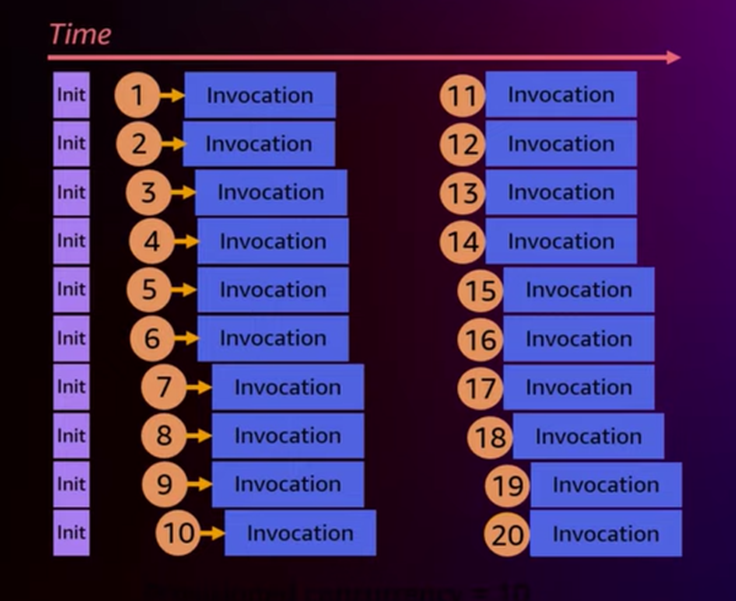

# AWS Lambda best practices

Here is a collection of best practices for advanced serverless developers.

## Use Event-Carried State Transfer to avoid unnecessary callbacks between functions

When using event-based communication between your functions, put all state which the consumers of your events might be
interested in into the events that you fire (event-carried state transfer).

Putting just identifiers of domain objects into your events requires all consuming functions to retrieve the actual domain objects
from the data-owning function. This pull model introduces an unwanted dependency or tight coupling between functions: when the
data-owning function becomes unavailable all functions depending on the data-owner will become dysfunctional as well.

A far better way is to put all data into the payload of the events that you fire. Thus, the consuming functions are able to process
that data without having to call back the data-owning function. This push model ensures a loose coupling between the functions.

## Enrich your events with useful and helpful information

In order to ensure a high observability in your serverless application, add additional data to your events which makes
tracking down bugs easier when things should get wrong. Useful and helpful additional data could be:

* The fully qualified name of the lambda function which sent the event
* A unique identifier of the event (correlation ID), if not already provided by the underlying event bus or event broker
* The name of the business domain or bounded context the sending function belongs to
* The name of the business service / operation the sending function represents

## The best Lambda Function is no Function at all

### Use Functions to transform, not to transport

Sometimes, a function only transports data between an event source and an event destination without doing anything with it.
This is a good indication to look for better ways to link the event source and the event destination directly without having
to use a function at all.

### Reduce Lambda Code with Direct Service Integration

The two most popular AWS services for function orchestration and choreography - AWS Step 
Functions and AWS EventBridge - offer a lot of features which can help you to reduce your
lambda code significantly:

* `AWS Step Functions` has the [AWS SDK integrations](https://docs.aws.amazon.com/step-functions/latest/dg/supported-services-awssdk.html) which lets you call over 200 hundred AWS service directly from your state machine.
* The [Optimized Integrations](https://docs.aws.amazon.com/step-functions/latest/dg/connect-supported-services.html) of `AWS Step Functions` makes the integration of specific AWS service into your workflows even more simple.
* `AWS Step Functions` comes with a concise set of [Intrinsic Functions](https://docs.aws.amazon.com/step-functions/latest/dg/amazon-states-language-intrinsic-functions.html) which can cover a lot of workflow-related logic directly within the `AWS states language`
* `AWS EventBridge` has [API destinations](https://docs.aws.amazon.com/eventbridge/latest/userguide/eb-api-destinations.html) which can call any API on the internet including security and failovers (@see: )
* [AWS service events](https://docs.aws.amazon.com/eventbridge/latest/userguide/eb-service-event.html) allow you to add AWS services directly as event sources to `AWS EventBridge`.

## Apply Orchestration/Choreography using Managed Services

In most non-trivial serverless scenarios, communication between functions must be coordinated using `Orchestration` or `Choreography`
or even both. Regardless which approach you are using, either orchestration or choreography should be handled by a managed service, 
NOT your function code.

!!! danger Avoid putting hard-wired coordination between functions into your function code at any cost!

In `Orchestration`, flow of communication between functions is controlled by a central component called 
an `Orchestrator`. The orchestrator initiates and coordinates interactions between functions, 
all functions only interact with the orchestrator. 

Using AWS Lambda, a popular orchestrator of functions is `AWS Step Functions`.



`Choreography` on the other hand is a more distributed approach based on collaboration: each function publishes and/or subscribes 
to events and each function reacts to these events independently. The only component that all functions have to rely on it a 
common event broker or event bus which ensures the reliable transport of events between the functions but does NOT 
control the flow of events between the functions in any way.

Using AWS Lambda, a popular common event bus is `AWS EventBridge`.



## Optimize Dependencies

Picking a more specific package from your AWS SDK library rather than the more generic one, can speed
up the init phase of your lambda function significantly.

Here are some samples based on Python:

````python
// const AWS = require('aws-sdk')
const DynamoDB = require('aws-sdk/clients/dynamodb') // 125ms faster 
````

````python
// const AWSXRay = require('aws-xray-sdk')
const AWSXRay = require('aws-xray-sdk-core') // 5ms faster 
````

````python
// const AWS = AWSXRay.captureAWS(require('aws-sdk'))
const dynamodb = new DynamoDB.DocumentClient()
AWSXRay.captureAWSClient(dynamodb.service) // 140ms faster 
````

The new version 3 of the AWS SDK for Javascript offers:

* Modularized packages to import only those you actually need
* Significantly smaller package size (~3 MB vs. 8 MB)
* TCP connection reuse by default
* ...

!!! tip 
    Always keep the versions of your AWS SDK up-to-date!

## Move to ARM based Architecture

AWS Graviton 2 offers a 34% better price-performance over x86-based lambda execution environments.
Switching from architecture `x86_64` to `arm64` is pretty easy depending on the programming language you use:

* Interpreted or bytecode-based languages like Java can run without modification.
* Compiled languages and container image require a rebuild for arm64.
* Most AWS tools and SDKs support AWS Graviton 2 transparently.

!!! note 
    If you are taking sustainability seriously, switching to ARM-based execution environments is a MUST!

!!! tip
    It's possible to build ARM-based docker images on Intel-based Windows machines!

## Use Memory as a Power/Cost Lever for your Lambda Function

Unfortunately, AWS Lambda only offers a memory configuration control, not a CPU configuration control.
Nevertheless, increasing the memory settings (which are between `128 MB` to `10 GB` in 1 MB increments)
will allocate more CPU power and network bandwidth proportionally.

!!! tip 
    So even if your code is rather CPU-bound or net-I/O-bound, adding more memory may 
    improve your performance and reduce your overall costs.

Here's an example of smart resource allocation for a CPU-bound function:

A lamda function calculates all prime numbers less than 1 million a thousand times.

|  Memory (MB) | Execution Time (seconds) |  Price (USD) |
|-------------:|-------------------------:|-------------:|
|          128 |                11.722965 | 0.024628 |
|          256 |                 6.678945 |     0.028035 |
|          512 |                 3.194954 |     0.026830 |
|         1024 |             1.465984 |     0.024638 |

Allocating 1024 memory for this CPU-heavy function results in almost 10 times better performance with an additional 
cost of 0.000010 dollar compared to the cheapest option.

!!! tip 
    The [AWS Lambda Power Tuning](https://docs.aws.amazon.com/lambda/latest/operatorguide/profile-functions.html) tool can 
    automate the process of finding the best balance between speed and cost. 

## Understand Concurrency in order to scale properly

In AWS Lambda, `concurrency` determines the number of parallel invokes of your functions at any point in time.
Each invoke takes a certain amount of time: the longer a function runs the sooner you are going to hit your 
concurrency limit.



### Impact of Cold Starts on Concurrency

The execution time of each invoke includes the time your function needs to initialize during a cold start as well.
Thus, the number of cold starts directly affects the number of functions which can be invoked in parallel.

### Reserved Concurrency

[Reserved Concurrency](https://docs.aws.amazon.com/lambda/latest/operatorguide/reserved-concurrency.html) restricts the __maximum number of concurrent invocations__ for that function. 
Synchronous requests arriving in excess of the reserved concurrency limit will fail with a throttling error.
The reserved concurrency of a particular function is deducted from the overall capacity for the AWS account 
in a given Region. The Lambda function always has the reserved concurrency available exclusively 
for its own invocations.



!!! tip "Power-off switch for AWS Lambda"
    Setting the reserved concurrency to `0` immediately blocks all further invocations of your function. So whenever
    you need to suspend invocations of your functions temporarily without uninstalling them, use the 
    reserved concurrency as a power-off switch.

### Provisioned Concurrency

[Provisioned Concurrency](https://docs.aws.amazon.com/lambda/latest/operatorguide/provisioned-scaling.html) is a feature
that prepares a pre-defined number of execution environments in advance of invocations. In other words: the provisioned
concurrency determines the number of instances of your function which are __kept warm__ at any time.



This is a very important feature for workloads which either rely heavily on low latency or must be able to handle
unexpected bursts potentially exceeding the default burst capacity of your AWS account.

### Concurrency Quotas

#### Account concurrency quota

The `Account Concurrency Quota` defines the maximum concurrency of all functions of a particular account 
in a given region.

The default account concurrency quota is `1000 per region` but can be increased.

#### Burst Concurrency Quota

The `Burst Concurrency Quota` defines how fast the concurrency of your function can scale up depending on the region.
This quota includes two limits:

* Initial burst: maximum increase in concurrency for an initial burst of traffic `(eu-west-1: 3000)`
* Step size: maximum increase in concurrency after an initial burst `(eu-west-1: 500)`

## Resources

* [AWS re:Invent 2022 - Best practices for advanced serverless developers (SVS401)](https://youtu.be/PiQ_eZFO2GU)