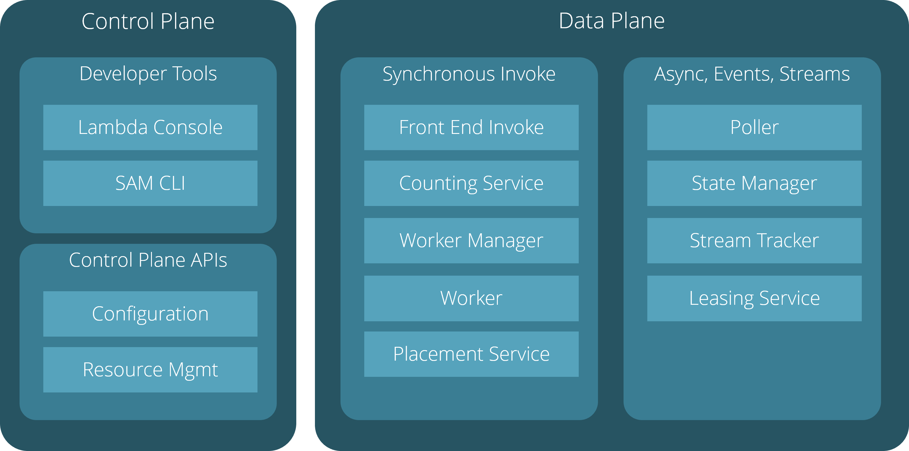

# AWS Lambda Deep Dive - Planes

## Overview

## Control Plane

## Data Plane

### Front End Invoke

The `Front End Invoke` orchestrates both synchronous and asynchronous invocations of functions.
It authenticates callers, checks the function metadata like CPU and RAM and checks the concurrency 
using the `Counting Service`.

### Counting Service

The `Counting Service` manages a region-wide view of customer concurrency to help to enforce set limits.

### Worker Manager

The `Worker Manager` tracks function container states (like idle and busy) and schedules incoming invoke requests
to available containers. It will spin up or spin down sandboxes according to the current workload on a particular 
function. If no container should be available for an incoming invoke request, it will use the `Placement Service` to
locate a suitable `Worker` for the new sandbox.

### Worker

A `Worker` provides a secure environment for the execution of a particular function called sandbox. 
It creates and manages a set of sandboxes, matches the available resources to the requirements of a particular function,
downloads the packaged function code and executes it. Besides hosting and executing functions in various runtime environments,
it also manages the agents for monitoring services like CloudWatch. All initializations and invocations of functions
are reported back to the `Worker Manager`.

### Placement Service

The `Placement Service` places sandboxes on workers while continuously trying to maximize the packing density without
impacting customer experience or cold-path latency. It monitors the health of the `Worker`s and is informed about 
used and idle workers by the `Worker Manager`. Based on this information, it autoscales the pool of `Workers`.

