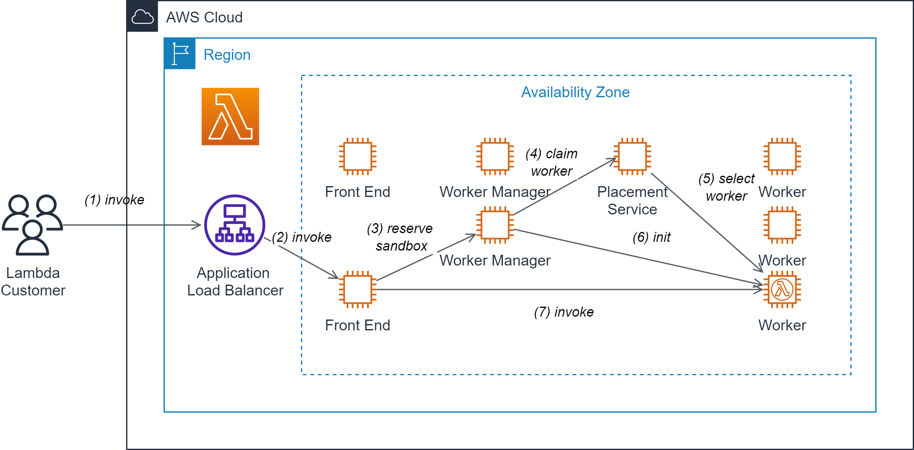
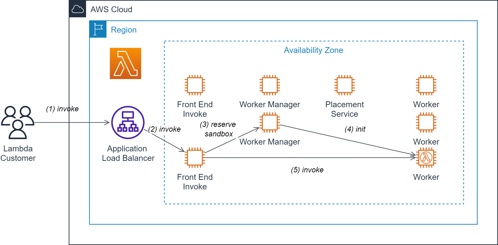

# AWS Lambda Deep Dive - Synchronous Invocation

## First synchronous invocation (cold start)

When a function is called for the first time, the following events are going to happen:

1. A `Lamdba Customer` invokes a function for the first time.
2. The `Application Loadbalancer` forwards the invocation to the first available `Front End Invoke`.
3. The `Front End Invoke` tries to reserve a sandbox for the function via a `Worker Manager`.
4. The `Worker Manager` calls the `Placement Service` to claim a worker from the pool of available workers.
5. The `Placement Service` selects a free `Worker` from the pool and passes the address of 
the selected worker back to the `Worker Manager`.
6. The `Worker Manager` initializes the function on the given `Worker` and passes the address
of the initialized function back to the `Front End Invoke`.
7. The `Front End Invoke` invokes the function.

## Subsequent synchronous invocation (warm start)

When a booted function is already repeatedly, the following events are going to happen:

1. A `Lamdba Customer` invokes a function repeatedly.
2. The `Application Loadbalancer` forwards the invocation to the first available `Front End Invoke`.
3. The `Front End Invoke` tries to reserve a sandbox for the function via a `Worker Manager`.
4. The `Worker Manager` already knows the `Worker` running an instance of the function, initializes it and passes its
address back to the `Front End Invoke`.
5. The `Front End Invoke` invokes the function.

