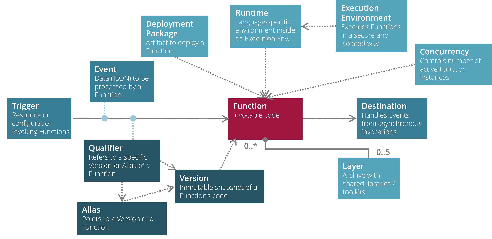
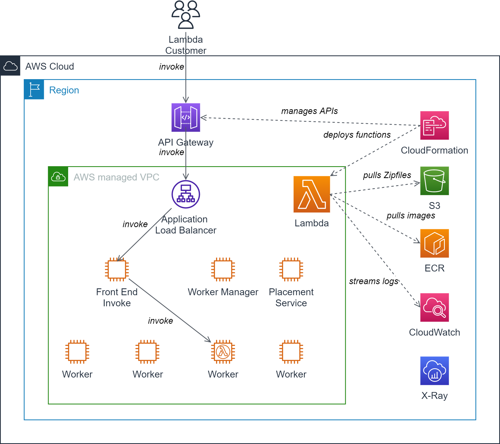

# Serverless on AWS with AWS Lambda

AWS Lambda is an AWS service which provides a platform to develop, build and run serverless applications.

@see [AWS Lambda](https://aws.amazon.com/lambda/)

## Lambda speak

Here are the most important terms you need to understand before you start with AWS Lambda. 

### Function

A `function` is a resource on AWS Lambda you can invoke to run your code. An invocation is typically done by a
[trigger](#trigger) sending an [event](#event).

### Trigger

A `trigger` is a resource or configuration that invokes a function by forwarding an event. 
Triggers may include AWS services or event source mappings.

### Event

An `event` is represented by a JSON document which contains data for a function to process.

### Deployment Package

In order to deploy your function to AWS Lambda, you need to build a `deployment package`. 

AWS Lambda supports two types of deployment packages:

* Container images
* Zip file archives

#### Container images

All artifacts and dependencies required to run your function on Lambda are packaged into a standard Docker image.
Lambda provides a set of open-source base images that you should use to build your Docker image. Any local installation
of Docker will do, if you want to ship your function as a container images.

The container images need to be pushed to AWS Elastic Container Registry (ECR) in order to deploy them to Lambda.

AWS SAM CLI can help a lot in generating and deploying lambdas packaged as Docker images.

!!! info "Favour container images over zip files"
    Using a container image is strongly recommended since it comes with all advantages of shipping containerized artifacts:
    Once build on your local machine or in a CI/CD pipeline, the image is easy to test and will never be changed until
    it is executed on the Lambda environment.

#### Zip file archives

Using Zip files to deploy your function was the only way before the container image option was introduced.
All artifacts and dependencies required to run your function a packaged into a classic zip file archive. 

The zip file needs to be uploaded to S3 in order to deploy your function to Lambda.

### Layers

A Lambda `layer` is an archive containing additional libraries, dependencies or even custom runtimes referenced by a
Lambda function. When you include a layer in a function, the contents are extracted to the /opt directory in the 
execution environments file system.

Using layers is optional, up to 5 layers may be included per function.

!!! warning "Layers cannot be used with container images"
    Unfortunately, layers cannot be used with container images!

#### Using layers may improve upload times during deployment

The introduction of layers may improve your
development experience since you move dependencies from your function to an externally managed artifact reducing the 
overall size of the packaged function uploaded during a deployment.

#### Layers are immutable versioned artifacts

Layers are immutable once deployed. Each layer has a specific version number which is incremented each time you deploy
this particular layer.

#### Best practice: pinning the version of the AWS SDK with a dedicated layer

A common usage scenario for layers is to pin the version of the AWS SDK present in the execution environment. Although
an AWS SDK is provided by default in the lambda execution environment, its version may change at any time whenever a new 
version of the AWS SDK is rolled out to the execution environment. By creating a layer with an explicit version of the
AWS SDK included in your function, you will get more control about AWS SDK upgrades.

#### Binaries in layers must be compatible to Amazon Linux

Since AWS lambdas are running on AWS Linux, you have to make sure that all your layers are compatible with this OS.

#### Sharing layers

By default, layers are private to your AWS account but you can optionally share them with other AWS accounts or even
make them public. Downside: sharing layers is only possible through the AWS CLI not the AWS Management Console.

### Execution environment

An `execution environment` manages processes and resources required to run a function.
It makes sure that all functions are executed in a secure and isolated environment.

Execution environments come in two flavours:

* 64-bit ARM architecture (AWS Graviton)
* 64-bit x86 architecture (Intel, AMD)

The `instruction set architecture` of your function determines which flavour to use.

### Runtime

A `runtime` provides a programming language-specific environment inside an execution environment.
The runtime relays invocation events, context information and responses between the Lambda platform and your function.

### Concurrency

The number of request that your function is processing at any given time is determined by its `concurrency`.
When your function is invoked, the Lambda platform first tries to find an available instance of it to handle the 
incoming request. If none is present, a new instance is spun up and the request is forwarded to it. The concurrency
of the function reflects the number of active instances processing invocations.

### Qualifiers, Versions and Aliases

Whenever you invoke a function you may pass a `qualifier` referring to a specific version or alias of your function.
A `version` is an immutable snapshot of a function's code (e.g. `my-function:1`). An `alias` is a pointer to a version
which can be mapped to different version at any time. You can combine versions and aliases to implement progressive delivery
of your functions.

### Destination

A `destination` is an AWS resource or service where the Lambda platform can send events from an asynchronous invocation.
So if you want to forward asynchronously events from your function to another function, you need to add a destination
to your function.

A destination may be:

* an Amazon SQS queue
* an Amazon SNS topic
* an AWS Lambda function
* an Amazon EventBridge event bus

For some endpoints you can configure special separate destinations when events can be processed successfully or the 
processing fails (e.g. dead-letter-queues).

## Moving Parts of a Lambda function

Well, AWS Lambda is `serverless` but definitely *NOT* `infrastructure-less`: 

### Lambda VPC to host your function

The execution environment for your functions is hosted in an AWS-managed VPC. 

It consists of:

* an `Application Loadbalancer` which accepts incoming invokes of your functions
* a `Front End Invoke` which forwards the invoke to an available instance of your function
* a `Worker Manager` which manages sandboxes for your functions
* a `Placement Service` which places sandboxes on a pool of workers to run your functions
* a pool of `Worker`s hosting sandboxes to run your function in a secure and isolated way

### API Gateway to expose your function endpoints as REST API

An API Gateway manages your REST API with its various operations, 
links the operations to the actual function implementing it and exposes the REST API to the function consumers
via public URLs.

The API gateway is capable of providing different versions of your REST API through different stages.
Additionally, it can handle authentication based on OpenID Connect or SAML through AWS Cognito.  

### CloudFormation to deploy your functions

Most Lambda development tools (like CDK, SAML and Amplify) use CloudFormation to deploy your function to the 
Lambda platform and to manage the routes to your functions in API Gateway.

### S3 as storage for your ZIP-based deployment packages

S3 is used during the deployment process of your function to store your ZIP-based deployment packages 
and the CloudFormation templates required to run the actual deployment.
Whenever Lambda needs to spin up a new instance of your function, the corresponding ZIP archive will be pulled from this
particular S3 instance.

### ECR as storage for your container-based deployment packages

If you use container-based deployment packages, an additional instance of ECR is required to store the container images.
Whenever Lambda needs to spin up a new instance of your function, the corresponding images will be pulled from this
particular ECR instance.

### CloudWatch & X-Ray to observe your functions

CloudWatch will be used by Lambda to store the log events related to your function.
Lambda will log each invocation of your function by default, but you may create new log events inside your function as well.
Additionally, AWS X-Ray may be used to trace invocations of your functions.
