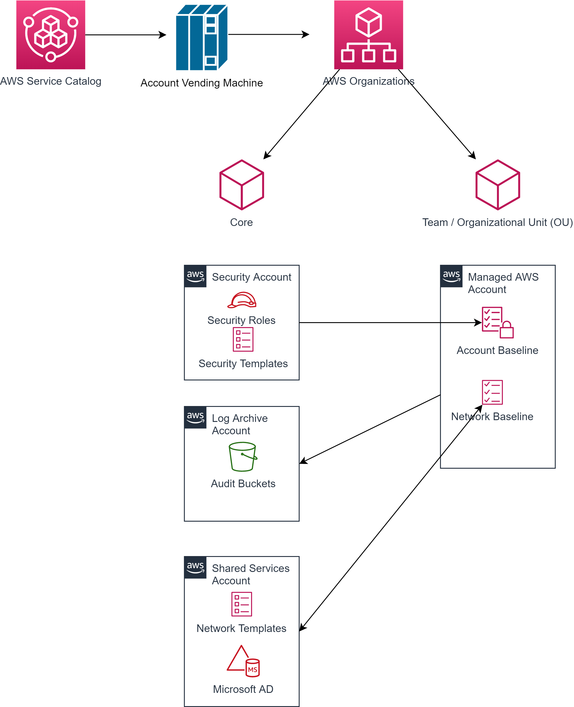

# AWS Landing Zones

## Motivation

Even managing a single AWS account can become very challenging:

* It has to meet your organization's security and auditing requirements
* It must be ready to support highly available and scalable workloads
* It needs to be configurable to support evolving business requirements

Now imagine you have to tackle with all these challenges on a large scale with loads of AWS accounts.
 
`AWS Landing Zone` is a framework which is supposed to help setting up a large number of AWS accounts fast in a secure way:

* It's a configured, secure, scalable, multi account AWS environment
  based on AWS best practices
* It's a good starting point 
  * for net new development and experimentation
  * for migrating applications
* It's an environment that allows for iteration and extension over time

## AWS Landing Zone in a Nutshell

The core of a landing zone is an `account vending machine` which that creates a standard set of accounts based on pre-defined
security and networking templates.

The accounts created by the account vending machine can be grouped into two categories:

* Core accounts handle common aspects of a landing zone like security, logging and shared services that are created when the landing zone is set up.
* Team or OU accounts created after the landing zone has been set up

All accounts are created with account baselines and network baselines in place. Everything that happens within the accounts is centrally logged and audited.

@see [AWS Landing Zone](https://aws.amazon.com/solutions/implementations/aws-landing-zone/)

@see [What Is AWS Service Catalog?](https://docs.aws.amazon.com/servicecatalog/latest/adminguide/introduction.html)

@see [What is AWS Organizations?](https://docs.aws.amazon.com/organizations/latest/userguide/orgs_introduction.html)

## Resources

[Launch AWS Faster Using Automated Landing Zones](https://youtu.be/RSv9H59AsoI)

AWS Webinar about AWS Landing Zones

[What's New in AWS Landing Zone](https://teams.microsoft.com/l/file/E9F55727-E0F3-4FF5-95FF-79FC3791E667?tenantId=763b2760-45c5-46d3-883e-29705bba49b7&fileType=pdf&objectUrl=https%3A%2F%2Fmsggroup.sharepoint.com%2Fsites%2Fmsteams_dd667b%2FShared%20Documents%2FGeneral%2FResources%2Faws%2F2019_0514-ENT_Slide-Deck.pdf&baseUrl=https%3A%2F%2Fmsggroup.sharepoint.com%2Fsites%2Fmsteams_dd667b&serviceName=teams&threadId=19:3e24fe7b26f9438c970c3d0fa229189c@thread.skype&groupId=cc8fc658-d11f-43ec-853e-6065bb0c2ae5)

Slide deck as presented in the webinar

[Automating Your AWS Landing Zone Deployment to Speed Up Large-Scale Migrations](https://aws.amazon.com/blogs/apn/automating-your-aws-landing-zone-deployment-to-speed-up-large-scale-migrations/)

AWS Partner Network Blog about AWS Landing Zones