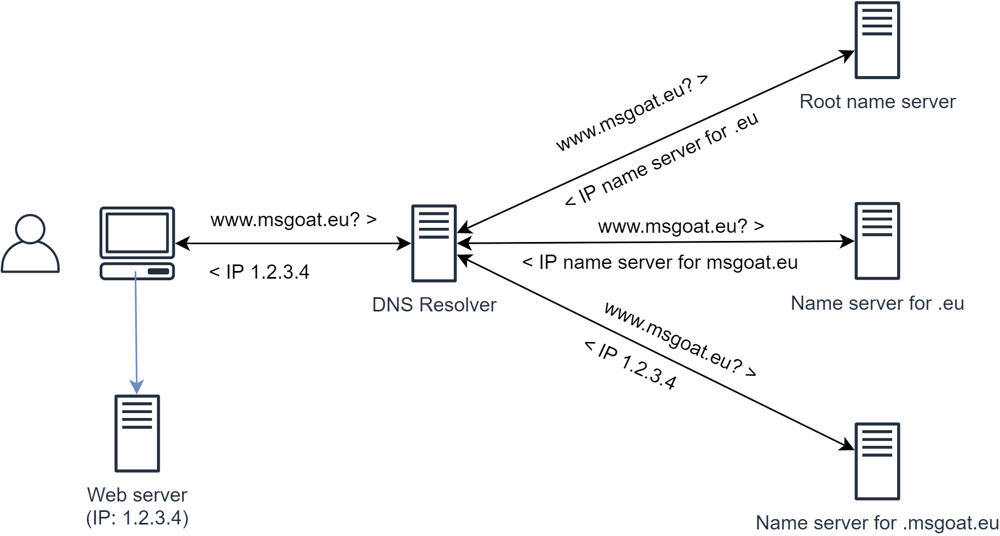

# DNS Basics

## What is DNS?

Your Webserver is accessible via public IP address __1.2.3.4__ somewhere in the internet.
In order to have a more human-friendly name for your server, you registered a
domain named __msgoat.eu__ with a DNS service provider and 
you added a DNS name __www.msgoat.eu__ referring to IP address 1.2.3.4 to your 
preferred DNS service.

But how does the DNS name __www.msgoat.eu__ gets resolved to IP address __1.2.3.4__?

Whenever you enter a URL like __https://www.msgoat.eu__ into your browser,
the hostname __www.msgoat.eu__ is sent to the `DNS resolver` of your corporate network
or of your internet service provider in order to translate the DNS name to an IP address. 

The DNS resolver delegates the request to the `Root name server` which knows about 
all other name servers in charge of top-level domains (TLD). 
The root name server will return the IP address of the name server in charge of 
top-level domain __.eu__.

Now the DNS resolver asks the name server for TLD __.eu__ to resolve the DNS name __www.msgoat.eu__.
The name server in charge of TLD __.eu__ knows all name servers in charge of registered
domains ending with __.eu__. Thus, the name server returns the IP address
of the name server in charge of domain __msgoat.eu__.

Now the DNS resolver requests an IP address from the name server in charge of
domain __msgoat.eu__, which the name server will provide.

Finally, the DNS resolver returns the IP address __1.2.3.4__ to the browser which
is now able to access your web server using the resolved IP address.
 
@see [What is DNS? (in under 5 minutes)](https://youtu.be/e2xLV7pCOLI)
