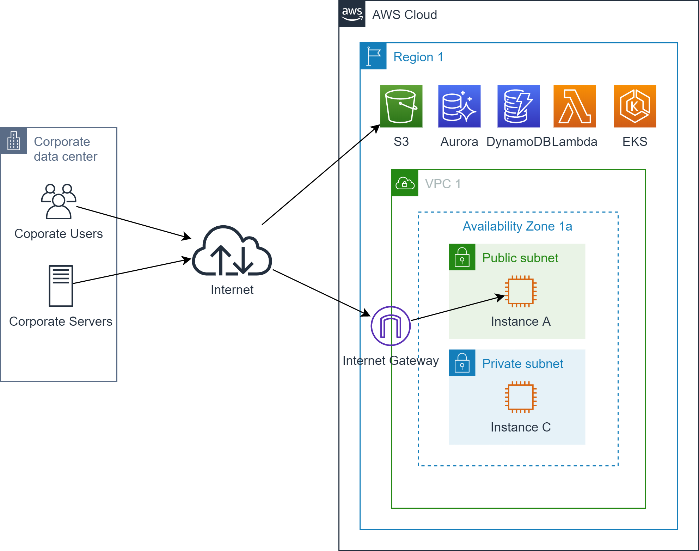
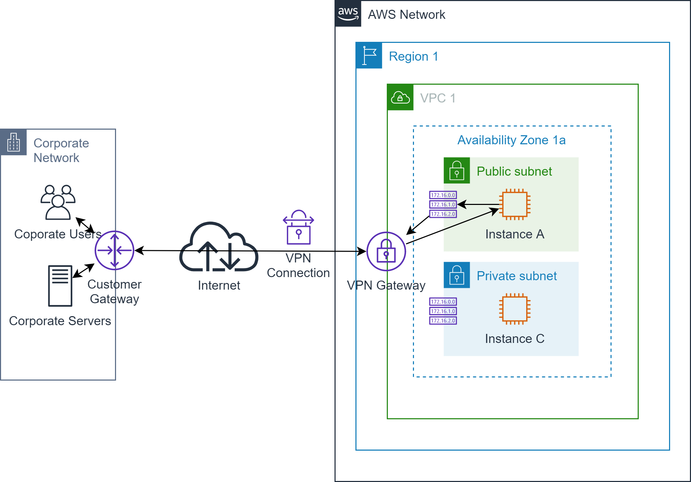
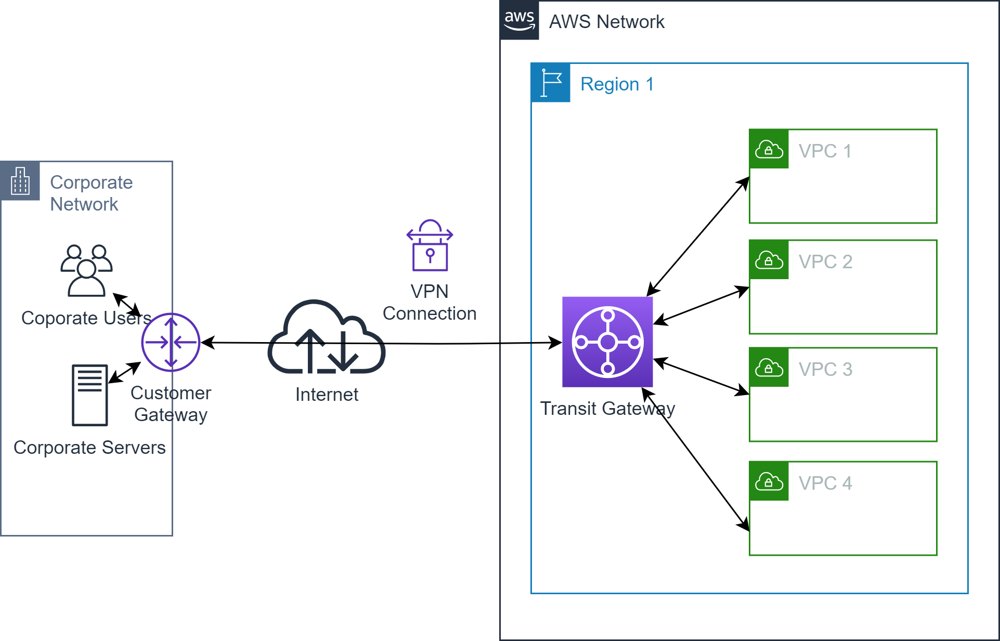
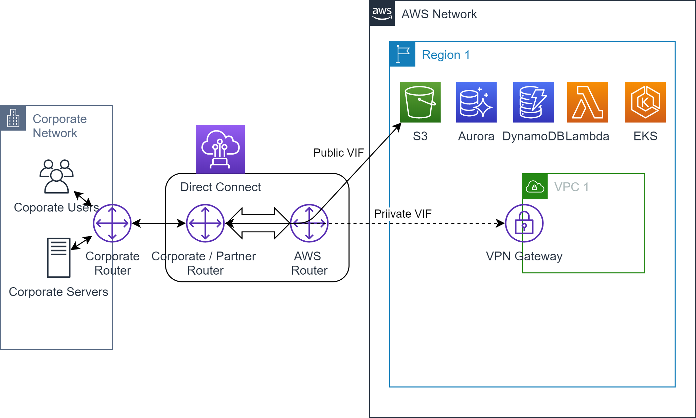
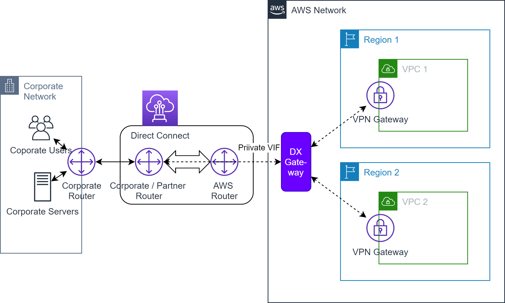
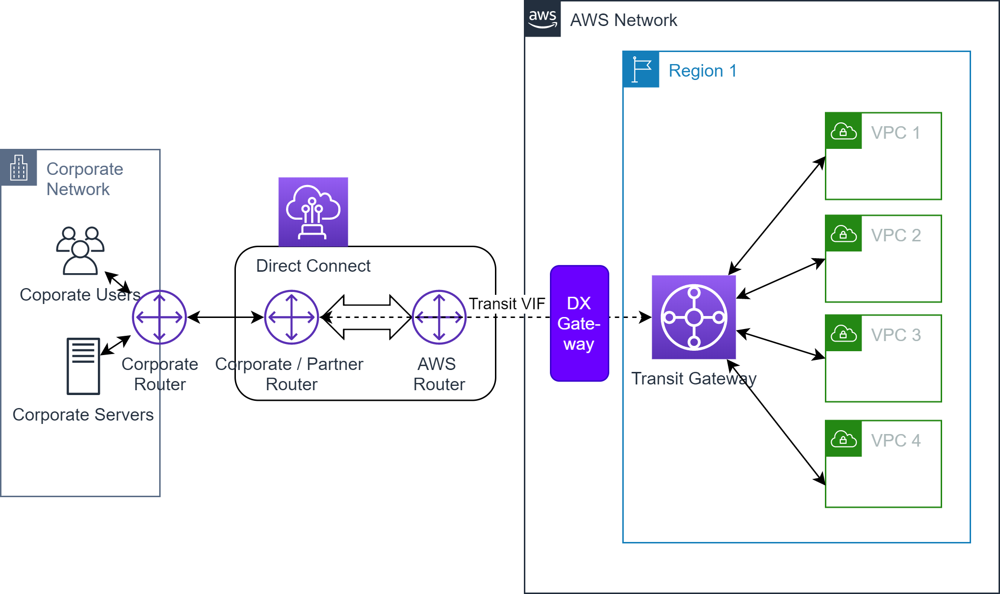

# Site to Site communication

## Motivation

The default way to access services and resources in the AWS network 
from a corporate network is to access them through the internet. 

Although all connections from the corporate network to the AWS network are
encrypted (or can be encrypted very easy), passing potentially confidential
traffic through the public internet is not a good idea.

Since no corporate network is likely to expose corporate resources to the public internet, communication between the 
networks will always be initiated from the corporate network to the AWS network. 
It is not possible to access the corporate network from the AWS network. 
Thus, connectivity in this scenario will be unidirectional from the corporate network to the AWS network.

## Site-to-Site connections using the internet
 
### AWS Site-to-Site VPN

If you need a more private approach and you need to have bidirectional connectivity between the corporate
network and the AWS network, the straightforward way to go is through a VPN connection:
All traffic between the networks is routed through a `VPN connection` established between a `customer gateway` on
the corporate side and a `VPN gateway` on the AWS side.

A VPN gateway actually exposes two public IP addresses the customer gateway can connect to. Thus, each 
VPN connection allows you to establish two VPN tunnels terminating in different availability zones.

Here's a list of features the site-to-site VPN connection offers:

* Fully managed and highly available AWS VPN termination endpoints (public IP addresses).
* There are two redundant VPN tunnels per one VPN connection terminating in different AZs.
* Each VPN tunnel offers a bandwidth of __1.25Gbps__.
* The VPN connection is based on [IPSec](https://en.wikipedia.org/wiki/IPsec) with full support of [IKEv2](https://en.wikipedia.org/wiki/Internet_Key_Exchange#Improvements_with_IKEv2)
and [NAT-T](https://en.wikipedia.org/wiki/NAT_traversal)
* Contemporary encryption options include [AES](https://en.wikipedia.org/wiki/Advanced_Encryption_Standard) 256-bit encryption, [SHA-2](https://en.wikipedia.org/wiki/SHA-2) hashing and [Diffie-Hellman groups](https://en.wikipedia.org/wiki/Diffie%E2%80%93Hellman_key_exchange)
* Private certificates can be managed through AWS Certificate Manager Private CA.

Here are some quotas related to Site-to-Site VPN:

| Quota | Value | Remark |
| --- | --- | --- |
| Customer gateways per Region | 50 |  |
| Virtual private gateways per Region | 5 |  You can attach only one virtual private gateway to a VPC at a time. |
| Dynamic routes advertised from a customer gateway device to a Site-to-Site VPN connection (on a transit gateway or virtual private gateway) | 100 |  This quota cannot be increased. |
| Routes advertised from a Site-to-Site VPN connection to a customer gateway device | 1000 | This quota cannot be increased. |
| Site-to-Site VPN connections per Region | 50 | |
| Site-to-Site VPN connections per virtual private gateway | 10 | | 

@see [What is AWS Site-to-Site VPN?](https://docs.aws.amazon.com/vpn/latest/s2svpn/VPC_VPN.html)

@see [Technische Richtlinie TR-02102-3Kryptographische Verfahren: Empfehlungen und Schlüssellängen](https://www.bsi.bund.de/SharedDocs/Downloads/DE/BSI/Publikationen/TechnischeRichtlinien/TR02102/BSI-TR-02102-3.pdf?__blob=publicationFile&v=6)

### AWS Site-to-Site VPN via AWS Transit Gateway

Manging a huge number of VPN connections from a customer gateway to a VPN gateway can become quite challenging.
Again, AWS Transit Gateway comes to the rescue: Simply connect your customer gateway to endpoints exposed by
a transit gateway. The transit gateway handles all routing to the attached VPCs without requiring VPN gateways.
 

Even a multi site-to-site VPN connection to multiple regions is possible by using transit gateway inter-region peering.

Like a regular site-to-site VPN, a transit gateway-to-customer gateway VPN connection offers to VPN tunnels
with a bandwidth of 1.25Gbps. However, unlike the former option a transit gateway VPN connection supports
[ECMP](https://en.wikipedia.org/wiki/Equal-cost_multi-path_routing) which allows you bundle both VPN tunnels.
Thus the effective bandwith becomes almost up to 2.5Gbps.

If you need more bandwidth, you can simply add more VPN connections between the transit gateways and the customer gateway.
 
Here are some quotas related to AWS transit gateways in a VPN context:

| Quota | Value | Remark |
| --- | --- | --- |
| Number of transit gateways per Region | 5 |  |
| Total number of transit gateway attachments per transit gateway |  5000 | Each transit gateway can connect to 5000 VPCs |
| Number of transit gateway attachments per VPC | 5 | Each VPC can connect to 5 transit gateways. This value cannot be increased since only 5 transit gateways are allowed per region. |
| Number of transit gateway peering attachments per transit gateway | 50 | Each transit gateway can connect to 50 other transit gateways.  |
| Maximum bandwidth (burst) per VPC | 50 Gbps |  |
| Maximum bandwidth per VPN tunnel | 1.25Gbps  | This is a hard value. You can use ECMP to get higher VPN bandwidth by aggregating multiple VPN tunnels.  |

## Site-to-Site connections avoiding the internet

### AWS Direct Connect

If you don't want to use the internet to connect your corporate network to the AWS network, you can use AWS Direct Connect.
You install your own corporate router at an AWS Direct Connect location. The corporate route gets connected to an AWS router.
The corporate router inside your corporate network is connected to the corporate router at the AWS Direct Connect location.
 
Alternatively, you can use an AWS Direct Connect service provider who installs a partner router at the AWS Direct Connect location on your behalf.
The edge router in your corporate network will be connected to the partner router at the AWS Direct Connect location using the
service providers network.

 

With this direct connection in place you can create virtual interfaces (VIF) to AWS services or VPCs bypassing 
any internet service providers in your network path.

AWS Direct Connect supports three types of virtual interfaces:

* __Private VIFs__ should be used to access a VPC using private IP addresses.
* __Public VIFs__ can access all AWS public services and VPCs using public IP addresses.
* __Transit VIFs__ should be used to access AWS transit gateways associated with Direct Connect gateways.

Here are some quotas related to AWS transit gateways in a VPN context:

| Quota | Value | Remark |
| --- | --- | --- |
| Private or public virtual interfaces per AWS Direct Connect dedicated connection | 50 | This limit cannot be increased. |
| Transit virtual interfaces per AWS Direct Connect dedicated connection | 1 | This limit cannot be increased. |
| Active AWS Direct Connect connections per Region per account | 10 |  |
| AWS Direct Connect gateways per account | 200 |  |
| Virtual private gateways per AWS Direct Connect gateway | 10 | This limit cannot be increased. |
| Transit gateways per AWS Direct Connect gateway | 3 | This limit cannot be increased. |

Here's a list of AWS Direct Connect locations in Europe (which is quite impressive by the way!):

| AWS Direct Connect Location | Campus Location also accessible from | Associated AWS Region |
| --- | --- | --- | 
| CE Colo, Prague, Czech Republic | | 	  	EU Central (Frankfurt) | 
| CDLAN Srl in Via Caldera 21, Milano, Italy | | 	  	EU Central (Frankfurt) | 
| DigiPlex Ulven, Oslo, Norway | | 	  	EU Central (Frankfurt) | 
| Equinix AM3, Amsterdam, Netherlands | | 	  	EU Central (Frankfurt) | 
| Equinix FR5, Frankfurt, Germany | 	Equinix FR4 & FR5, Frankfurt | 	EU Central (Frankfurt) | 
| Equinix HE6, Helsinki, Finland | | 	  	EU Central (Frankfurt) | 
| Equinix MU1, Munich, Germany 	| Equinix MU1 & MU3, Munich | 	EU Central (Frankfurt) | 
| Equinix WA1, Warsaw, Poland | | 	  	EU Central (Frankfurt) | 
| Equinix ITConic MD2, Madrid, Spain | | 	  	EU Central (Frankfurt) | 
| Interxion AMS7, Amsterdam, Netherlands | 	Interxion, Amsterdam | 	EU Central (Frankfurt) | 
| Interxion CPH2, Copenhagen, Denmark | | 	  	EU Central (Frankfurt) | 
| Interxion FRA6, Frankfurt, Germany | 	Interxion, Frankfurt | 	EU Central (Frankfurt) | 
| Interxion MAD2, Madrid, Spain | 	Interxion, Madrid | 	EU Central (Frankfurt) | 
| Interxion STO1, Stockholm, Sweden | 	Interxion, Stockholm | 	EU Central (Frankfurt) | 
| Interxion VIE2, Vienna, Austria | 	Interxion, Vienna | 	EU Central (Frankfurt) | 
| Interxion ZUR1, Zurich, Switzerland | 	Interxion, Zurich | 	EU Central (Frankfurt) | 
| IPB, Berlin, Germany 	| |   	EU Central (Frankfurt) | 
| MedOne in Haifa, Israel | | 	  	EU Central (Frankfurt) | 
| Telehouse Voltaire, Paris, France | | 	  	EU Central (Frankfurt) | 
| Digital Realty (UK) Docklands, London, England | | 	  	EU West (Ireland) | 
| Eircom Clonshaugh, Dublin, Ireland | | 	  	EU West (Ireland) | 
| Equinix DX1, Dubai, UAE | | 	  	EU West (Ireland) | 
| Equinix LD5, Slough, England | 	Equinix LD4 - LD6, Slough | 	EU West (Ireland) | 
| Etisalat Smart Hub Data Center, Fujairah, UAE | | 	  	EU West (Ireland) | 
| Interxion DUB2, Dublin, Ireland | 	Interxion, Dublin | 	EU West (Ireland) | 
| Interxion MRS1, Marseille, France | 	Interxion, Marseille | 	EU West (Ireland) | 
| Teraco CT1, Cape Town, South Africa | | 	  	EU West (Ireland) | 
| Teraco JB1, Johannesburg, South Africa | | 	  	EU West (Ireland) | 
| Digital Realty (UK) Docklands, London, England | | 	  	EU West (London) | 
| Equinix LD5, Slough, England 	| Equinix LD4 - LD6, Slough |  	EU West (London) | 
| Equinix MA3, Manchester, England 	| |   	EU West (London) | 
| Telehouse West, London, England | 	Telehouse London Docklands, London | 	EU West (London) | 
| Equinix PA3, Paris, France | | 	  	EU West (Paris) | 
| Interxion PAR7, Paris, France | | 	  	EU West (Paris) | 
| Telehouse Voltaire, Paris, France	| |   	EU West (Paris) | 
| Equinix SK1, Stockholm, Sweden | | 	  	EU North (Stockholm) | 

@see [What is AWS Direct Connect?](https://docs.aws.amazon.com/directconnect/latest/UserGuide/Welcome.html)

### AWS Direct Connect via AWS Direct Connect Gateway

AWS Direct Connect on it's own can only connect a corporate network to a specific region within the AWS network.
If you need to access more than one region from your corporate network you have to add a AWS Direct Connect Gateway.

 

@see [Working with Direct Connect Gateways](https://docs.aws.amazon.com/directconnect/latest/UserGuide/direct-connect-gateways.html)

### AWS Direct Connect via AWS Transit Gateway

If you need to access a large number of VPCs through AWS Direct Connect all Direct Connect options 
mentioned before may not be good enough.
Again, the secret weapon AWS Transit Gateway comes to the rescue:
You simply don't connect your VPCs through a Direct Connect gateway to Direct Connect but use a
transit gateway in between.

 

Thus you are able to reach up to 5000 VPCs through a single transit VIF.

@see [Transit gateway associations](https://docs.aws.amazon.com/directconnect/latest/UserGuide/direct-connect-transit-gateways.html)