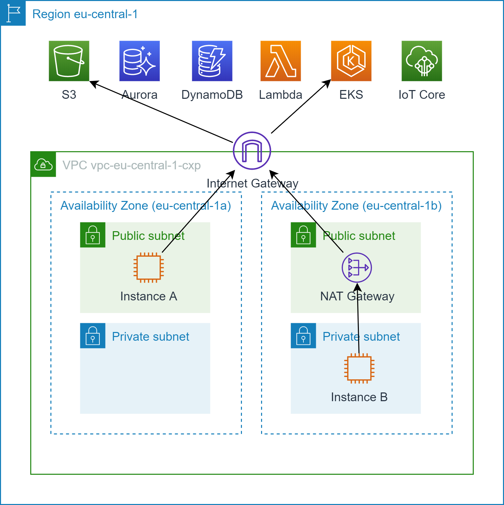
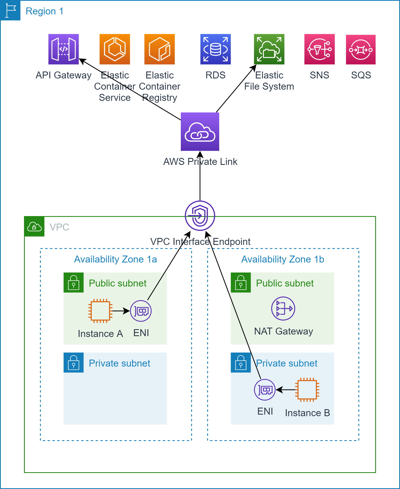
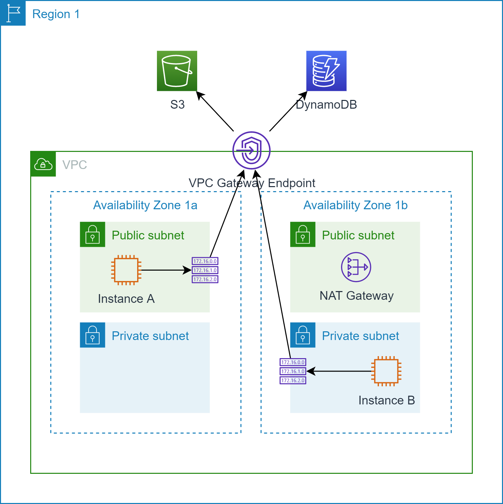

# VPC to AWS services communication

## Motivation

By default, each instance in your VPC has to use an AWS internet gateway to access 
AWS services in the same region. Instances in private networks even had to pass a NAT
gateway, although they never intended to reach the internet.

## VPC Endpoints (VPCE)

A `VPC endpoint` allows you to privately connect to AWS services and other VPC endpoint services supported by AWS Private Link
without requiring to route your traffic through an internet gateway, NAT gateway or NAT instance. 
Privately means that traffic between your VPC and the destination service does not leave the AWS network (which is what AWS Private Link actually does).

There are two types of VPC endpoints:

* Interface endpoints
* Gateway endpoints

In most cases the service you want to access determines the type of VPC endpoint you have to create.

@see [VPC endpoints](https://docs.aws.amazon.com/vpc/latest/userguide/vpc-endpoints.html)

### VPC Interface Endpoints

An `interface endpoint` is an elastic network interface (ENI) with a private IP address from the CIDR range of your subnet
that hosts the entry point to the supported service.

Routing is done automatically by the elastic network interface without having to add a route to your subnet's route table.
Of course, you have to attach the elastic network interface to your instance in order to use the interface endpoint.

> More than __40__ AWS services are supported by AWS Private Link now!
 
@see [Interface VPC endpoints](https://docs.aws.amazon.com/vpc/latest/userguide/vpce-interface.html)

### VPC Gateway Endpoints

A `gateway endpoint` is a gateway that you must specify as a target for a route in your subnet's route table. 
Gateway endpoint were actually available before interface endpoints.

The following AWS services are supported:

* Amazon S3
* Dynamo DB

@see [Gateway VPC endpoints](https://docs.aws.amazon.com/vpc/latest/userguide/vpce-gateway.html)
