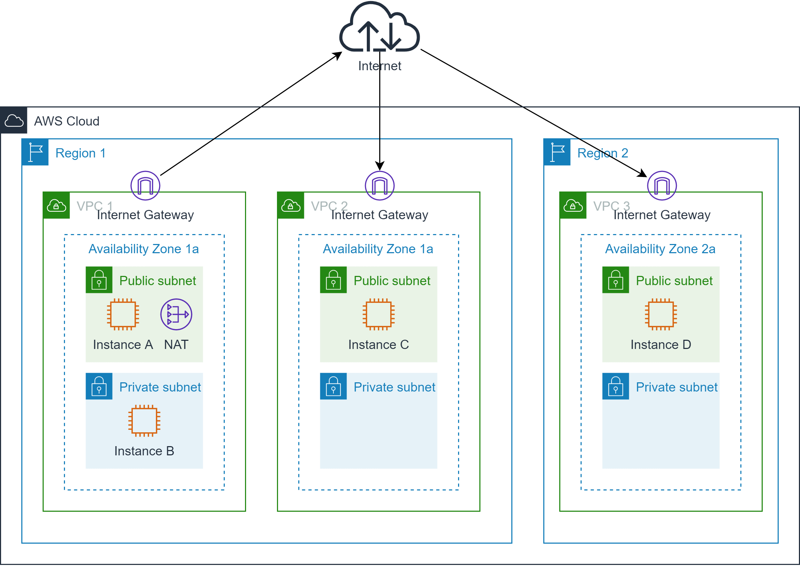
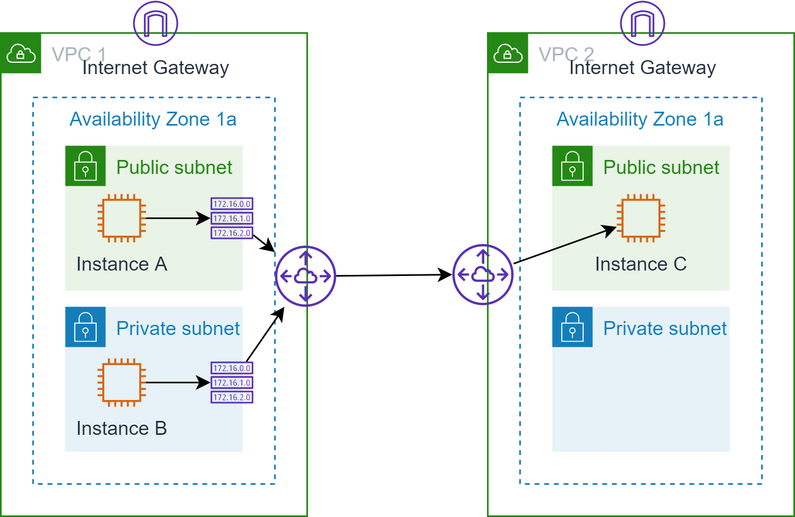
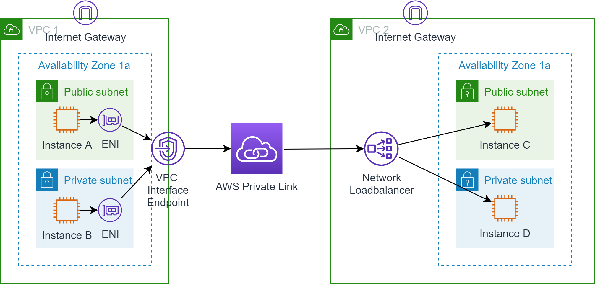
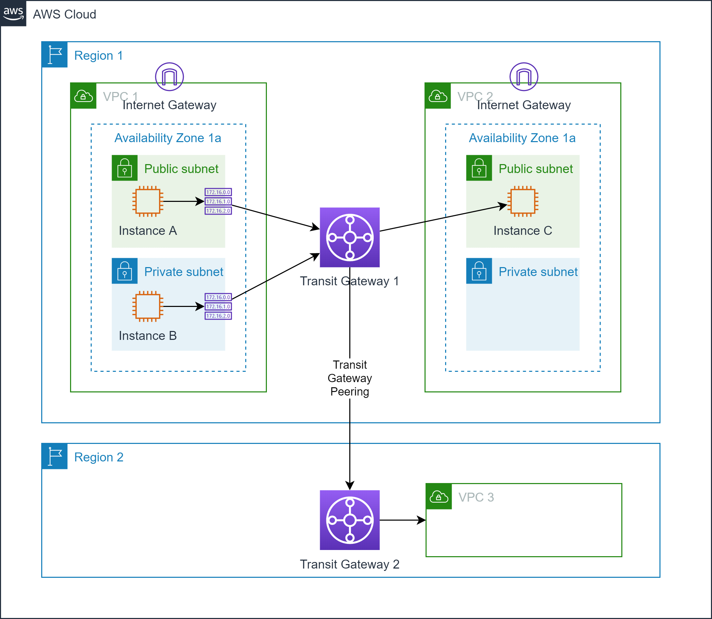

# VPC to VPC communication

## Motivation

By default, each instance in your VPC has to use an AWS internet gateway to access 
instances in other VPCs in the same or other regions via the internet. 
Instances in private networks even had to pass a NAT
gateway, although they never intended to reach the internet.

## VPC Peering

A `VPC peering` connection is a private network connection between VPCs. 
All traffic routed through this connection will stay inside the AWS network.
Instances in either VPC can communicate which each other as if they were in the same VPC. 

@see [What is VPC peering](https://docs.aws.amazon.com/vpc/latest/peering/what-is-vpc-peering.html)

Traffic from an instance in the source VPC to the VPC peering connection has to be explicitly routed by
adding a specific route to the route table of the subnet hosting the source instance.

A VPC peering connection from a source VPC to a destination VPC has to be requested by the source VPC and to be approved by the destination VPC.

!!! danger "Separate CIDR ranges required"
    VPC peering does not support IP address mapping. Thus, the CIDR ranges of all VPCs participating 
    in VPC peering must not overlap.
    
!!! info "VPC peering supports inter-region connections"
    VPC peering connection may be used to connect VPC from different regions as well.
        
### VPC Interface Endpoints with AWS Private Link

Similar to VPC to AWS services communication, an `interface endpoint` may be used to connect a VPC to another
VPC using AWS Private Link. Only downside of this option is: the target has be to a network loadbalancer.

Routing is done automatically by the elastic network interface without having to add a route to your subnet's route table.
Of course, you have to attach the elastic network interface to your instance in order to use the interface endpoint.

This setup only works uni-directional: Only the source VPC can send traffic to the destination VPC. Thus, this
scenario is suitable for public services provided by the destination VPC which are supposed to be consumed by
the source VPC.
 
@see [Interface VPC endpoints](https://docs.aws.amazon.com/vpc/latest/userguide/vpce-interface.html)

### AWS Transit Gateway

A `transit gateway` is the silver bullet AWS service when it comes to connections between VPCs, 
VPNs, corporate networks and the AWS network etc. By default, AWS transit gateway is a region-bound 
service but inter-region connections may be established through transit gateway peering.

As with gateway endpoints, traffic must be explicitly routed from source subnets to the AWS transit gateway 
by adding a specific route to the source subnet's route table.

!!! info "AWS Transit Gateway supports address mapping"
    Best thing about AWS transit gateway is that it supports IP address translation, if the CIDR blocks 
    of the source VPC and the destination network should overlap.
    
@see [What is a transit gateway?](https://docs.aws.amazon.com/vpc/latest/tgw/what-is-transit-gateway.html)
