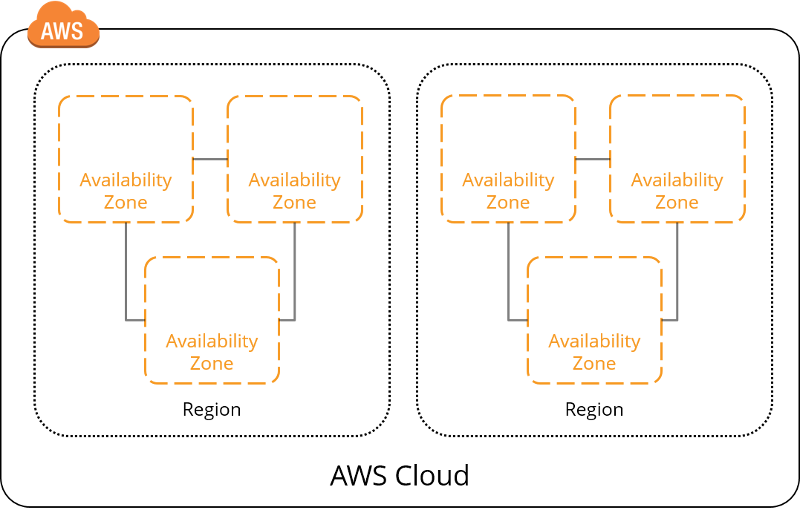
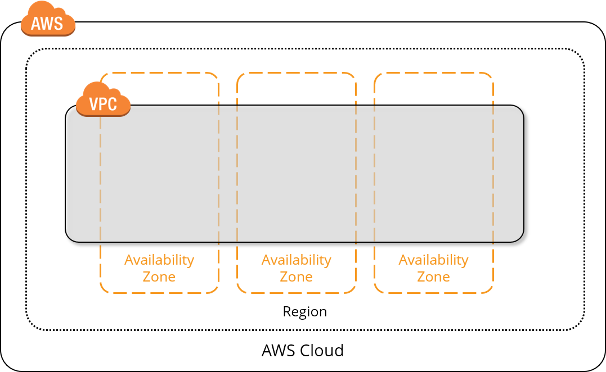
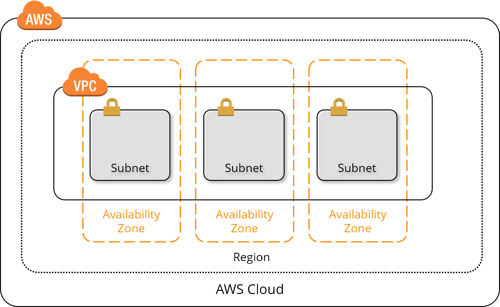
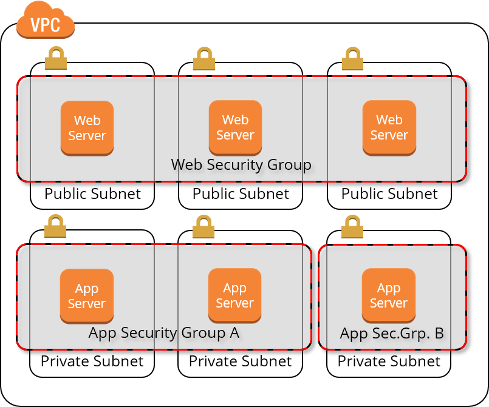
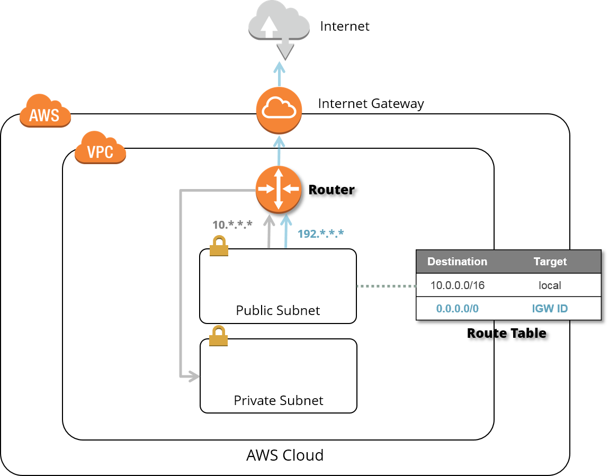
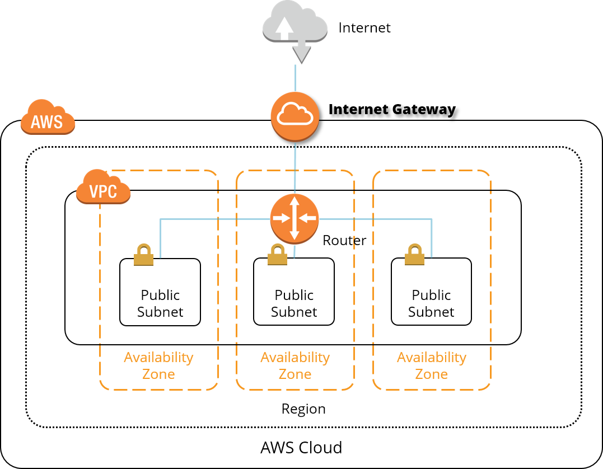
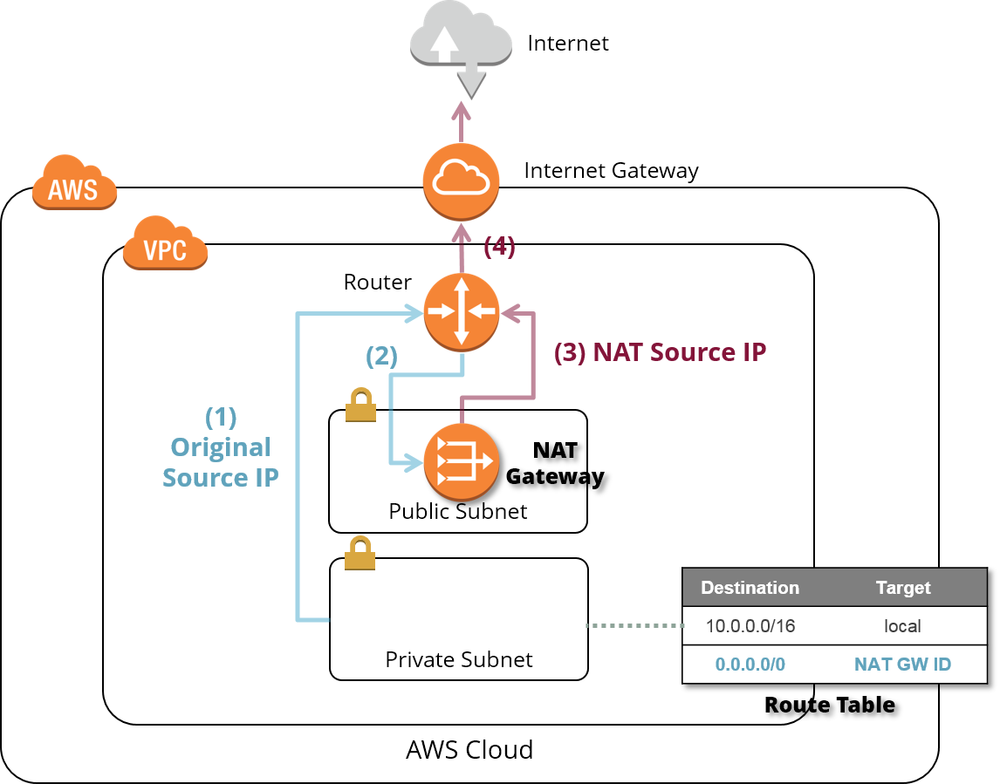

# AWS VPC Basics

Here you will find a description of the most important terms and concepts to get you started quickly in the world of the AWS Cloud.

## Terms and Concepts

### Region

A `region` is a separate geographic area in which AWS offers its cloud services. It is completely separated from all other regions in order to ensure the highest possible reliability and stability.

Most AWS resources must be assigned to a region in which they are supposed be hosted. 
An AWS user account gives you access to almost all available regions. Exception: A user account at AWS China can only access the China region.

AWS is represented in Germany with the __eu-central-1__ region in the Frankfurt / Main area.

@see [Region](http://docs.aws.amazon.com/AWSEC2/latest/UserGuide/using-regions-availability-zones.html)

@see [AWS Global Infrastructure](https://aws.amazon.com/about-aws/global-infrastructure/)

### Availability Zone (AZ)

An `availability zone` is represented by a single independent data center or a group of independent data centers.
There are at least 2 - usually 3 - availability zones per [region](#region), i.e. 2 to 3 data centers 
that are at least 40 kilometers apart, but are connected to each other via high-bandwidth data lines with low latency.

Most AWS resources have to be assigned to an Availability Zone in which they are hosted.

@see [Availability Zone](http://docs.aws.amazon.com/AWSEC2/latest/UserGuide/using-regions-availability-zones.html)

### Virtual Private Cloud (VPC)

A `virtual private cloud` is a virtual network that is tied to an AWS user account. It is logically isolated from other virtual networks, i.e. by default, all resources in a VPC are only visible within the VPC.

Each AWS account provides a default VPC from the beginning.

A VPC spans all [availability zones](#availability-zone-az) in a [region](#region). 
The IP address range - the so-called CIDR block - for all resources within the VPC must be defined when the VPC is created 
and cannot be changed later. It is therefore advisable to reserve a large address range immediately, 
e.g. / 16 (corresponds to 65534 IP addresses). If you need more IP addresses after a VPC has been created, you can
add a second CIDR block to it.

@see [Virtual Private Cloud (VPC)](http://docs.aws.amazon.com/AmazonVPC/latest/UserGuide/VPC_Introduction.html)

### Subnets

VPCs can be subdivided further with the help of subnets. 
A subnet must be within a [VPC](#virtual-private-cloud-vpc) and within an [availability zones](#availability-zone-az). 
As with a VPC, the IP address range of the subnet must also be specified when it is created and cannot be changed later. 
The subnet's CIDR block must be a subset of the VPC's CIDR block.

There are two types of subnets:

* __public__ subnets are accessible from the internet
* __private__ subnest are only visible within a VPC

By default, all subnets within a VPC can communicate with each other. 
Restrictions can be defined via security groups and route tables.

@see [Subnets](http://docs.aws.amazon.com/AmazonVPC/latest/UserGuide/VPC_Introduction.html)

### Security Groups

A `security group` acts like a virtual firewall that controls incoming and outgoing connections to an instance 
(VMs, load balancers or gateways). 
Rules can be added to a security group. 
Each rule describes which protocol and port can be used to communicate from or to which IP addresses.

A security group can then be assigned to an EC2 instance (VM at AWS), for example. 
Then this particular EC2 instance can only communicate with the outside world in accordance with the rules specified in the security group. 
Of course, a security group can be assigned to multiple instances. 
In this way, instances with the same security requirements can be grouped into logical groups.

Example:

* Web servers run in public subnets, since they must be accessible via the Internet.
* Web servers only listen to HTTPS on port 443.
* Web servers only send over HTTPS on port 443.
* Web servers must be able to accept connections from any IP from the Internet.
* Appservers run in private subnets, since they only have to be accessible via the webserver.
* Appservers only listen to HTTPS on port 443.
* Appserver only send over HTTPS on port 443.
* Appserver may only accept internal connections from the VPC.
* Appserver 3 (far right) must also communicate with a message broker.

The web servers are now combined in the Web Security Group, all app servers end up in app security group A except for app server 3, which is assigned to app security group B.
 
A security group can subsequently be changed either via the AWS console or the AWS CLI. The changes take effect automatically after they have been saved for all instances of the Security Group.

Although it is possible to share security groups among VPCs, security groups are assigned to a VPC in general and can be used in all subnets of the VPC. 
 
@see [Security Groups](http://docs.aws.amazon.com/AmazonVPC/latest/UserGuide/VPC_SecurityGroups.html)

### Route Tables

If you want to control connections between entire subnets rather than connections between instances, then `route tables` come into play. 
Each subnet in a VPC has such a route table: If you do not explicitly assign a special route table, each subnet receives 
a master route table when it is created, which simply allows all connections.

!!! info "Implicit router in each VPC"
    Each VPC comes with a router, which controls any network traffic within a VPC and any outbound network traffic from a VPC.

A route table consists of rules:

* Each rule defines a route to a destination IP address range (_Destination_) via a specific intermediate station (_Target_). 
This intermediate station can be, for example, an Internet gateway or a NAT gateway.
* Each route table has a so-called main route, which always allows local traffic within the VPC. 
This main route cannot be changed and cannot be removed from the route table.

__Beispiel__: Routing traffic from public subnets to the internet via an Internet Gateway

Destination | Target | Beschreibung
----------- | ------ | ------------
10.0.0.0/16 | local  | Main route that routes connections from the subnet to all local destinations in the VPC
0.0.0.0/0 | _Internet Gateway ID_ | Special route that routes all connections from the subnest to remote destinations on the internet through the given internet gateway

__Beispiel__: Routing traffic from private subnets to the internet through NAT Gateway

Destination | Target | Beschreibung
----------- | ------ | ------------
10.0.0.0/16 | local  | Main route that routes connections from the subnet to all local destinations in the VPC
0.0.0.0/0 | _NAT Gateway ID_ | Special route that routes all connections from the subnest to remote destinations on the internet through the given NAT gateway 

@see [Route Tables](http://docs.aws.amazon.com/AmazonVPC/latest/UserGuide/VPC_Route_Tables.html)
    
### Internet Gateways (IGW)

An `internet gateway` is a horizontal scaling, redundant and highly available VPC component
that allows traffic between instances within a VPC and the internet.

The internet gateways has two tasks:

* To provide a target for routes in routing tables, through which the traffic can be directed to the internet.
* Hide public IP addresses of instances in the VPC from the internet via NAT (Network Address Translation).

!!! warning "Internet-bound traffic has to be routed explicitly"
    The internet gateway must be defined as a target in the route table of each public subnet, 
    in order to be able to communicate with the internet!

@see [Internet Gateways](http://docs.aws.amazon.com/AmazonVPC/latest/UserGuide/VPC_Internet_Gateway.html)

### NAT Gateways and NAT Instances

Instances from private subnets can establish connections to the Internet and other AWS services using NAT components. At the same time, the NAT components prevent a connection to the private instances from being opened from the Internet.

Using IP address mapping (Network Address Translation), the NAT components ensure that the IP addresses of the private 
entities do not reach the Internet: the actual IP addresses of the private entities are replaced by the IP address of the NAT components.

Initially, AWS only offered so-called `NAT instances` for address translation. 
These NAT instances are preconfigured EC2 instances that are based on a specific image. 
It soon became obvious that the performance of NAT instances was degrading rapidly if they had to handle heavy traffic. 
Besides that, NAT instances are not automatically redundant and highly available.

For this reason, AWS decided to introduce the `NAT gateway`. A NAT gateway is an AWS NAT service that automatically scales 
and offers the desired reliability and high availability.

!!! tip "Always protect private instances using NAT" 
    Even in simple VPC installations, all instances in private subnets should be protected via NAT gateways, if they need to communicate with the internet.
    
NAT instances or NAT gateways must be started in public subnets because they are supposed to communicate with the Internet. In order to guarantee a high level of reliability and at the same time optimize the traffic in your own VPC, a NAT instance or a NAT gateway should be provided for each availability zone.

!!! warning "Route all internet-bound traffic from private subnets through NAT using route tables" 
    In order for the private subnets to be able to communicate with the Internet in a secure way, the route tables of the private subnets must be adapted so that every connection directed to the Internet runs via the NAT instance or the NAT gateway in the same availability zone.

@see [NAT Gateways and NAT Instances](http://docs.aws.amazon.com/AmazonVPC/latest/UserGuide/vpc-nat.html)

### Elastic IP (EIP) 

An `elastic IP` address is a static public IP address that can be dynamically assigned to specific EC2 instances or network interfaces. The main difference from normal public IP addresses is that an elastic IP address is not lost when the instance to which it is attached is removed.

Elastic IP addresses are therefore the means of choice if you want to permanently reserve a set of public IP addresses for accessibility from the Internet without having to commit yourself to specific instances.

Unfortunately, EIPs are very rare: Usually, you can only reserve 5 EIPs in one region per AWS user account. 
However, if you consider that an EIP is a public IPv4 address and we are living in a time 
when we are slowly running out of IPv4 addresses, then this constraint understandable. 
In exceptional cases, you can negotiate with AWS to increase this limit.

!!! tip "Use elastic IP to access AWS resources via SSH"
    By default, any outbound SSH traffic from the msg network is blocked.
    Therefore it is advisable to reserve an elastic IP for specific jump boxes 
    (bastion servers in AWS jargon) first before requesting a firewall rule for this elastic IP via 
    TUFIN.

@see [Elastic IP](http://docs.aws.amazon.com/AmazonVPC/latest/UserGuide/vpc-eips.html)