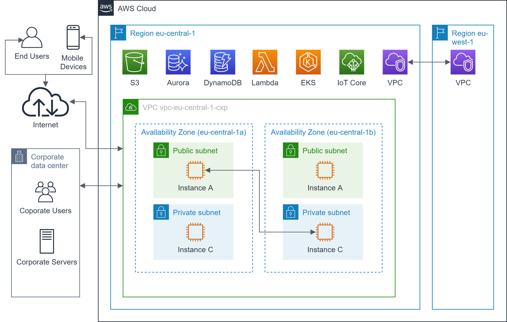

# VPC Extended Networking: Ways to get into and out of your VPC

## Overview

In most non-trivial use cases, a single VPC is never an island but needs to communicate
with other AWS services, AWS VPC or coporate networks as well:

* Instances in your VPC need to talk to AWS services in the same region [VPC to AWS services communication](vpc_2_aws_services.md).
* Instances in your VPC need to talk to instances in other VPCs in the same or other regions [VPC to VPC communication](vpc_2_vpc.md).
* End users and mobile devices need to access your AWS services or instances from the internet.
* Corporate users in corporate networks need to access your AWS services or instance through VPN tunnels 
via the internet or without using the internet at all [AWS Site-to-Site communication](site_2_site.md).
* Corporate servers must talk to your AWS resources and vice versa [AWS Site-to-Site communication](site_2_site.md).

## Resources

[AWS re:Invent 2019: Advanced VPC design and new capabilities for Amazon VPC (NET305-R1)](https://youtu.be/7acKgdDOOu4)

[AWS re:Invent 2019: Connectivity to AWS and hybrid AWS network architectures (NET317-R1)](https://youtu.be/eqW6CPb58gs)