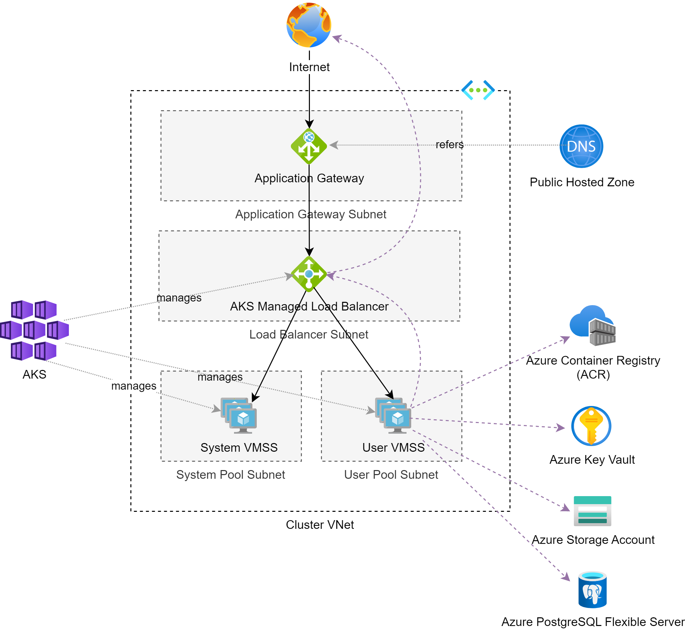
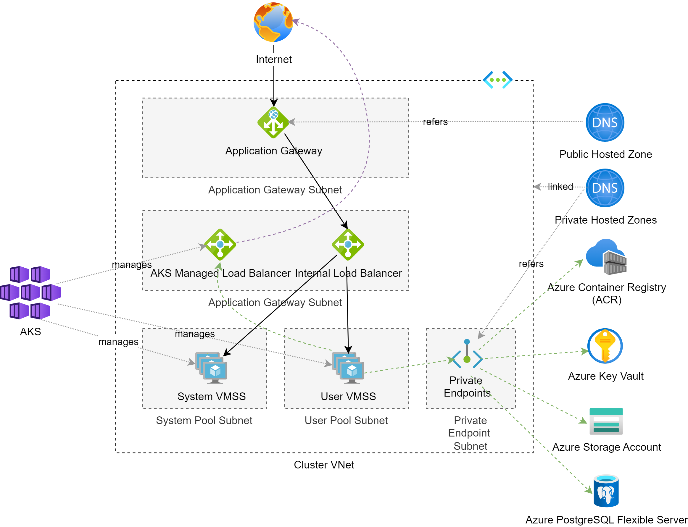

# Azure Kubernetes Service (AKS)

## Introduction

`Azure Kubernetes Service` or AKS is the Kubernetes as a Service offering of Microsoft Azure.
All master nodes of the Kubernetes cluster - or in other words: the control plane of the Kubernetes cluster - 
are managed by Azure. 
All you have to provide are the worker nodes usually hosted by [virtual machine scale sets](../vm/vm_basics.md#virtual-machine-scale-set).

## Simple AKS setup

The AKS cluster instance uses two node groups or pools implemented as [virtual machine scale sets](../vm/vm_basics.md#virtual-machine-scale-set):

* the `system node group` or `system pool` provides all worker nodes supposed to handle system workloads for cluster management etc.
* the `user node group` or `user pool` provides all worker nodes supposed to handle non-system workloads 
like applications, jobs and tool stacks for ingress, logging, monitoring and tracing.

Both VMSS use autoscaling to handle increasing or decreasing workload. 
To ensure high availability, all VMSS are spanning all availability zones (if present) and 
VMs are evenly distributed across the availability zones.

The VNet hosting the node groups contains at least three subnets:

* one subnet for the application gateway
* one subnet for the user node group or user pool
* one subnet for the system node group or system pool

An optional fourth subnet could host all DBaaS instances used by applications running on the cluster.

An [application gateway](../vnet/vnet_basics.md#application-gateway) acts as a level-7 loadbalancer in front of the AKS cluster.
It uses a SSL certificate created and managed by a key vault to terminate HTTPS. 
All incoming traffic is mainly forwarded via the AKS manage load balancer to the user pool which is hosting the Traefik ingress controller.

A dedicated DNS zone manages all DNS records referring to external names of services hosted on the AKS cluster.
Each DNS record contained in the DNS zone points to the application gateway. The application gateways does all forwarding into the cluster. 

Outbound traffic from the private nodes outside the VNet is routed through the AKS managed load balancer which handles all NATting.

## Refined AKS setup

The VNet hosting the node groups contains at least four subnets:

* one subnet for the application gateway
* one subnet for the user node group or user pool
* one subnet for the system node group or system pool
* one subnet for the internal load balancer managed by AKS
* one subnet for the private endpoints

An optional fifth subnet could host all DBaaS instances used by applications running on the cluster.

An internal load balancer is added to host the private endpoint of the ingress controller installed in the AKS cluster.
The application gateway forwards all inbound traffic to the cluster via this internal load balancer using private IPs.
Since the ingress controller never registers with the public default load balancer, there is no public endpoint into the cluster anymore
(which is besides the public IP address of the application gateway of course!).

Private DNS zones host the private DNS records for the Azure services. These private DNS zones must be linked to the VNet.

Outbound traffic to Azure services like Azure Container Registry, Azure Key Vault, Azure Storage Accounts and Azure databases
routed through private endpoints which keeps the communication between the nodes and the Azure services private. Each Azure service instance
requires its own dedicated private endpoint plus a private DNS record in the private hosted zones.

## Reference Setup for production-ready AKS clusters

The Azure documentation provides a reference setup called `Azure Kubernetes Service (AKS) production baseline`, which
can be used as a good starting point to set up AKS clusters in production.

A production-ready setup of an AKS cluster differs significantly from the simple setup mentioned before.
Please check [Azure Kubernetes Service (AKS) production baseline](https://docs.microsoft.com/en-us/azure/architecture/reference-architectures/containers/aks/secure-baseline-aks) for details.

@see [Azure Kubernetes Service (AKS) production baseline](https://docs.microsoft.com/en-us/azure/architecture/reference-architectures/containers/aks/secure-baseline-aks)

## Resources

[Azure Kubernetes Service (AKS)](https://docs.microsoft.com/en-us/azure/aks/) Official Azure Documentation