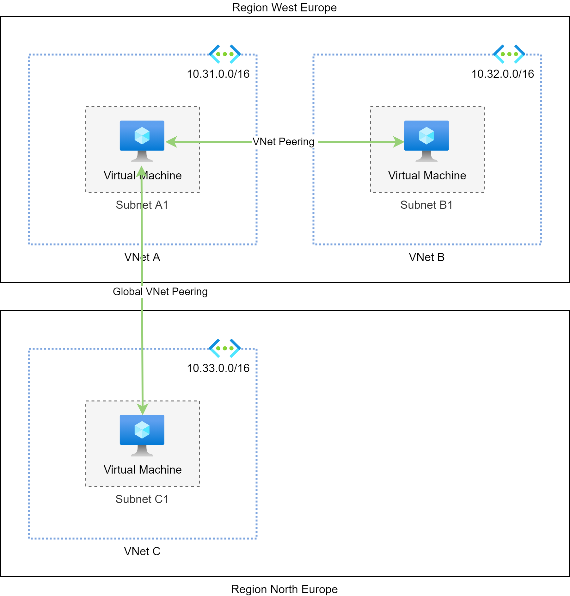

# VNet-to-VNet with VNet Peering

Virtual network peering allows you to connect two VNets to each other. The two VNets may reside:

* in the same region
* in different regions (global VNET peering)
* in different subscriptions (cross-subscription VNet peering)

Adding a peering connection to your VNet automatically adds all required routes to the system route table of the  
subnets in your VNet.

The CIDR ranges of the peer VNets must not overlap since a peering connection does not provide any NAT capabilities.

All peering connections are using the Azure network only even if they cross region boundaries.
Thus all traffic is private by default and you will benefit from the high bandwith and the low latency of the Azure backbone.

Traffic through peering connections is not encrypted: if you need confidential transport you have to implement it on your own.

!!! info
    When using Terraform remember to create `azurerm_virtual_network_peering` resource for both directions
    of the peering connection. Otherwise, the peering will remain in an incomplete state which block all communication
    between the VNets.
    
@see [Virtual network peering](https://docs.microsoft.com/en-us/azure/virtual-network/virtual-network-peering-overview)
 
@see [Terraform azurerm_virtual_network_peering](https://registry.terraform.io/providers/hashicorp/azurerm/latest/docs/resources/virtual_network_peering)

