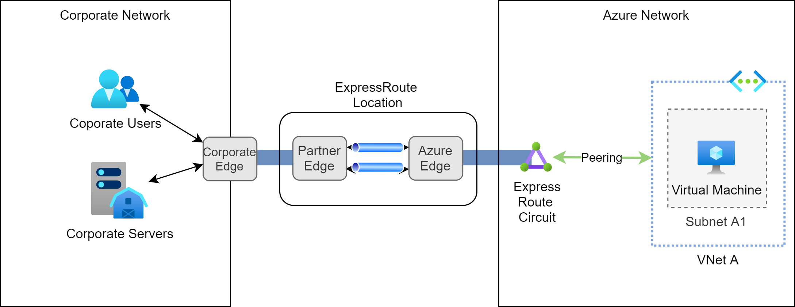

# Site-to-Site with ExpressRoute

ExpressRoute lets you extend your on-premises networks into the Microsoft cloud over a private connection 
with the help of a connectivity provider.

This setup actually requires setting up hardware at a physical ExpressRoute location. An ExpressRoute partner sets up 
a partner edge router at a specific ExpressRoute location. 
This partner edge router is connected to an Azure edge router using at least two channels to ensure high availability.
The Azure edge router has direct access to the Azure network. 
An ExpressRoute endpoint within the Azure network is called an ExpressRoute circuit. 
A VNet on the Azure network can be connected to an ExpressRoute circuit via a private peering connection.

@see [ExpressRoute documentation](https://docs.microsoft.com/en-us/azure/expressroute/) 