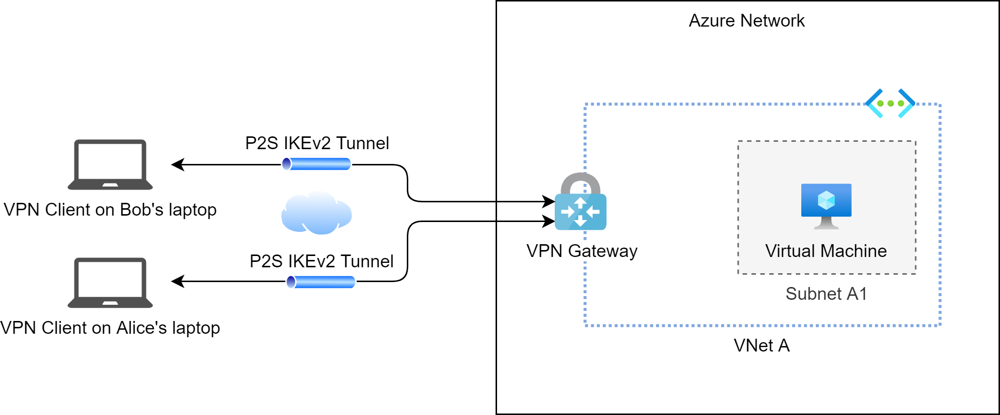
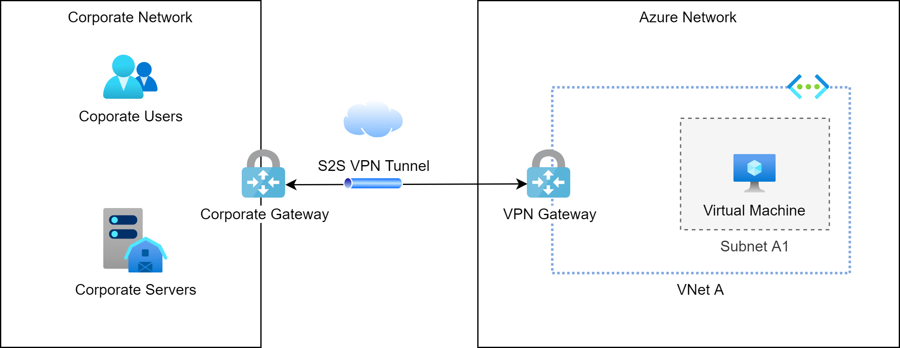

# Point-to-Site/Site-to-Site with VPN Gateways

VPN Gateways enable you to connect the Azure network to corporate networks using either

* public encrypted VPN connections through the internet
* or private encrypted connections through Azure ExpressRoute

It's worth knowing that you have options available for VPN Gateway connections:

* Point-to-Site 
* Site-to-Site
* Site-to-Site with ExpressRoute

@see [VPN Gateway documentation](https://docs.microsoft.com/en-us/azure/vpn-gateway/)

## Point-to-Site

A Point-to-Site (P2S) VPN gateway connection lets you create a secure connection to your virtual network from 
an individual client computer. 
A P2S connection is established by starting a VPN client on a client computer. 
This solution is useful for everyone who wants to connect to Azure VNets using secured transport from a potentially 
insecure remote location, such as from home or from a public conference. 
P2S VPN is also a useful solution to use instead of S2S VPN when you have only a few clients that need to connect to a VNet.

Unlike S2S connections, P2S connections do not require an on-premises public-facing IP address or a VPN device. 
P2S connections can be used with S2S connections through the same VPN gateway, as long as all the configuration 
requirements for both connections are compatible.

## Site-to-Site

A Site-to-Site (S2S) VPN gateway connection is a connection over IPsec/IKE (IKEv1 or IKEv2) VPN tunnel. 
S2S connections can be used for cross-premises and hybrid configurations. 
A S2S connection requires a VPN device located on-premises that has a public IP address assigned to it.

## Multi-Site

This type of connection is a variation of the Site-to-Site connection. 
You create more than one VPN connection from your virtual network gateway, typically connecting to multiple on-premises sites. 
When working with multiple connections, you must use a RouteBased VPN type. 
Because each virtual network can only have one VPN gateway, all connections through the gateway share the available bandwidth.

## Site-to-Site with ExpressRoute

A peering connection from a VNet to an ExpressRoute circuit does not require any gateway at all. Thus, it is not listed here. 
Nevertheless, ExpressRoute and VPN Gateway Site-to-Site connections may coexist.
