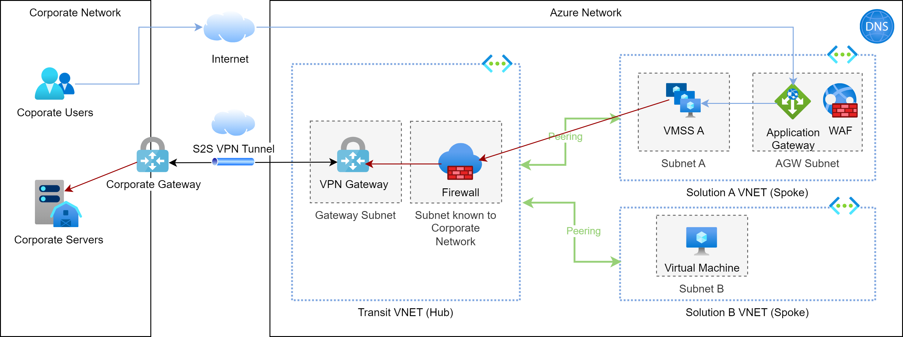

# Site-to-Site with Hub-Spoke

Disregarding the type of site-to-site you will choose (VPN Gateways or ExpressRoute), it's always
a good idea to keep the complexity of the site-to-site network link out of your VNet.

A dedicated `hub` VNet acts like a transit or gateway VNet to your corporate network. The hub VNet contains 
all the network components which are necessary to connect the Azure network to a corporate network. All outbound traffic is sent through 
an Azure Firewall which controls the traffic and optionally performs source NAT-ting to map private Azure IP addresses
to private corporate IP addresses.

All VNets requiring connections to the corporate network are attached as `spoke`s to the hub VNet using
peering connections.

Of course, this Azure network - Corporate network link can work bi-directionally!