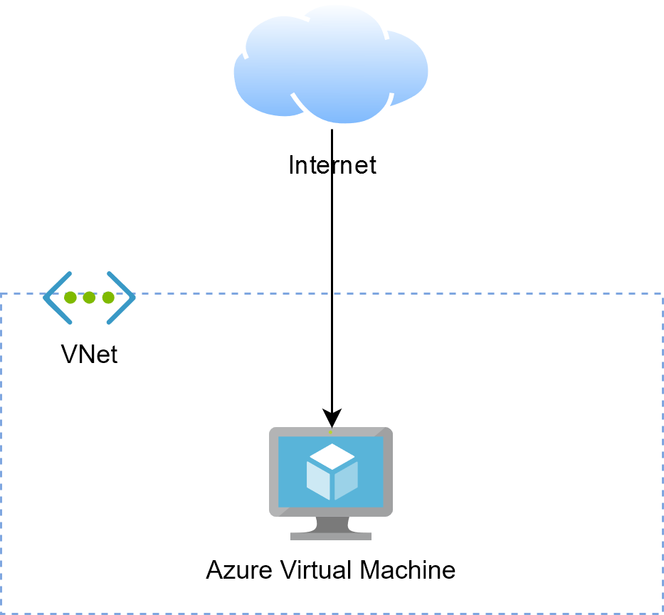

# Virtual Network Basics

## Azure Virtual Network (VNet)

Azure Virtual Network (VNet) is the fundamental building block for your private network in Azure.

Each VNet come with the following capabilities:

* Address space: each VNet has its own IP address space that you must specify upon creation.

* Subnets: allow you to segment your VNet into smaller networks with their own address space.

* Regions: a VNet is bound to a specific region but may communicate with VNet from other regions
through Virtual Network Peering

* Subscription: a VNet is associated with a subscription

All resources hosted in a VNet can communicate outbound to the internet by default. 
Inbound traffic from the internet to a resource is enabled by simply assigning a public IP address
to it.

## Subnets
t
## Network Security Groups

@see [Network security groups](https://docs.microsoft.com/de-de/azure/virtual-network/network-security-groups-overview)

## Application Security Groups

@see [Application security groups](https://docs.microsoft.com/de-de/azure/virtual-network/application-security-groups)

## NAT Gateways

@see [Designing virtual networks with NAT gateway resources](https://docs.microsoft.com/de-de/azure/virtual-network/nat-gateway-resource)