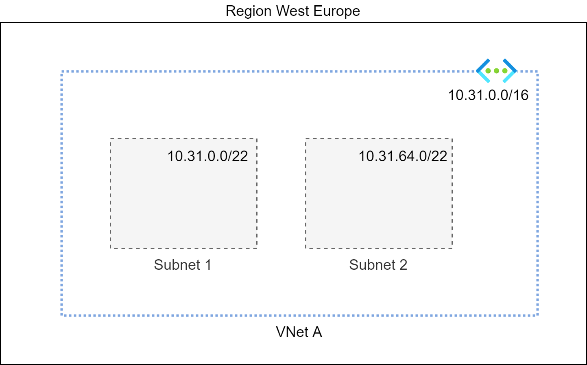
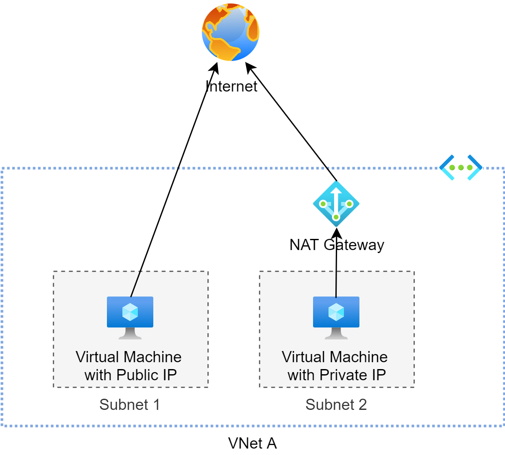
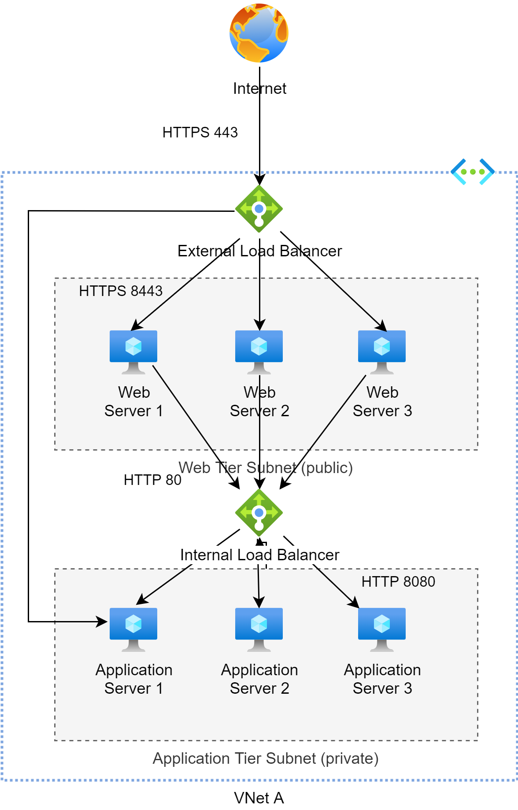
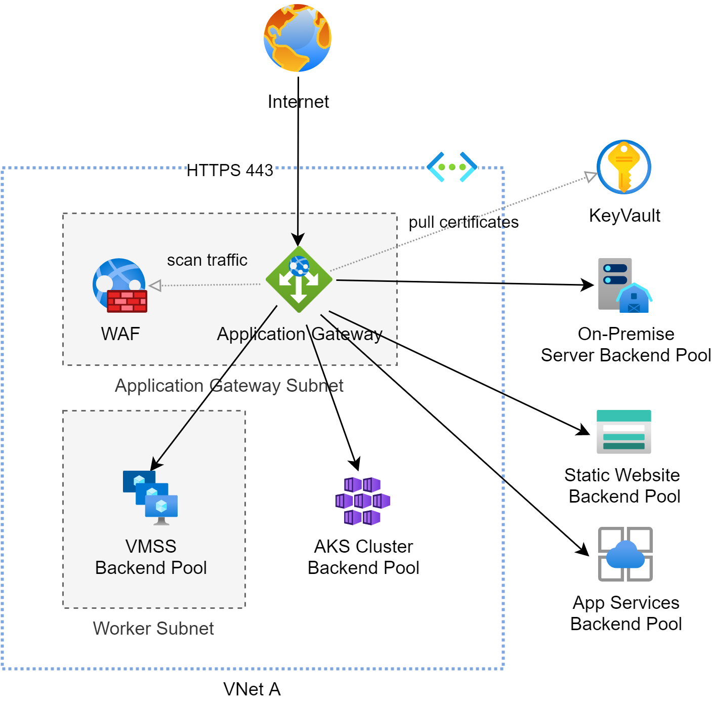
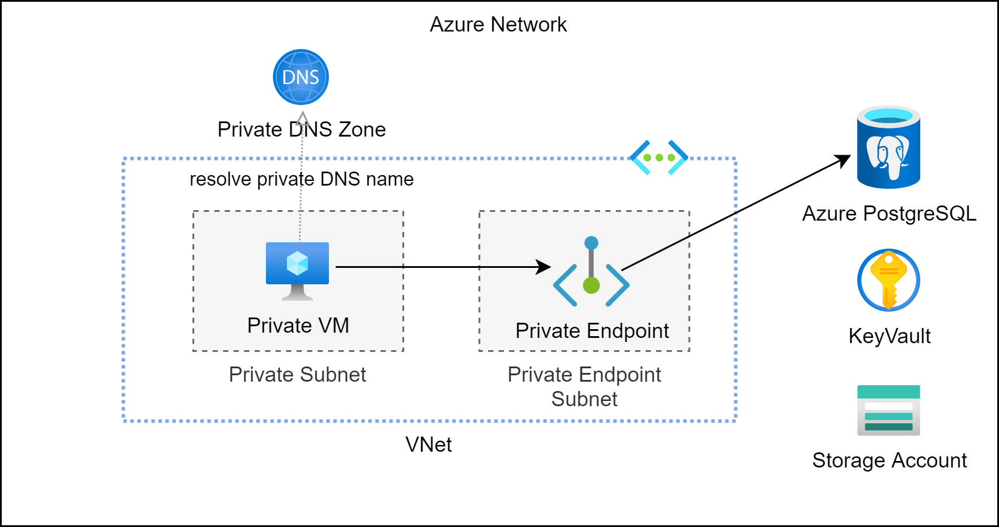

# Virtual Network Basics

## Azure Virtual Network (VNet)

Azure Virtual Network (VNet) is the fundamental building block for your private network in Azure.

Each VNet come with the following capabilities:

* Address space: each VNet has its own IP address space that you must specify upon creation.

* Subnets: allow you to segment your VNet into smaller networks with their own address space.

* Regions: a VNet is bound to a specific region but may communicate with VNet from other regions
through Virtual Network Peering

* Subscription: a VNet is associated with a subscription

All resources hosted in a VNet can communicate outbound to the internet by default. 
Inbound traffic from the internet to a resource is enabled by simply assigning a public IP address
to it.

@see [Virtual Network documentation](https://docs.microsoft.com/en-us/azure/virtual-network/)

@see [Terraform azurerm_virtual_network](https://www.terraform.io/docs/providers/azurerm/r/virtual_network.html)

## Subnets

`Subnets` allow you to segment your VNet into smaller networks with dedicated address spaces and tailored network access control
via network security groups.

A subnet spans all [availability zones](../az_get_started.md#availability-zones) of a [region](../az_get_started.md#region).
Although a subnet may have multiple address prefixes (CIDR blocks), it's always a good idea to think about how to
distribute your VNets address space among your subnets, before you actually create them.
Subnets must have distinct non-overlapping address prefixes.

@see [Virtual Network documentation](https://docs.microsoft.com/en-us/azure/virtual-network/)

@see [Terraform azurerm_subnet](https://www.terraform.io/docs/providers/azurerm/r/subnet.html),
[cidrsubnets](https://www.terraform.io/docs/configuration/functions/cidrsubnets.html)

## Network Security Groups

A `network security group` allows you to control network traffic inside your VNet on a subnet level.
By default, your subnets will not have any traffic restrictions. If you want to be more specific about which subnet is allowed
to talk to which other subnet you need to create a network security group and to attach it to the subnets.

A network security group consists of a set of rules which come in two different flavours: ingress rules control inbound traffic,
egress rules control outbound traffic. 
Each network security group has a set of default rules, which are automatically added to the group when it is created.
 
@see [Network security groups](https://docs.microsoft.com/en-us/azure/virtual-network/network-security-groups-overview)

@see [Terraform azurerm_network_security_group](https://www.terraform.io/docs/providers/azurerm/r/network_security_group.html)

## Application Security Groups

@see [Application security groups](https://docs.microsoft.com/en-us/azure/virtual-network/application-security-groups)

## NAT Gateways

A `NAT gateway` is an Azure service which offers a highly available and scalable NAT solution.

The NAT gateway can be attached to private subnets in a VNet. 
The internet-bound traffic of any resource within the private subnet is automatically routed to the attached NAT gateway
which having to add an explicit route to the subnets route table.

Each NAT gateway needs either a [public IP](#public-ip) or a [public IP prefix](#public-ip-prefix) to be able to translate private IP addresses into public ones.  

@see [Designing virtual networks with NAT gateway resources](https://docs.microsoft.com/en-us/azure/virtual-network/nat-gateway-resource)

@see [Terraform azurerm_nat_gateway](https://www.terraform.io/docs/providers/azurerm/r/nat_gateway.html)

## Public IP

A `public IP` defines a public IP address which may be allocated statically or dynamically.
Each resource that needs to be accessible from the internet must have a public IP address.

Of course, Azure supports IPv4 and IPv6 addresses.

@see [Public IP addresses](https://docs.microsoft.com/en-us/azure/virtual-network/public-ip-addresses)

@see [Terraform azurerm_public_ip](https://www.terraform.io/docs/providers/azurerm/r/public_ip.html)

## Public IP Prefix

A `public IP prefix` is a reserved contiguous range of static public IP addresses.
The actual contiguous IP addresses will be picked from the set of public IP addresses available in a [region](../az_get_started.md#region). 

The size of the static public IP address pool has to be determined when the public IP prefix is allocated.
A prefix of `/28` specified on creation for example will result in a public IP prefix with 16 public IP addresses.

@see [Public IP address prefix](https://docs.microsoft.com/en-us/azure/virtual-network/public-ip-address-prefix)

@see [Terraform azurerm_public_ip_prefix](https://www.terraform.io/docs/providers/azurerm/r/public_ip_prefix.html)

## Bastion 

`Azure Bastion` is an Azure service which enables you to access private resources in your VNet directly from the Azure Portal
using either RDP or SSH.

!!! danger
    If you want to add the Azure Bastion service to your VNet, you must add a subnet named `AzureBastionSubnet`!

@see [Azure Bastion documentation](https://docs.microsoft.com/en-us/azure/bastion/)

@see [Terraform azure_bastion_host](https://www.terraform.io/docs/providers/azurerm/r/bastion_host.html)

## Load Balancer

An Azure `load balancer` is a Level-4 load balancer which distributes inbound traffic
that arrive at the load balancer's front end to backend pool instances.
The routing happens according to load balancing rules and health probes.
The backend pool instance can be [virtual machine](../vm/vm_basics.md#virtual-machine)s 
or instances in a [virtual machine scale set](../vm/vm_basics.md#virtual-machine-scale-set).

!!! info
    An Azure load balancer resembles an AWS Network Load Balancer.

   
@see [Load Balancer documentation](https://docs.microsoft.com/en-us/azure/load-balancer/)

@see [Terraform azurerm_lb](https://registry.terraform.io/providers/hashicorp/azurerm/latest/docs/resources/lb)

## Application Gateway

An Azure `application gateway` is a Level-7 load balancer which distributes inbound web traffic
to your web applications.

An application gateway includes the following features:
* Host-based or path-based routing
* SSL/TLS termination
* Ingress Controller for AKS
* Websocket and HTTP/2 support
* ...
 
!!! info
    An Azure Application Gateways can be compared to an AWS Application Load Balancer.

@see [Azure Application Gateway documentation](https://docs.microsoft.com/en-us/azure/application-gateway/)

@see [Terraform azurerm_application_gateway](https://registry.terraform.io/providers/hashicorp/azurerm/latest/docs/resources/application_gateway)

## Private Endpoints

Private endpoints allow you the keep the traffic between the resources running inside your VNet and the Azure services running outside your VNet private.

Private endpoints should be kept in a dedicated private subnet of your VNet. Each private endpoint pulls a private IP address from the address space of this particular subnet.
Since you do not want to work with IP addresses when using private endpoints, you will need to attach private DNS zones to your VNet.
These private DNS zones hold the private DNS records mapping private DNS names of Azure services to private IPs of the private endpoints.

!!! info
    Unfortunately Azure uses different DNS domains for each Azure service. 
    Thus, you will need multiple private DNS zones hosting the private DNS records.

@see [Azure Private Link documentation](https://learn.microsoft.com/en-us/azure/private-link/private-endpoint-overview)

