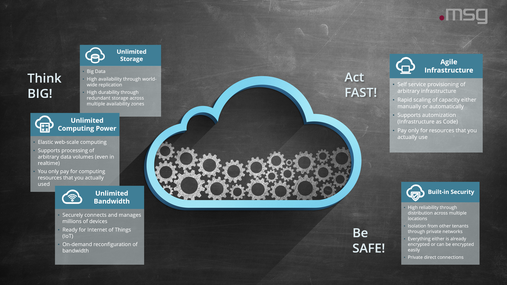

# Cloud Capabilities

This page introduces some basic cloud capabilities 
which allow you to think big, act fast and be safe at the same time.

## Overview

Most successful contemporary __cloud native__ companies like Netflix, Uber, Spotify, etc share common characteristics:

* High velocity of innovation allows them to deliver new solutions at a rapid pace
* Their services are permanently available
* [Web Scale IT](https://blogs.gartner.com/cameron_haight/2013/05/16/enter-web-scale-it/) enables them to achieve extreme levels of service delivery
* They offer optimal user experience on mobile devices

These cloud native companies didn't invent the cloud as we know it today but they almost exlusively rely on the cloud 
to think big, act fast and be safe.

## Think BIG! 

### Unlimited Storage

Big Data requires storage capacity which can grow without limits. World-wide replication allows you to bring your data
to globally dispersed locations minimizing access time. Redundant storage across multiple availability zones ensures
a high durability of your data.

### Unlimited Computing Power

Elastic web-scale computing allows the computing capacity to automatically adapt to the current workload you need to handle.
This elasticity enables processing of arbitrary data volumes - even in realtime. 

Good thing is: you only pay for computing resources that you actually use.

### Unlimited Bandwidth

Most modern businesses need to be ready for the Internet of Things (IoT). 
The cloud securely connects and manages millions of devices.
On-demand reconfiguration of bandwidth enables you to handle peaks in network traffic effortlessly.
 
Good thing is: you only pay for the traffic which actually passed through your network.

## Act FAST!

### Agile Infrastructure

Self service provisioning of arbitrary infrastructure significantly decreases the time you need to provision new infrastructure.
Rapid scaling of capacity can be done either manually or automatically.
An agile infrastructure facilitates automization via __Infrastructure as Code__.

Good thing is: you pay only for resources that you actually use

## Be SAFE!

### Built-in Security

Everything you run on the cloud is highly reliable through distribution across multiple locations.
Private networks completely isolate you from other tenants using the same cloud provider.
Data in transit or data on rest is already encrypted or can be encrypted easily.
Private direct connections allow direct access to cloud networks from corporate networks without have to route your
traffic through the internet.
