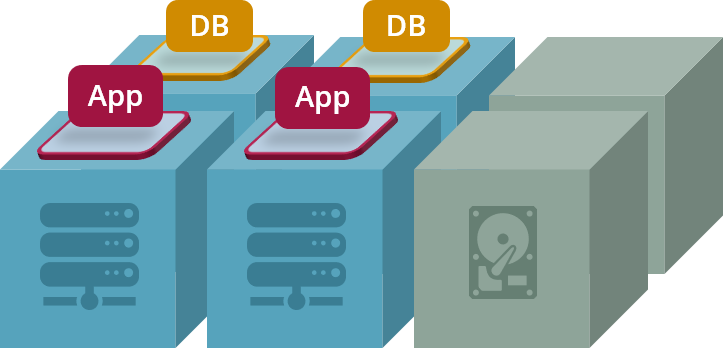
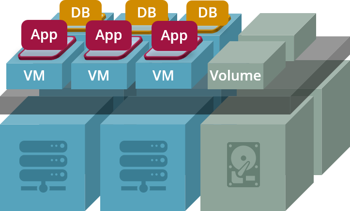
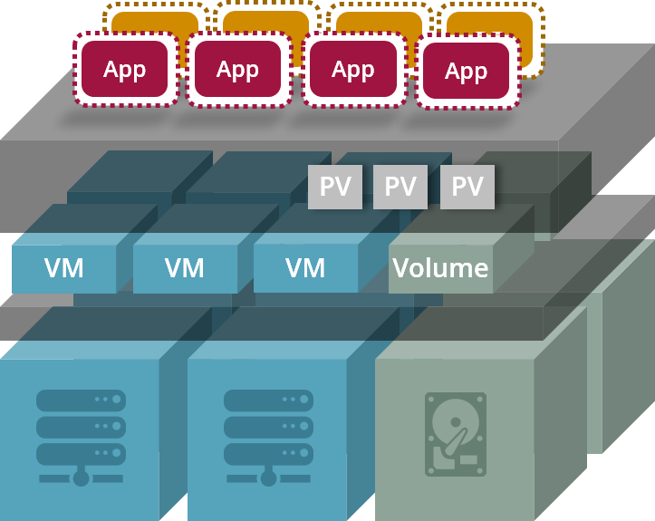
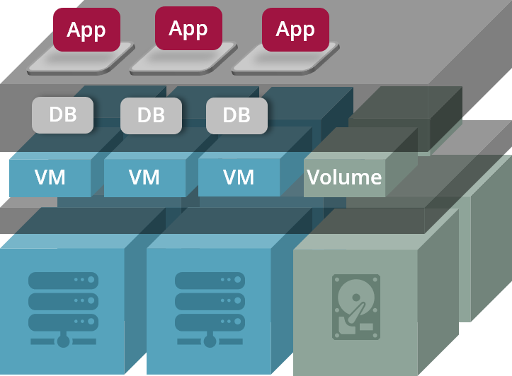
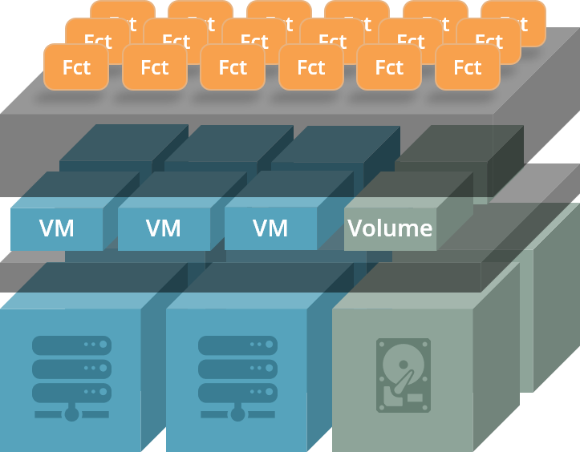
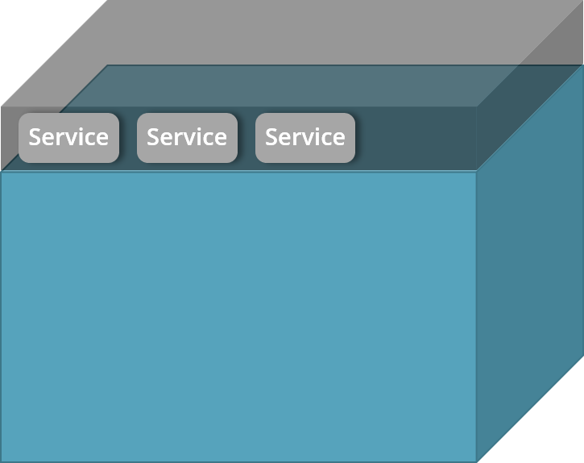
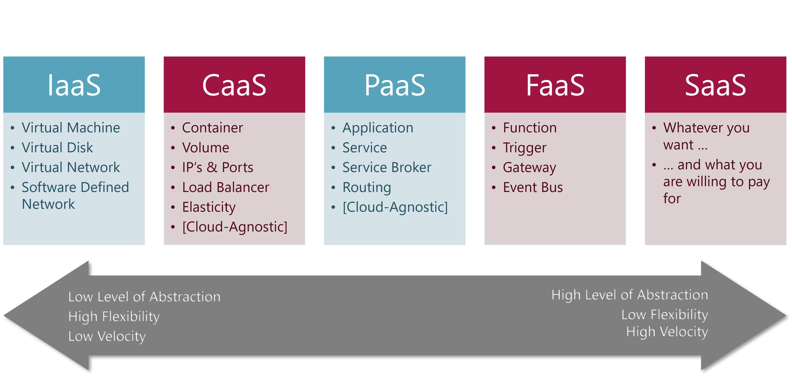

# Cloud Service Categories

This page provides an overview about the various categories of
cloud services that most public cloud providers offer.

## Once Upon a Time in a regular Data Center

Operations in a classic data center began with applications and databases running on bare-metal servers 
connected through physical networks:

* Applications and databases are run on bare metal
* Clumsy provisioning of machines and storage
* Clumsy provisioning of networks and network components
* Pay for everything that‘s up and running (even if it‘s not used)
* Required runtime environment must be manually installed and configured

## Infrastructure as a Service (IaaS)

Virtual machines and software-defined networks that can be provisioned directly by end-users simplified
the infrastructure procurement process significantly:

* Applications and databases are run on virtual machines (VM)
* Free to choose the operation system and the system resources (RAM, CPU, Storage) that meet your requirements
* System resources of VMs can be easily reconfigured if your requirements are changing
* Rapid provisioning that can be automated
* Rapid provisioning of networks and network components (virtual networks, software defined networks)
* Only pay for resources that are actually used (CPU + Storage + Traffic / Time)
* Required runtime environment still has to be installed and configured

__Relevant products:__

* [AWS EC2](https://aws.amazon.com/ec2/)
* [Azure VMs](https://azure.microsoft.com/en-us/services/virtual-machines/)
* [OpenStack](https://www.openstack.org/)
* [VMware vSphere](https://www.vmware.com/products/vsphere.html)
* [Azure Stack](https://azure.microsoft.com/en-us/overview/azure-stack/)
* [AWS Outpost](https://aws.amazon.com/outposts/)
* [AWS Lightsail](https://aws.amazon.com/lightsail/)
* [Google GCE](https://cloud.google.com/compute)

## Container as a Service (CaaS)

Large scale container orchestration platforms added more options to choose from: anything that runs in
a container can be put into production!

* Applications and databases are run as containers
* Application plus required runtime environment is packaged into one container
* Almost all types of applications or services are supported
* Support of persistent volumes (data is retained even if container crashes)
* Required system resources (RAM, CPU, Storage) can be defined during deployment
* Traffic is automatically routed to the container
* Platform ensures availability and scalability
* Supports installation on bare metal as well

__Relevant products:__

* [Kubernetes](https://kubernetes.io/)
* [AWS EKS](https://aws.amazon.com/eks/)
* [AWS Fargate](https://aws.amazon.com/fargate/)
* [AWS ECS](https://aws.amazon.com/ecs/)
* [Azure AKS](https://azure.microsoft.com/en-us/services/kubernetes-service/)
* [DC/OS](https://dcos.io/)
* [Docker EE](https://docs.mirantis.com/docker-enterprise/v3.0/dockeree-products/index.html)
* [Google GKE](https://cloud.google.com/kubernetes-engine)
* [VMware Tanzu Kubernetes Grid](https://tanzu.vmware.com/kubernetes-grid) formerly known as __Pivotal Container Service__

## Platform as a Service (PaaS)

Platform as a Service lets you to deploy and run naked applications without having to deal with
container technology and databases are available as pre-packaged service ready to be attached to your
application.

* Applications are directly run on a platform through built-in runtime environments
* Databases and similiar platform services are provided by the platform
* External services can be attached to applications through Service Brokers and Connectors
* Required system resources (RAM, CPU, Storage) and required services are defined during deployment
* Traffic is automatically routed to the application
* Platform ensures availability and scalability
* Which types of applications can be run depends on provided runtime environments
* Application platforms come with a hefty price tag

__Relevant products:__

* [RedHat OpenShift](https://www.openshift.com/)
* [CloudFoundry](https://www.cloudfoundry.org/)
* [VMware Tanzu Application Service](https://tanzu.vmware.com/application-service) formerly known as __Pivotal Cloud Foundry__ or __Pivotal Application Service__
* [AWS Elastic Beanstalk](https://aws.amazon.com/elasticbeanstalk/)
* [Azure App Service](https://azure.microsoft.com/en-us/services/app-service/)
* [Google App Engine](https://cloud.google.com/appengine)
* [Heroku](https://www.heroku.com/)
* [Jelastic](https://jelastic.com/)

## Function as a Service (FaaS)

Serverless execution of functions allows you to run business logic without having to deal with any 
server whatsoever and you only pay when your function is actually used.

* Youngest member of the *aaS family
* Based on dedicated functions as deployment units and execution units
* No server provisioning
* No server management
* Pay only for number of invocations and the compute time you consume
* Platform handles routing of traffic to a function
* Platform ensures availability and scalability

__Relevant products:__

* [AWS Lambda](https://aws.amazon.com/lambda/)
* [Serverless Framework](https://www.serverless.com/)
* [Azure Functions](https://azure.microsoft.com/en-us/services/functions/)
* [Knative](https://knative.dev/)
* [OpenWhisk](https://openwhisk.apache.org/)
* [Fission](https://fission.io/)
* [IronFunctions](https://open.iron.io/)
* [Google GCF](https://cloud.google.com/functions)

## Software as a Service (SaaS)

Rich services as on-demand software represent the highest level of cloud services.

 

* Software plus infrastructure is externally provided as one package which is centrally hosted
* Customers consume services provided by this package
* Payment is usually based on a subscription model
* Nothing to develop on the customer side
* No operations or administration costs on the customer side

__Relevant products:__

* SAP
* Oracle
* Salesforce
* Microsoft 365

## Conclusions

### We focus on CaaS and FaaS

Most of our customers who initially started with __PaaS__ (Pivotal Cloud Foundry, RedHat OpenShift) are
switching to __CaaS__ (Kubernetes) when moving from on-premise private clouds to the public cloud.

__FaaS__ or __Serverless__ is gaining a lot of traction although it is a fairly new technology 
and although it is mostly implemented through provider-specific cloud services like AWS Lambda or Azure Functions. 

### We focus on Kubernetes and AWS Lambda

__Kubernetes__ turns out to be the de-facto standard for CaaS platforms when it comes to public clouds.
Although we have customers which bring their own distribution to AWS or Azure, we strongly recommend to
use the provider-specific Kubernetes services like AWS EKS or Azure AKS.

Since to this day, all our serverless projects are hosted on AWS, we need to get to know __AWS Lamdba__ properly
before turning to __Azure Functions__.