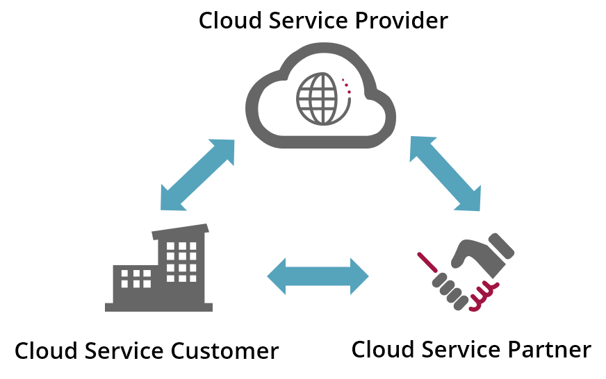
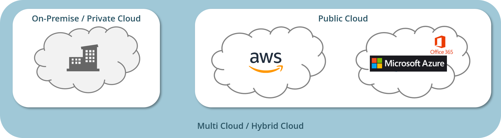

# Cloud Terminology

This page lists some basic cloud terminology you should be familiar with.

## Cloud Computing

The ISO standard [ISO/IEC 17788:2014](https://standards.iso.org/ittf/PubliclyAvailableStandards/c060544_ISO_IEC_17788_2014.zip) provides a pretty good definition of `cloud computing`: 

> __Cloud computing__ is a paradigm for enabling network access to a scalable and elastic pool of shareable physical or virtual resources with self-service provisioning and administration on demand.

This definition summarizes all characteristics of cloud computing in a single sentence:

### Broad network access
All cloud services provided by a cloud computing platform are accessible through broad network connections.

### Measured service
All cloud services are measured services: everything that you do with a particular service is tightly tracked and monitored.
Although the cloud service provider mainly uses this measurement to bill you, all measured data is available to you as well.

### Multitenancy
Multiple tenants share a common platform but are completely isolated from each other.

### On-demand self-service
Everything you want to do with cloud computing can be set up and torn down by you without having to 
involve someone else.

### Rapid elasticity and scalability
Cloud computing capacity automatically adapts to growing or shrinking workloads.

### Resource pooling
A cloud service provider's physical or virtual resources can be
aggregated in order to serve one or more cloud service customers.

## Cloud computing roles and activities

### Cloud Service Provider
A `cloud service provider` makes cloud services available

### Cloud Service Customer
A `cloud service customer` uses cloud services through a business relationship with a cloud service provider or a Cloud Service Partner

### Cloud Service Partner
A `cloud service partner` supports activities of either the cloud service provider or the cloud service customer or both

## Cloud Deployment Models

### Private Clouds (on-premise)

* Highest degree of security
* Highest degree of control
* Limited scalability and bandwidth
* Limited global availability  (depending on data center locations)

### Public Clouds

* Sufficient security (AWS DE, Azure DE)
* Sufficient control
* Unlimited scalability and bandwidth
* Global availability
* Support direct connections to corporate networks

### Multi Clouds

* Highest degree of flexibility
* Ability to pick the best provider for a specific requirement (bandwidth, cost, Office 365)
* Portability through cloud-agnostic platforms like Kubernetes, Cloud Foundry or OpenShift

