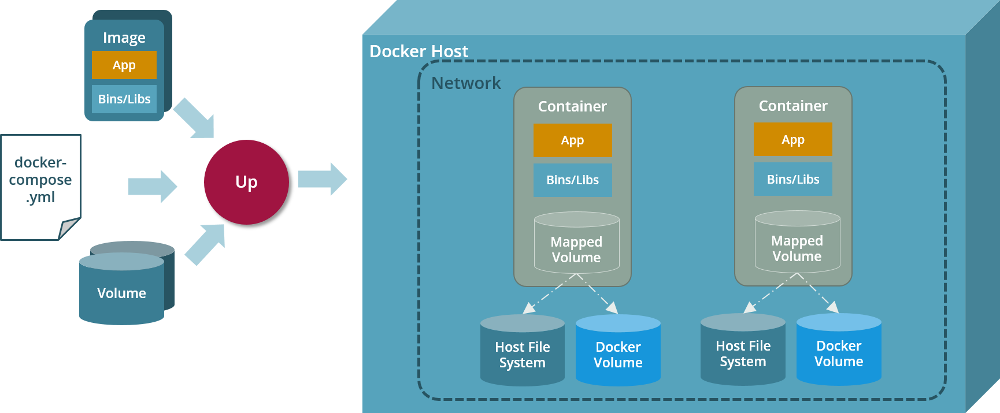

# Composing Docker Containers with Docker Compose

This article introduces you to `docker-compose` which helps you to manage
all containers to start, all volumes to map and all containers to link in a single YAML file.

If you want to learn more about docker-compose, check out the official [Docker Compose Documentation](https://docs.docker.com/compose/).

## Docker Compose simplifies management of Docker Containers

Although Docker is a powerful tool, its command line interface feels a little clumsy if you have to start a lot of containers with volumes at the same time. This is when the Docker tool `docker-compose`comes in handy.
docker-compose allows you to declare all container and volumes you need in a single YAML configuration file called `docker-compose.yaml`.
All images are pulled, all containers are created and started, all volumes are created and mapped with a single __docker-compose up__ command on the `docker-compose.yaml` file.



Since all containers started by docker-compose automatically share the same virtual network, containers may communicate 
with each other without having to expose their ports to the host system:
All containers from a docker-compose point of view are defined as named `services`. Each container running in the same network
can address another container by using its service name. 

## Hands-on Docker Compose with a Java Backend and a PostgreSQL Database

Imagine you have a Java-based backend application which stores its data in a PostgreSQL database.
To start this simple scenario with Docker, you will need to:

* create one Docker volume for PostgreSQL
* run one Docker container with PostgreSQL mapping the previously created volume to it
* run one Docker container with the Java-based backend application linking it to the
previously started PostgreSQL container

### The `docker-compose.yaml` file

Here's the configuration file `docker-compose.yaml` for the scenario mentioned before:

```yaml
# docker-compose.yml
# ----------------------------------------------------------------------------
# Composes Docker containers and volumes to a runnable Spring Boot application
# ----------------------------------------------------------------------------
#
---
version: '3'

services:

  postgres:
    image: postgres:11-alpine
    environment:
      POSTGRES_USER: postgres
      POSTGRES_PASSWORD: "********"
      POSTGRES_PORT: "5432"
      POSTGRES_DB: cloudtrain
    volumes:
      - postgres-data:/var/lib/postgresql/data

  backend:
    image: docker.at.automotive.msg.team/cloudtrain/cnj-persistence-sql-backend-spring:latest
    ports:
      - "8080:8080"
    environment:
      SPRING_PROFILES_ACTIVE: cloud
      CNAP_CLOUD: openshift
      KEYCLOAK_REALM: "cloudtrain"
      KEYCLOAK_AUTH_SERVER_URL: "http://k8sapps.at.automotive.msg.team/auth"
      KEYCLOAK_SSL_REQUIRED: "none"
      KEYCLOAK_RESOURCE: "cnj-cloudtrain"
      KEYCLOAK_CREDENTIALS_SECRET: "************************************"
      POSTGRES_DB_USER: postgres
      POSTGRES_DB_PASSWORD: "********"
      POSTGRES_DB_NAME: cloudtrain
      POSTGRES_DB_HOST: postgres
      POSTGRES_DB_PORT: 5432
      LOGGING_LEVEL_ORG_KEYCLOAK: INFO
      LOGGING_LEVEL_ORG_SPRINGFRAMEWORK_SECURITY: INFO

    depends_on:
      - postgres

volumes:

  postgres-data:
```

As you can see the docker-compose.yaml file contains two services and one volume:

* service `postgres` represents the PostgreSQL DB
* service `backend` represent a Java backend built with Spring Boot
* volume `postgres-data` is used by service `postgres` to store the DB tables persistently

First thing you will probably notice is that service `postgres` does __NOT__ expose any ports to the host network. Nevertheless, service `backend` can connect to the PostgreSQL DB using the service name of the PostgreSQL container `postgres` (configured via envvar `POSTGRES_DB_HOST`) and the container port `5432` (configured via envvar `POSTGRES_DB_PORT`) which PostgreSQL uses by default.

## Starting the Containers

All containers are started running the __docker-compose up__ command in the directory containing the `docker-compose.yaml` file:

```shell
docker-compose up -d
```

Command line argument `-d` (for detached) makes sure that the containers are started in the background. Otherwise the console would block until the containers are stopped.

## Stopping the Containers

All containers are stopped running the __docker-compose down__ command in the directory containing the `docker-compose.yaml` file:

```shell
docker-compose down
```

If you would like to delete the images and volumes as well, you can do so by adding the `-v` command line argument for deleting all defined volumes and the `--rmi 'all'` argument to delete all images cached on your local machine. 


## Accessing Container Logs

Logs of running containers can be accessed using the __docker-compose logs__ command in the directory containing the `docker-compose.yaml` file:

```shell
docker-compose logs [-f] [${serviceName}]
```

Use argument `-f`, if you want to follow the log output of the containers. The console will block until you exit with `Ctrl-c`. 
If you want to filter the log output, you can add the service name of a specific container you would like to see.

## References

* [Docker Compose Documentation](https://docs.docker.com/compose/)