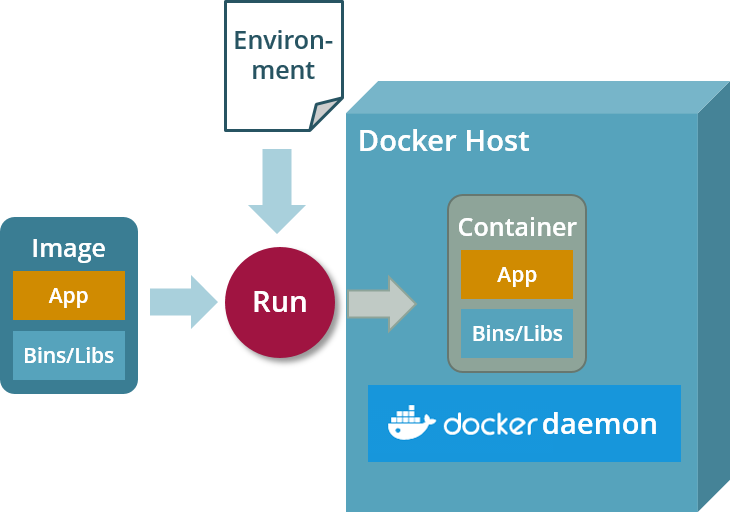
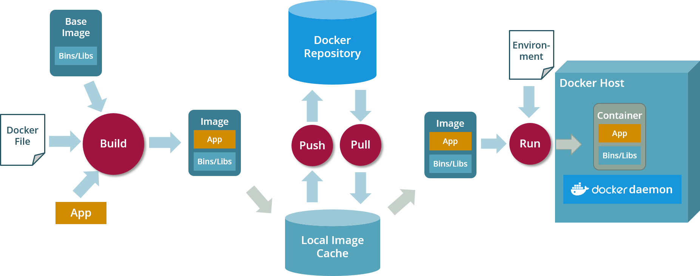

# From Dockerfile to Docker Container

This article introduces you to Docker terminology 
in general and to the development process from a Dockerfile to a running Docker container in particular.

## Getting familiar with Docker Speak - The Terminology

### Docker Image

A __Docker image__ is the *build time* representation of containerized software. It can be regarded as a snapshot of a 
Linux file system containing base operating system, the libraries you need to run your software (i.e. a Java Runtime or JRE) 
and your software (i.e. a Java Application Server with a deployed Java application or a simple Java JAR).

In most cases your Docker image will *inherit* from a __base Docker image__ which provides common functionality you
would like to reuse. Let's say you want to build a Docker image exposing a Java Runtime Environment (JRE): 
The base Docker image will contain a specific Linux distribution. Your own Docker image will add the JRE to it.

Docker images are created by running the __docker build__ command on a Dockerfile, some custom files you would like to
add your image and a base image you are going to inherit from.
   
Docker images may be shared via a common [Docker registry](#docker-registry): you can push a Docker image from your local machine to a central Docker registry to share
it with your colleagues. You can pull an existing Docker image from a central Docker registry to your local machine. 

A Docker image is identified by its fully qualified image name which consists of:
* a [Docker repository](#docker-repository) name
* a Docker image name
* a [Docker image tag](#docker-tag)
   
### Docker Container

A __Docker container__ is the *run time* representation of containerized software: it´s a native process running on the 
host operating system inside its own virtual network with access to its own view of a file system based on the 
blueprint provided by the associated [Docker image](#docker-image).

Transforming a Docker image into a running Docker container is actually a two-step process: first the container is 
created from an image (__docker create__), then the container is started (__docker start__). Both steps can be combined 
by using the __docker run__ command.

Upon container start, the containerized software inside the container can be configured via environment variables, 
container ports have to be mapped to host ports, and [Docker volumes](#docker-volume) or native files or directories may 
be mounted into the container file system.  

### Docker Registry
 
If you want to share [Docker images](#docker-image) with others, you need to use a remote __Docker registry__ which 
hosts remote [Docker repositories](#docker-repository). Sound's familiar? Well it should: a Docker registry is something 
like [GitHub](https://github.io) but for Docker repositories instead of git repositories.

The most popular Docker registry is [DockerHub](https://hub.docker.com/). However, most enterprises will maintain their
own private registries based on products like [Quay](https://quay.io/) or [Harbor](https://goharbor.io/) which may be accessible via internet but will require
authentication via __docker login__.

### Docker Repository

A __Docker repository__ is a remote location hosted at a [Docker registry](#docker-registry) where you can store versions
of a particular Docker image.

You can push local Docker images to a remote Docker repository by running __docker push__, to pull a remote Docker image 
to your local cache you need to run __docker pull__. Sound's familiar? Well it should: a remote Docker repository is something like
a remote git repository only for Docker images instead of git-managed source code.

The name of the repository is part of the fully qualified name of a Docker image.

### Dockerfile

A __Dockerfile__ contains all build instructions to be executed during a Docker build. A complete reference of the build 
instructions a Dockerfile may contain is available through the official 
[Dockerfile reference](https://docs.docker.com/engine/reference/builder/).

The Dockerfile is a mandatory input parameter for the __docker build__ command.

A good Dockerfile should always contain:

* A fully qualified name of a Docker images it is based on.
* A set of meaningful __labels__ which provide information about the Docker image you would like to build. (__LABEL__)
* Linux commands to add all __required libraries__ that your application needs to run (if not provided by the base image!). (__RUN__)
* Linux commands to add a __non-root user__ which actually executes the containerized software. (__USER__)
* A list of all __mounting points__ which your images exposes. (__VOL__)
* A list of all __ports__ which your image exposes. (__PORT__)
* A list of all __environment variables__ which can be used for container configuration upon start time. (__ENV__)
* A Docker __entrypoint__ which refers to a shell script to be executed when the container is started. (__ENTRYPOINT__)
* A default Docker __command__ to be passed to the entrypoint script when no other command was given.

### Docker Tag

A __Tag__ refers to a particular version of a [Docker image](#docker-image) and it part of the fully qualified name of 
a Docker image.
A single Docker image may be referred by multiple tags. 
Each Docker image at least contains the default tag __latest__ which refers to the most recent version of a Docker image.
If you do not specify a tag when addressing a particular Docker image, Docker implicitly uses tag __latest__.

Docker images are tagged while running __docker build__ but may be retagged using __docker tag__ on an existing Docker image.

## Putting the Terminology into Context - The Process

Now that we have learned a lot about Docker terminology, you probably want to know more about the ways to actually apply the terminology.
So here's the detailed view on a regular development process which transforms a [Dockerfile](#dockerfile) into a running [Docker container](#docker-container):

1\. Write a Dockerfile which is based on a Docker base image and contains instructions to  