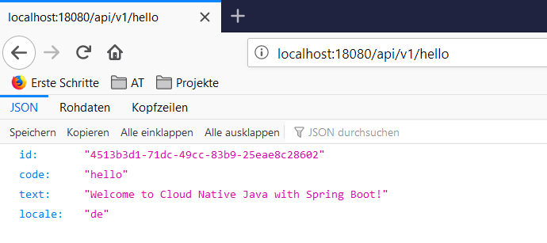

# From Dockerfile to Container by Example

This article walks you through the complete development process from a Dockerfile to a running Docker Container by a concrete example:

1. You are going to write a `Dockerfile` for a Spring Boot application (which will be provided to you).
1. You are going to write a `docker-entrypoint.sh` shell script which starts a Spring Boot application.
1. You are going to build the Docker image for a Spring Boot application.
1. You are going to push the Docker image to a private Docker registry (including login) and pull it afterwards.
1. You are going to run a Docker container with a Spring Boot application on your local machine (or whatever machine you installed Docker on)

## Writing a Dockerfile for a Spring Boot Application

1\. Create a project directory named `cnj-hello-backend-spring` on your local machine.

2\. Create a new text file called `Dockerfile` within that directory according to the following template:

```Dockerfile
FROM adoptopenjdk/openjdk11:x86_64-alpine-jre-11.0.6_10

LABEL maintainer="${yourUserIdOrEmail}"
LABEL group.msg.at.cloud.cnj-hello-backend-spring.project="CXP" 
LABEL group.msg.at.cloud.cnj-hello-backend-spring.version="3.0.0" 
LABEL group.msg.at.cloud.cnj-hello-backend-spring.description="Simplest possible cloud native java backend based on Spring Boot"

ENV JAVA_OPTS="" \
    DOCKER_JAVA_OPTS="" \
    SPRING_JAVA_OPTS="" \
    SPRING_PROFILES_ACTIVE="default" \
    CNAP_CLOUD="local"

RUN echo "adding run user spring to system" \
    && addgroup -S spring -g 1000 \
    && adduser -S spring -u 1000 -G spring

COPY *.jar /home/spring/
COPY docker-entrypoint.sh /home/spring/

RUN chown -R spring:spring /home/spring \
    && chmod u+x /home/spring/docker-entrypoint.sh

USER spring

EXPOSE 8080

ENTRYPOINT ["/home/spring/docker-entrypoint.sh"]
CMD ["java"]
```

3\. Replace placeholder `${yourUserIdOrEmail}` with a proper value.

!!! tip "Make sure you read Dockerfile Reference and Dockerfile Best Practices"
    This is a pretty simple Dockerfile. Before you want to dig deeper and start writing more complex Dockerfiles, 
    make sure you read 
    [Dockerfile reference](https://docs.docker.com/engine/reference/builder/) 
    and 
    [Best practices for writing Dockerfiles](https://docs.docker.com/develop/develop-images/dockerfile_best-practices/) 

## Write a Docker Entrypoint Script for a Spring Boot Application

1\. Create a new shell script file called `docker-entrypoint.sh` within the same directory according to the following template:

```shell
#!/bin/sh

if [ "$1" = 'java' ]; then
	echo "Running Spring Boot application ..."
	java ${JAVA_OPTS} ${DOCKER_JAVA_OPTS} ${SPRING_JAVA_OPTS} -jar /home/spring/*.jar
else 
	exec "$@"	
fi
```

2\. Do NOT replace any placeholders: everything enclosed in `${}` is a reference to an environment variable!

3\. Make sure you switch to Unix compliant line endings (`LF` insteadof `CRLF`)!

!!! danger "Make sure you use Unix compliant line terminators on a all shell script files"
    Remember: everything you put into a Docker image will run in a Unix/Linux environment. Therefore, you have
    to use proper Unix/Linux line terminators on all shell scripts, if you are using a Windows environment to build
    the Docker image!!!
    
## Copy Spring Boot Application to your source directory

1\. Copy the Spring Boot application you want to containerize to the same directory. The Spring Boot application can be downloaded from 
[here](https://msggroup.sharepoint.com/sites/msteams_dd667b/Shared%20Documents/General/Sessions/2020-05-08/cnj-hello-backend-spring-3.0.0.jar).

## Building the Docker Image

1\. Run __docker build__ in the source directory (check __docker build --help__ if you want to know more about the build arguments passed here):

```shell
$ docker build --rm --force-rm --tag cnj-hello-backend-spring:latest .
Sending build context to Docker daemon  19.26MB
Step 1/11 : FROM adoptopenjdk/openjdk11:x86_64-alpine-jre-11.0.6_10
 ---> 4f04f7aef4d8
Step 2/11 : LABEL maintainer="michael.theis@msg.group"         group.msg.at.cloud.cnj-hello-backend-spring.project="CXP"         group.msg.at.cloud.cnj-hello-backend-spring.version="3.0.0"         group.msg.at.cloud.cnj-hello-backend-spring.description="Simplest possible cloud native java backend based on Spring Boot"
 ---> Using cache
 ---> abed1862962a
Step 3/11 : ENV JAVA_OPTS=""     DOCKER_JAVA_OPTS=""     SPRING_JAVA_OPTS=""     SPRING_PROFILES_ACTIVE="default"     CNAP_CLOUD="local"
 ---> Using cache
 ---> 8ad6ece00761
Step 4/11 : RUN echo "adding run user spring to system"     && addgroup -S spring -g 1000     && adduser -S spring -u 1000 -G spring
 ---> Using cache
 ---> ce4d9d4ddba6
Step 5/11 : COPY *.jar /home/spring/
 ---> Using cache
 ---> 4c19924870d4
Step 6/11 : COPY docker-entrypoint.sh /home/spring/
 ---> Using cache
 ---> 5d1f14151a6d
Step 7/11 : RUN chown -R spring:spring /home/spring     && chmod u+x /home/spring/docker-entrypoint.sh
 ---> Using cache
 ---> 67852cc0d968
Step 8/11 : USER spring
 ---> Using cache
 ---> 94d3383bb237
Step 9/11 : EXPOSE 8080
 ---> Using cache
 ---> c774b0568bcf
Step 10/11 : ENTRYPOINT ["/home/spring/docker-entrypoint.sh"]
 ---> Using cache
 ---> 18e69a74b390
Step 11/11 : CMD ["java"]
 ---> Using cache
 ---> 1f7cfd859b2c
Successfully built 1f7cfd859b2c
Successfully tagged cnj-hello-backend-spring:latest
SECURITY WARNING: You are building a Docker image from Windows against a non-Windows Docker host. All files and directories added to build context will have '-rwxr-xr-x' permissions. It is recommended to double check and reset permissions for sensitive files and directories.
```

2\. Check with __docker images__, if the Docker image `cnj-hello-backend-spring:latest` exists on your local machine:

```shell
$ docker images
REPOSITORY                                                          TAG                           IMAGE ID            CREATED             SIZE
cnj-hello-backend-spring                                            latest                        1f7cfd859b2c        2 minutes ago       185MB
```

## Pushing Docker Images to a Docker Repository

1\. Login to the private Docker Registry at `https://docker.cloudtrain.aws.msgoat.eu` with the username `${dockerUserName}` and password `${dockerPassword}` given to you:

```shell 
$ docker login -u ${dockerUserName} docker.cloudtrain.aws.msgoat.eu
Password: ${dockerPassword}
Login Succeeded
```
2\. Retag the Docker image with a fully qualified image name including repository name and a personal version tag:

```shell
docker tag cnj-hello-backend-spring:latest docker.cloudtrain.aws.msgoat.eu/cxp/cnj-hello-backend-spring:3.0.0-${userId}
```

Please notice that the fully qualified image name now contains more parts than before:

* `docker.cloudtrain.aws.msgoat.eu` represents the URL of our private Docker registry
* `cxp` represents the project or library within the private Docker registry for all Docker images used in the Cloud Expert Program
* `cnj-hello-backend-spring` represents the simple Docker image name (here: the name of the Spring Boot application)
* `3.0.0-${userId}` represents the tag that we attached to this Docker image. It should always be a proper version number according
to [Semantic Versioning](https://semver.org/). Since we all use the same repository in the Docker registry we have to add our user ID as
a suffix to the tag; otherwise we would override images pushed by a colleague. 

3\. Push the Docker image to the remote repository with __docker push__:

```shell
$ docker push docker.cloudtrain.aws.msgoat.eu/cxp/cnj-hello-backend-spring:3.0.0-${userId}
The push refers to repository [docker.cloudtrain.aws.msgoat.eu/cxp/cnj-hello-backend-spring]
7f9942ee293b: Pushed
2899c2ab947c: Pushed
1363d9859b9f: Pushed
e2cc8e6b9aa2: Pushed
e15499644c7d: Pushed
0a3b259546c8: Pushed
beee9f30bc1f: Pushed
3.0.0-******: digest: sha256:9dd9f754681871f25651851242fe2e0eff47953d92ae6a4c5afda7e7318b46da size: 1790
```

## Pulling Docker Images from a Docker Repository

1\. Login to the Docker registry, if you have to. In our case, the previous Docker login should be still valid plus the
repository we are pulling from is a public repository. Thus, no login required now.

2\. Pull the image from the remote repository using __docker pull__ with the fully qualified name of the image:

```shell 
$ docker pull docker.cloudtrain.aws.msgoat.eu/cxp/cnj-hello-backend-spring:3.0.0-${userId}
3.0.0-******: Pulling from cxp/cnj-hello-backend-spring
Digest: sha256:9dd9f754681871f25651851242fe2e0eff47953d92ae6a4c5afda7e7318b46da
Status: Image is up to date for docker.cloudtrain.aws.msgoat.eu/cxp/cnj-hello-backend-spring:3.0.0-******
docker.cloudtrain.aws.msgoat.eu/cxp/cnj-hello-backend-spring:3.0.0-******
```

Since the image is still present on our local machine, Docker just checks the digests and downloads nothing.

## Running a Docker Container

1\. Create and start the Docker container with __docker run__ (check __docker run --help__ for information about all given command line arguments):

```shell 
$ docker run --name cnj-hello-backend-spring --rm -p 18080:8080 -d docker.cloudtrain.aws.msgoat.eu/cxp/cnj-hello-backend-spring:3.0.0-${userId}
d016125da6218cb76471b9ae46d083b1a0873837c41821edc2a310403526ff4b
```

Given command line arguments are:

* `--name cnj-hello-backend-spring` specifies the name of the container
* `--rm` makes sure the container is deleted immediately when stopped
* `-p 18080:8080` maps the container port `8080` to the host port `18080`
* `-d` starts the container in the background; console would block otherwise

2\. Check with __docker ps__, if the container runs:

```shell 
$ docker ps
CONTAINER ID        IMAGE                                                                          COMMAND                  CREATED             STATUS              PORTS                     NAMES
d016125da621        docker.cloudtrain.aws.msgoat.eu/cxp/cnj-hello-backend-spring:3.0.0-******   "/home/spring/docker…"   3 minutes ago       Up 3 minutes        0.0.0.0:18080->8080/tcp   cnj-hello-backend-spring
```

3\. Open a browser on `http://localhost:18080/api/v1/hello` to access the Spring Boot application



## Watching Logs of a Docker Container

1\. Run __docker logs__ with the name of the container or the unique identifier of the container:

```shell 
$ docker logs cnj-hello-backend-spring
Running Spring Boot application ...

  .   ____          _            __ _ _
 /\\ / ___'_ __ _ _(_)_ __  __ _ \ \ \ \
( ( )\___ | '_ | '_| | '_ \/ _` | \ \ \ \
 \\/  ___)| |_)| | | | | || (_| |  ) ) ) )
  '  |____| .__|_| |_|_| |_\__, | / / / /
 =========|_|==============|___/=/_/_/_/
 :: Spring Boot ::        (v2.2.4.RELEASE)

2020-05-08 09:00:07.347  INFO 6 --- [           main] g.m.a.c.c.SpringHelloApplication         : Starting SpringHelloApplication v3.0.0 on d016125da621 with PID 6 (/home/spring/cnj-hello-backend-spring-3.0.0.jar started by spring in /)
2020-05-08 09:00:07.351  INFO 6 --- [           main] g.m.a.c.c.SpringHelloApplication         : The following profiles are active: default
2020-05-08 09:00:10.239  INFO 6 --- [           main] o.s.b.w.embedded.tomcat.TomcatWebServer  : Tomcat initialized with port(s): 8080 (http)
2020-05-08 09:00:10.257  INFO 6 --- [           main] o.apache.catalina.core.StandardService   : Starting service [Tomcat]
2020-05-08 09:00:10.259  INFO 6 --- [           main] org.apache.catalina.core.StandardEngine  : Starting Servlet engine: [Apache Tomcat/9.0.30]
2020-05-08 09:00:10.383  INFO 6 --- [           main] o.a.c.c.C.[Tomcat].[localhost].[/]       : Initializing Spring embedded WebApplicationContext
2020-05-08 09:00:10.383  INFO 6 --- [           main] o.s.web.context.ContextLoader            : Root WebApplicationContext: initialization completed in 2848 ms
2020-05-08 09:00:11.115  INFO 6 --- [           main] o.s.s.concurrent.ThreadPoolTaskExecutor  : Initializing ExecutorService 'applicationTaskExecutor'
2020-05-08 09:00:11.503  INFO 6 --- [           main] o.s.b.a.e.web.EndpointLinksResolver      : Exposing 13 endpoint(s) beneath base path '/actuator'
2020-05-08 09:00:11.605  INFO 6 --- [           main] o.s.b.w.embedded.tomcat.TomcatWebServer  : Tomcat started on port(s): 8080 (http) with context path ''
2020-05-08 09:00:11.609  INFO 6 --- [           main] g.m.a.c.c.SpringHelloApplication         : Started SpringHelloApplication in 6.024 seconds (JVM running for 7.017)
2020-05-08 09:05:48.702  INFO 6 --- [nio-8080-exec-1] o.a.c.c.C.[Tomcat].[localhost].[/]       : Initializing Spring DispatcherServlet 'dispatcherServlet'
2020-05-08 09:05:48.702  INFO 6 --- [nio-8080-exec-1] o.s.web.servlet.DispatcherServlet        : Initializing Servlet 'dispatcherServlet'
2020-05-08 09:05:48.740  INFO 6 --- [nio-8080-exec-1] o.s.web.servlet.DispatcherServlet        : Completed initialization in 38 ms
```

If you want to follow upcoming log entries, add command line argument `-f`. The console will block, but you can exit with `Ctrl+c`.

## Stopping a Docker Container

1\. Stop the running container with __docker stop__ passing the container name as an argument:

```shell 
$ docker stop cnj-hello-backend-spring
cnj-hello-backend-spring
```

Be patient: stopping container may take a while!

2\. Check with __docker ps__, if the container has been stopped successfully:

```shell 
$ docker ps
CONTAINER ID        IMAGE                                                                          COMMAND                  CREATED             STATUS              PORTS                     NAMES
```

The list of existing containers should be empty.

## Congratulations

You made it through your first development cycle from a Dockerfile to a running Docker container!

## References

* [Dockerfile reference](https://docs.docker.com/engine/reference/builder/) 
* [Best practices for writing Dockerfiles](https://docs.docker.com/develop/develop-images/dockerfile_best-practices/)
