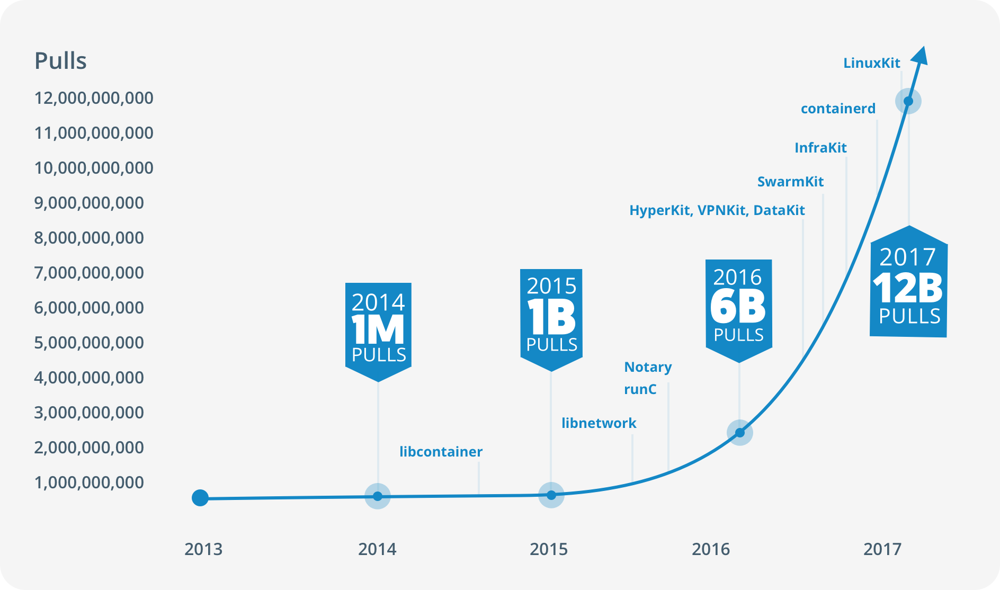

# Getting Started with Docker

## Docker has changed the IT world as we know it

In 2013, Docker introduced what would become the industry standard for containers.
Starting with 1 million pulls in 2013, Docker proved to be one of the fastest growing
technologies passing more than 12 billion pulls in 2017. 
Although there are other alternatives or competitors, Docker is the de facto standard to build and 
share containerized apps today. 

 
## Docker helps you to "build once, run anywhere"

Containerized software packaged as Docker images is a self-contained execution unit completely isolated 
from the runtime environment. 
All you need to run your containerized software is a Docker or Docker-compatible runtime environment and you
are ready to go.
This allows you to build, test and containerize your software on a Windows machine and promote it through all 
stages up to production which may be Linux-based without having to apply any changes to your software at all. 

## Docker packages software into immutable artifacts

Another great thing about Docker is that is creates immutable artifacts which you cannot change anymore once 
you have created them.
The only way to change the containerized software inside the immutable artifact is to change its behaviour by
providing environment-specific configuration upon start-time. 
So if the containerized software works on your machine according to its functional and non-functional requirements,
you can be pretty sure it behaves the same way in production and on all stop-overs on the way to get there
because no one can tamper with it.

