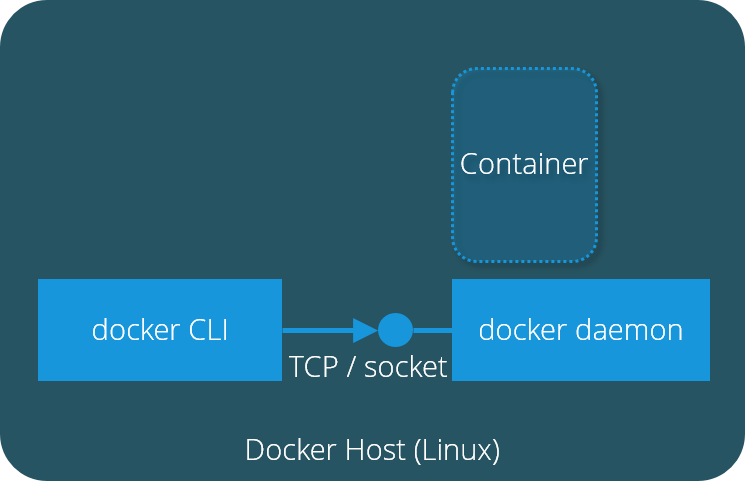
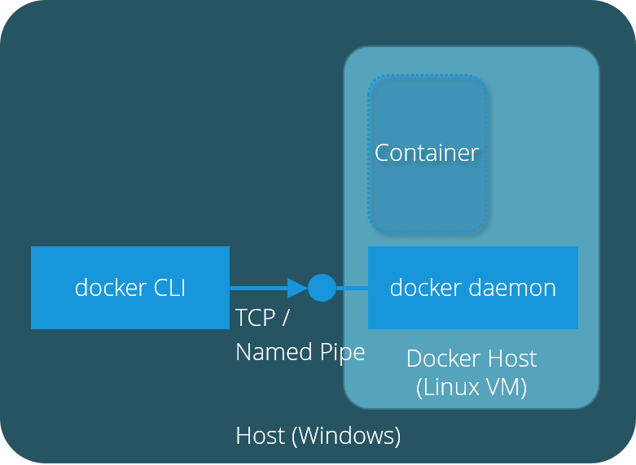
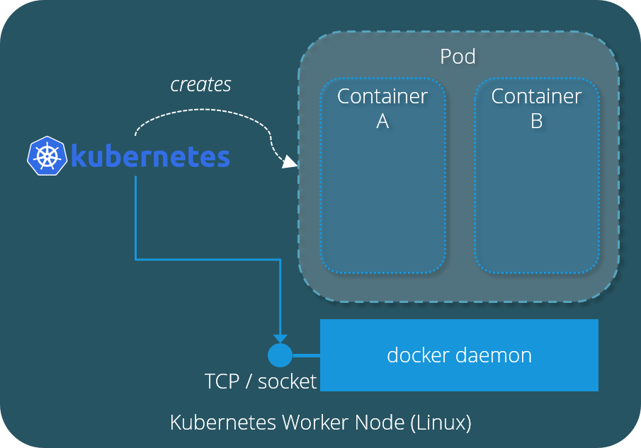
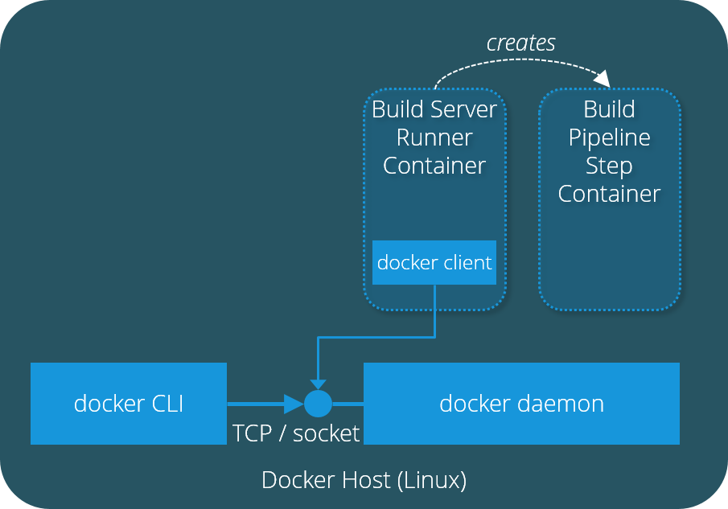
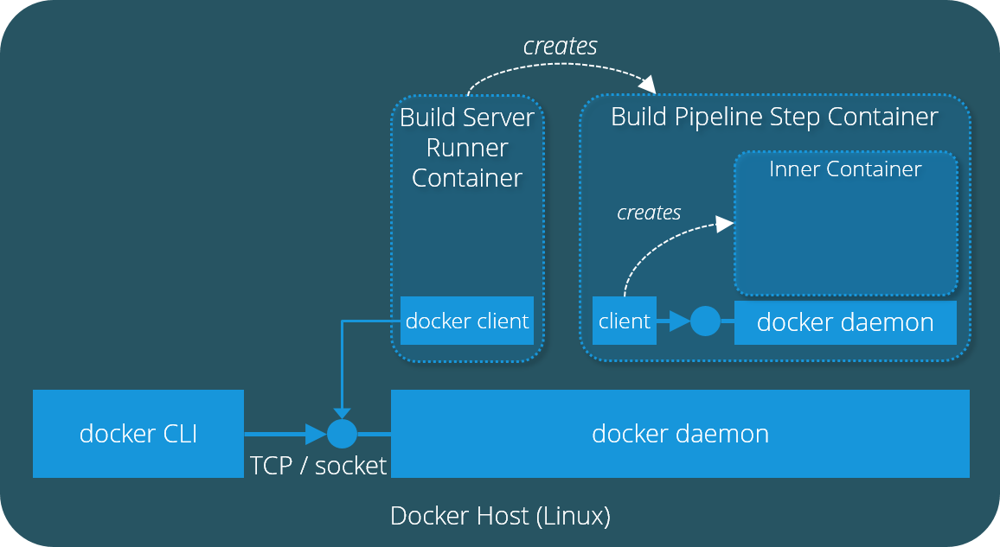

# Docker runtime scenarios

This article digs a little deeper into common and unusual scenarios for running Docker.

## Running Docker on Linux (default)

If you install Docker in Linux you most likely will encounter the following runtime scenario:

Both Docker CLI and Docker daemon are running natively on the Docker host operating system. The Docker CLI sends all commands
as Docker API calls via socket or TCP connection to the Docker daemon, which executes them. Docker daemon builds images, creates containers
and manages them.

## Running Docker on Windows

On Windows, the Docker daemon has to run in a separate Linux VM managed by HyperV or VirtualBox:

The Docker CLI runs natively on Windows. The Docker daemon runs in a separate Linux VM. Docker CLI sends all commands
as Docker API calls via named pipe or TCP connection to the Docker daemon, which executes them inside the Linux VM.

## Running Docker on Kubernetes

Although Kubernetes uses a Docker runtime by default, things look completely different on a Kubernetes worker node:
 

Kubernetes takes charge of container management, there is no more Docker CLI involved. A single container or a group of 
containers is managed as a logical construct called `pod`. Since Kubernetes is the only one who has access to the Docker
daemon running Docker commands from containers in pods is technically possible but not a good idea. 
 
## Running Docker in Docker using Sidecars

Wait a minute: *running Docker commands from containers? Why would I do that?* 

Well happens more often than you would expect:
contemporary build servers like [Drone](https://drone.io/) and even the good old [Jenkins](https://www.jenkins.io/) are 
using containerized build server runners or build slaves these days. So if you are running a docker build or a docker container 
in your build pipeline, you will execute Docker commands within a running Docker container.

There are two possible ways to solve this problem, here is the first one: the docker client within the build server 
runner container has access to the outer docker daemon which created the runner container in the first place. Any docker command
from the runner container is sent to the outer docker daemon, which happily executes them. So if you run __docker run__ inside
the runner container, the command is executed by the outer daemon which creates a new sibling pipeline step container.

## Running Docker in Docker using DinD

There are runtime environments where sharing a common daemon is not possible: Kubernetes will not be happy if someone 
creates new container on one of its worker nodes. For this type of scenario, `dind` (__d__ ocker __in__ __d__ ocker) is the right approach:

Here the pipeline step container does not have access to the outer docker daemon of the host system. To be 
able to run docker commands nevertheless, the pipeline step container runs its own docker daemon which manages
inner containers.

## References

| Link | Description |
| --- | --- |
[Best practices for operating containers](https://cloud.google.com/solutions/best-practices-for-operating-containers) | Googles view on best practices when running Docker containers