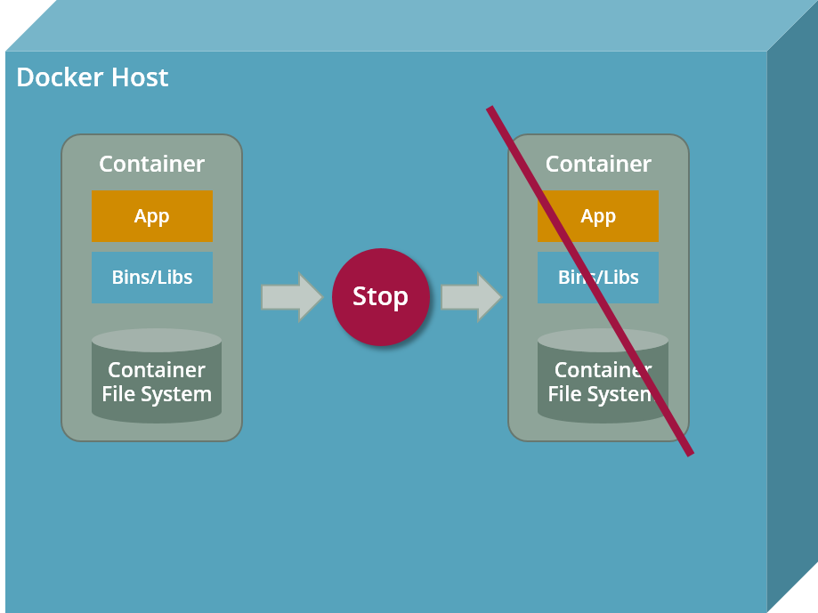
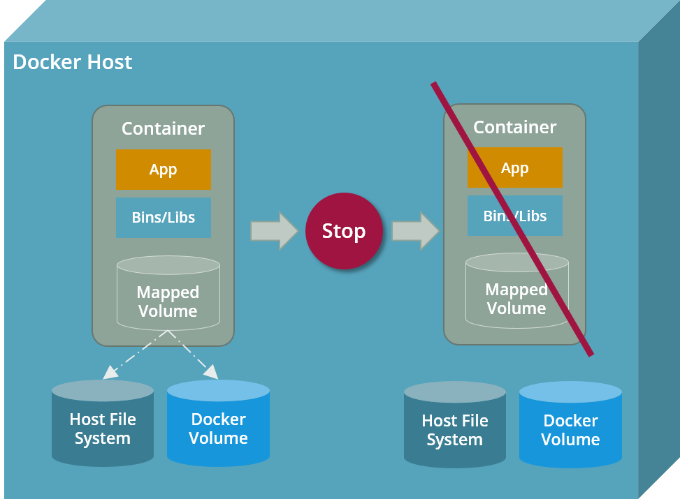

# Docker Container Storage

This article tells you how you can add persistent storage to your Docker containers.

## Container Storage is ephemeral by default

By default, Docker container file systems are ephemeral, 
which means they are gone including all data if you stop the Docker container.
Obviously this is not the expected behaviour if want to run a database inside a Docker container.



## Persistent Storage via external Volumes

Fortunately, Docker comes with the support of volume mappings: like in regular Linux systems, external
volumes can be mounted at specific mounting points into the container file system upon container start.
From the container point of view, a mapped volume behaves like a regular directory or file.
But due to the fact that the lifecycle of the mapped volume does not depend on the lifecycle of the container,
all data stored on the mapped volume survives container crashes or restarts. 



### Defining the Mounting Point in Dockerfile

The mounting point (i.e. the target directory) in the container file system should be defined in the Dockerfile as a __VOLUME__ statement:

Here's an excerpt from the official Dockerfile used to build the PostgreSQL Docker image:

```dockerfile
VOLUME /var/lib/postgresql/data
```

The __VOLUME__ statement defines the mounting point for external volumes inside the container at directory `/var/lib/postgresql/data`.

!!! tip "Always declare your mounting points in Dockerfile"
    Although volume mappings can be defined on the fly during container start, 
    its is strongly recommended to declare them explicitly in the Dockerfile using
    the __VOLUME__ statement. Thus, all mounting points are part of the Docker images metadata,
    which can be extracted using the __docker inspect__ command.
    
### Mapping an external Volume on Container start

The actual volume mapping is defined during container start with the `-v` argument passed to a __docker run__ or __docker start__ command:

```shell
docker run --name some-postgres -v /my/own/datadir:/var/lib/postgresql/data -e POSTGRES_PASSWORD=mysecretpassword -d postgres:tag
```

The `-v /my/own/datadir:/var/lib/postgresql/data` command line argument mounts the directory `/my/own/datadir` 
located on the host machine as directory `/var/lib/postgresql/data` inside the container.  

### Mount Types

There are two mount types to implement persistent storage with Docker:

* mapping existing files or directory from the host file system (__bind mounts__)
* mapping previously created Docker volumes (__volumes__)

#### Bind Mounts 

__Bind mounts__ are stored anywhere on the host system. 
All data written to or read from the bind mount is directly visible outside the container, which is good for getting data into or out of containers but may cause security issues.
 
#### Docker volumes

__Docker volumes__ are created and managed by Docker.
From the container point of view a Docker volumes feels like a regular file or directory, but from the host machines 
perspective a Docker volume is a blob stored somewhere in the host file system.

Docker volumes are created either by using the __docker volume create__ command before starting the container or by
using the `-v` argument during container start. Since volumes last longer than containers they have to be deleted using 
the __docker volume rm__ command. All existing volumes without a running container may be deleted by using the __docker volume prune__ command.
    
## References

* [Manage data in Docker](https://docs.docker.com/storage/) - official Docker documentation about container storage
