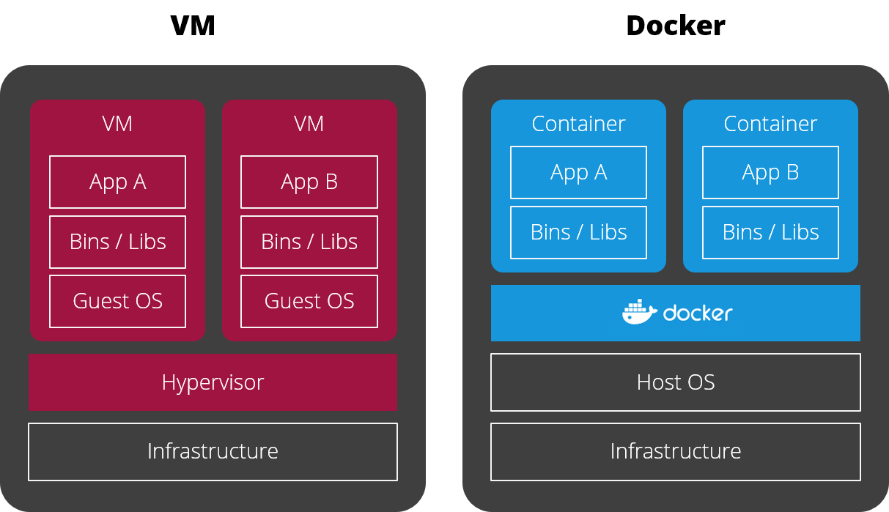
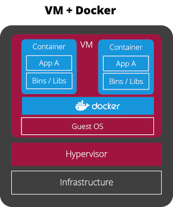

# Docker vs Virtual Machines

## How Docker differs from Virtual Machines

| Virtual Machines | Docker Containers |
| --- | --- |
| Require a Hypervisor to manage them. | Need a Docker runtime (a.k.a Docker daemon) to manage them. |
| Contain a fully copy of a guest operation system. | Share the operating system of the host. |
| Guest operating system may differ from host operating system. | Containerized software must be compatible with host operating system (i.e. specific Linux kernel version) |
| Higher physical isolation: software runs on its own copy of an operating system. | Lower physical isolation: software runs as a process on host operating system, which is isolated from other processes via virtual network and virtual filesystem. |
| Lower hardware utilization: guest operating systems of each VM allocate resources not available to applications. | Higher hardware utilization: containers do not need a guest operating system. |

## What Docker shares with Virtual Machines

| Virtual Machines | Docker Containers |
| --- | --- |
| Isolated through virtual networks. | Isolated through virtual networks: containers do not see the network of the host or of other containers |
| Isolated through dedicated volumes or file systems. | Isolated through virtual file systems: by default, containers do not see the file system of the host and they do not see the file system of other containers. |
| Constraints on resources like CPU, RAM, Disk IO, Network IO. | Constraints on resources like CPU and RAM but not on Disk IO and Network IO. |

## Docker running on Virtual Machines

These days, Docker and virtual machines will live in peaceful co-existence: Since most public cloud providers mainly
give you access to virtual machines rather than physical hardware, its more likely your containerized software 
will run on Docker installed on a virtual machine:

 