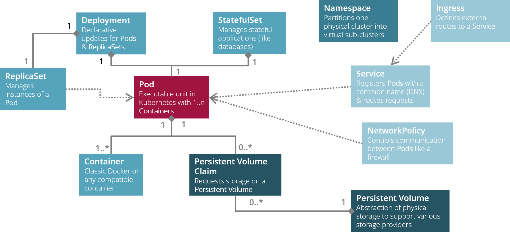

# Kubernetes Basic Object Model

## Overview



## Core objects for stateless applications

These are the essential resources you need to know when you want to run applications on Kubernetes.

The minimum set of Kubernetes resources or objects you have to create in order to deploy a stateless application includes:

* 1 [deployment](#deployment) which will manage the [pods](#pod) and the [replica set](#replicaset) for you.
* 1 [service](#service) which will expose your application within the cluster
* 1 [ingress](#ingress) which will expose your application outside the cluster
* 1 [network policy](#networkpolicy) which will allow inbound traffic to your application's [pods](#pod) 
(if your cluster blocks all inbound traffic by default)

### Pod

A `pod` can be regarded as the executable unit which Kubernetes runs.
Pods are not managed on their own, but through higher level objects like [deployments](#deployment) or [stateful sets](#statefulset).
A pod must contain at least one [container](#container).

@see [Pods](https://kubernetes.io/docs/concepts/workloads/pods/pod-overview/)

@see [PodTemplateSpec Reference](https://kubernetes.io/docs/reference/generated/kubernetes-api/v1.20/#podtemplatespec-v1-core)

### Container

A `container` is a plain old Docker container, which is managed through a [pod](#pod). 
Each container must refer to a specific Docker image, can be configured through environment variables, may mount volumes 
backed by [persistent volume claims](#persistentvolumeclaim).

@see [The Distributed System ToolKit: Patterns for Composite Containers](https://kubernetes.io/blog/2015/06/the-distributed-system-toolkit-patterns/) 

@see [Container Reference](https://kubernetes.io/docs/reference/generated/kubernetes-api/v1.20/#container-v1-core)

### Deployment

A `deployment` provides declarative updates to [pods](#pod) and [replica sets](#replicaset).
In most cases, deployments are used to install, update and uninstall *stateless* applications on Kubernetes.

@see [Deployments](https://kubernetes.io/docs/concepts/workloads/controllers/deployment/)

@see [Deployment Reference](https://kubernetes.io/docs/reference/generated/kubernetes-api/v1.20/#deployment-v1-apps)

### ReplicaSet

A `replica set` controls the specified number of identical [pods](#pod) which are supposed to be available at any time.
These days, replica sets are supposed to be managed exclusively through [deployments](#deployment) or [stateful sets](#statefulset).
 
@see [ReplicaSet](https://kubernetes.io/docs/concepts/workloads/controllers/replicaset/)

### Service

A `service` provides an abstract way to expose an application running on a set of [pods](#pod) as a network service 
with a specific DNS name.
Each service must refer to a set of [pods](#pod) which it is supposed to handle through a pod selector.
Any inbound request on the service is forwarded to the next available pod in this set of pods.
Additionally, services map service ports to container ports exposed by the pods running them.

The most common service types are:

* __ClusterIP (default)__: Exposes the service internally on a cluster-internal IP. 
If you want to access your application from outside the cluster, you will have to create an [ingress](#ingress) as well.
* __NodePort__: Exposes the service externally on each node’s IP at a static port (the `node port`) making it accessible from outside the cluster by using `<NodeIP>:<NodePort>`.
* __LoadBalancer__: Exposes the service externally using a cloud provider's loadbalancer.

The preferred way to expose a service externally is using a ClusterIP service plus ingress.

!!! tip "Internal services can be made externally accessible using `kubectl`"
    ClusterIP or NodePort services can be made accessible to a remote client using `kubectl proxy` or `kubectl port-forward`.
    Use both approaches very judiciously: only for debugging or testing purposes, never as the default way to access
    your services.
       
@see [Service](https://kubernetes.io/docs/concepts/services-networking/service/)

@see [Service Reference](https://kubernetes.io/docs/reference/generated/kubernetes-api/v1.20/#service-v1-core)

### Ingress

An `ingress` manages external access to the [services](#service) in a cluster, typically HTTP.
Using ingresses requires an `ingress controller` to be installed on the Kubernetes cluster. Popular ingress controller
implementations are [NGinX](https://www.nginx.com/) or [Traefik](https://containo.us/traefik/). In an ingress scenario,
the ingress controller acts as an externally visible router into the cluster and the ingress represents a new route 
which gets added to the routers routing table.

Each ingress must refer to a [service](#service). 
Ingresses support host-based or path-based routing, path manipulation, redirects, SSL certificates for HTTPS etc.  

!!! tip "Ingress Controller on CPX Kubernetes cluster is Traefik" 
    On the CXP Kubernetes cluster, Traefik is installed as the default ingress controller.
    Please remember to add the Traefik specific annotations to your ingress manifest.
    
@see [Ingress](https://kubernetes.io/docs/concepts/services-networking/ingress/)

@see [Ingress Reference](https://kubernetes.io/docs/reference/generated/kubernetes-api/v1.20/#ingress-v1beta1-networking-k8s-io)

### NetworkPolicy

A `network policy` represents a set of virtual firewall rules which control how groups of [pods](#pod) are allowed 
to communicate with each other and other network endpoints.
Each network policy must refer to a set of pods through a pod selector. 
Network policies can define either ingress (inbound traffic) and/or egress (outbound traffic) policies.

!!! tip "Each enterprise-grade Kubernetes cluster should block any traffic by default"
    In most enterprise-grade Kubernetes clusters, each [namespace](#namespace) has a default network policy which
    denies any inbound and outbound traffic. So keep in mind to add a network policy manifest to each of your
    deployments, which explicitly allows specific traffic on specific ports / protocols with specific sources / destinations.

!!! danger "Deleting network policies on AWS EKS does not deactivate them"
    In our CXP scenario, each namespace has a default network policy `default-deny-inbound` which blocks all inbound traffic to any pod
    in the namespace. In order to make your application available you will have to add a custom network policy which
    allows inbound traffic to your application's pods. If you delete this custom network policy, your application pods
    are still accessible. Only a redeployment of your application will make the deletion of the custom network policy
    actually effective.
     
@see [Network Policies](https://kubernetes.io/docs/concepts/services-networking/network-policies/)

@see [NetworkPolicy Reference](https://kubernetes.io/docs/reference/generated/kubernetes-api/v1.20/#networkpolicy-v1-networking-k8s-io)

@see [Network Policy Recipies](https://github.com/ahmetb/kubernetes-network-policy-recipes)

__Example: NetworkPolicy manifest__

This manifest file named `networkpolicy.yaml` creates a network policy which denies all inbound traffic to any pod running in the same namespace.

```yaml
apiVersion: networking.k8s.io/v1
kind: NetworkPolicy
metadata:
  name: default-deny-inbound
  labels:
    app.kubernetes.io/name: default-deny-inbound
    app.kubernetes.io/component: network
    app.kubernetes.io/part-of: cxp
    app.kubernetes.io/managed-by: kubectl
spec:
  podSelector: {}
  policyTypes:
    - Ingress
```

This network policy can be created by running kubectl:

```shell
kubectl -n ${namespaceName} create -f networkpolicy.yaml
```

Remember to specify a proper namespace name; otherwise this network policy will be created in namespace __default__.

### Namespace

A `namespace` subdivides a physical Kubernetes cluster into virtual isolated sub-clusters. Thus, namespaces
are the preferred way to implement multi-tenancy on Kubernetes clusters.

Each Kubernetes cluster comes with a set of default namespaces:

* __kube-system__: Contains all system components of the Kubernetes cluster. Access to this namespace should be 
restricted to cluster administrators.
* __default__: Contains all applications which are installed on a Kubernetes without specifying a particular namespace.
Should be only used in very simple test scenarios.

Each namespace may have its own set of quotas regarding CPU, memory, storage etc.

There are various approaches to subdivide a Kubernetes cluster into namespaces (combinations are possible):

* __One cluster shared by many projects__: Each project has a dedicated namespace for each stage 
(like development, integration test, user acceptance test, production). Production stages should be hosted in namespaces
on a dedicated production cluster.
* __One cluster per stage__: Each project has a dedicated cluster for each of its stages. So there will be three
separate clusters in a three-stage scenario.
* __One cluster shared by many tenants__: Each tenant has a dedicated namespace which is isolated from the other 
tenant namespaces by network policies or even virtual networks.
* __One cluster shared by many applications__: Each application or application group has its own dedicated namespace.
Application groups representing system tool stacks for monitoring, logging and tracing should be separated from regular applications / application groups. 

!!! tip "Always define quotas for your namespaces"
    Each namespace should have constraints regarding resources like CPU, memory and storage. Otherwise any unrestricted
    namespace running wild may impact the performance of other namespaces or even the overall performance of the 
    cluster itself (*noisy neighbour problem*).
      
!!! danger "Managing namespaces should be restricted to cluster admins"
    Only cluster admins should be allowed to create, update or delete namespaces on a Kubernetes cluster.
    Deleting namespaces is a very dangerous operation in particular: all objects bound to that particular namespace
    will be deleted as well without confirmation! So namespaces should be handled only by people who know what
    they are doing.
    
@see [Namespaces](https://kubernetes.io/docs/concepts/overview/working-with-objects/namespaces/)

@see [Namespace Reference](https://kubernetes.io/docs/reference/generated/kubernetes-api/v1.20/#namespace-v1-core)

__Example: Namespace manifest__

This manifest file named `namespace.yaml` creates a namespace.

```yaml
apiVersion: v1
kind: Namespace
metadata:
  name: ${namespaceName}
  labels:
    app.kubernetes.io/name: ${namespaceName}
    app.kubernetes.io/component: network
    app.kubernetes.io/part-of: cxp
    app.kubernetes.io/managed-by: kubectl
```

Remember to replace __${namespaceName}__ with a proper name!

This namespace can be created by running kubectl:

```shell
kubectl create -f namespace.yaml
```

## Core objects for stateful applications

More objects you need to be familiar with if you want to install stateful applications on your Kubernetes cluster.

### StatefulSet

A `stateful set` manages the deployment and scaling of a set of [pods](#pod), 
and provides guarantees about the ordering and uniqueness of these [pods](#pod).
A strict ordering and uniqueness of pods and its attached volumes - sometimes called *pod stickiness* - is especially important for stateful workloads:
If a pod running in a replica set terminates, it needs to be reattached to the same volume it was attached before upon restart. 
Thus, stateful sets are the preferred way install, update and uninstall *stateful* applications on Kubernetes.

@see [StatefulSets](https://kubernetes.io/docs/concepts/workloads/controllers/statefulset/)

@see [StatefulSet Reference](https://kubernetes.io/docs/reference/generated/kubernetes-api/v1.20/#statefulset-v1-apps)

### PersistentVolumeClaim

A `persistent volume claim` represents a claim for storage on a [persistent volume](#persistentvolume) 
by a [stateful set](#statefulset) or [deployment](#deployment).
 
Each persistent volume claim must specify the amount of storage.
The type of persistent storage to be claimed can be defined through `storage classes`. 

To prevent unintended data loss, persistent volume claims are not automatically deleted when the associated stateful set 
or deployment is uninstalled from the cluster: they have to be deleted explicitly after the owning stateful set or deployment
has been removed. Any deletion of a persistent volume claim automatically releases the associated persistent volume.

@see [Persistent Volumes](https://kubernetes.io/docs/concepts/storage/persistent-volumes/)

@see [PersistentVolumeClaim Reference](https://kubernetes.io/docs/reference/generated/kubernetes-api/v1.20/#persistentvolumeclaim-v1-core)

### PersistentVolume

A `persistent volume` (PV) is a piece of storage in the cluster that has been provisioned by an administrator 
or dynamically provisioned by a `storage class provider` for a particular `storage class`. 
It is a resource in the cluster just like a node is a cluster resource. 
PVs are volume plugins, which have a lifecycle independent of any individual Pod that uses the PV. 
This object encapsulates the details of the implementation of the storage, be that NFS, iSCSI, 
or a cloud-provider-specific storage system like AWS EBS or AWS EFS.

Developers deploying their applications on Kubernetes never deal with persistent volumes directly, they only manage them
implicitly through [persistent volume claims](#persistentvolumeclaim).

@see [Persistent Volumes](https://kubernetes.io/docs/concepts/storage/persistent-volumes/)

## References

* [Working with Kubernetes Objects](https://kubernetes.io/docs/concepts/overview/working-with-objects/kubernetes-objects/): 
official documentation about Kubernetes resources (a.k.a. Kubernetes objects)