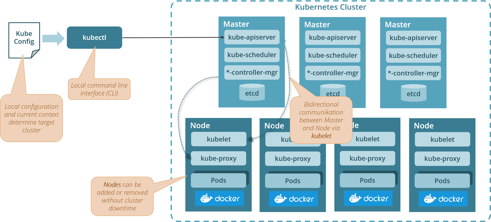

# Moving parts of a Kubernetes Cluster

## References

* [Kubernetes Components](https://kubernetes.io/docs/concepts/overview/components/): official introduction to Kubernetes components a Kubernetes cluster is made of
* [Cluster Architecture](https://kubernetes.io/docs/concepts/architecture/nodes/): official information about Kubernetes cluster architecture