# Creating Linux VMs on Hyper-V

## Motivation
This page is going to show you how to create a Linux VM with Hyper-V based on CentOS 8.

## Prerequisites
Make sure Hyper-V is activated

## Download CentOS ISO Image
Normally you would download the CentOS ISO Image from one the official CentOS download mirrors. I usually use http://mirror.eu.oneandone.net/linux/distributions/centos/ as my favourite mirror server.

## Create Linux VM with Hyper-V Manager

Well there is an excellent article on how-to article in the internet [CentOS Linux on Hyper-V – The Complete Guide](https://www.altaro.com/hyper-v/centos-linux-hyper-v/) (kudos to Robert) . It uses an CentOS 7 ISO and PowerShell to create the VM but it's a good starting point for CentOS 8 and a GUI based approach as well.
 
So here we go!
 
1\. Open Hyper-V Manager

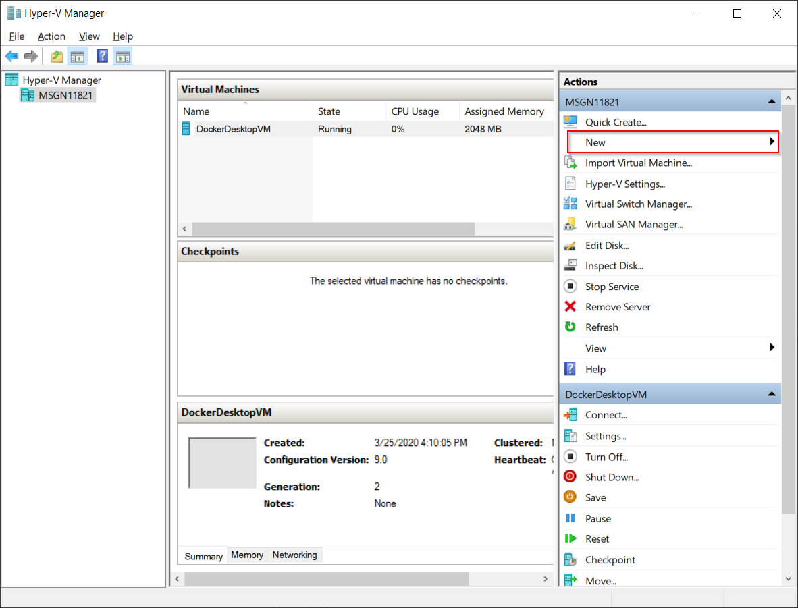

2\. Select __Actions > New > Virtual Machine__ to start the __New Virtual Machine Wizard__:

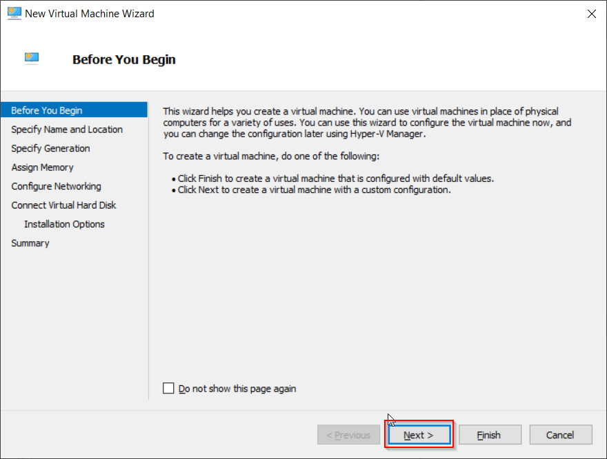

3\. Push __Next__ to proceed to __Specify Name and Location__:

4\. Enter name of VM and push __Next__ to continue:

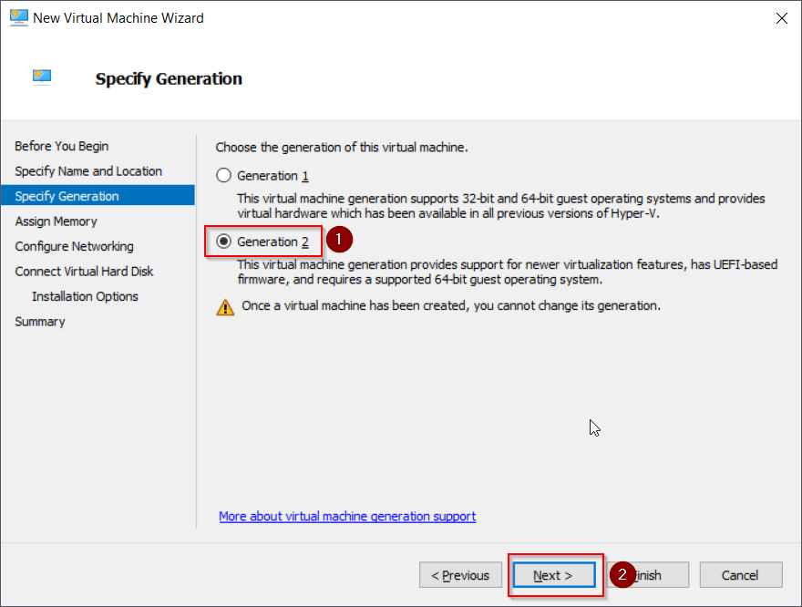

5\. Select option __Generation 2__ and push __Next__:

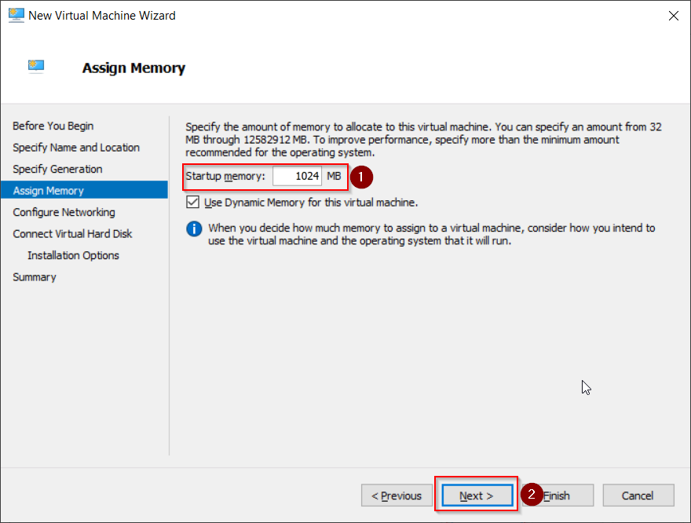

6\. Enter __Startup memory__ in MB (here: 1024MB == 1GB) and push __Next__ :

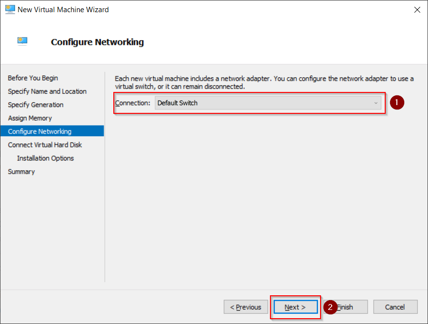

7\. Select option __Default Switch in Connection__ and push __Next__:

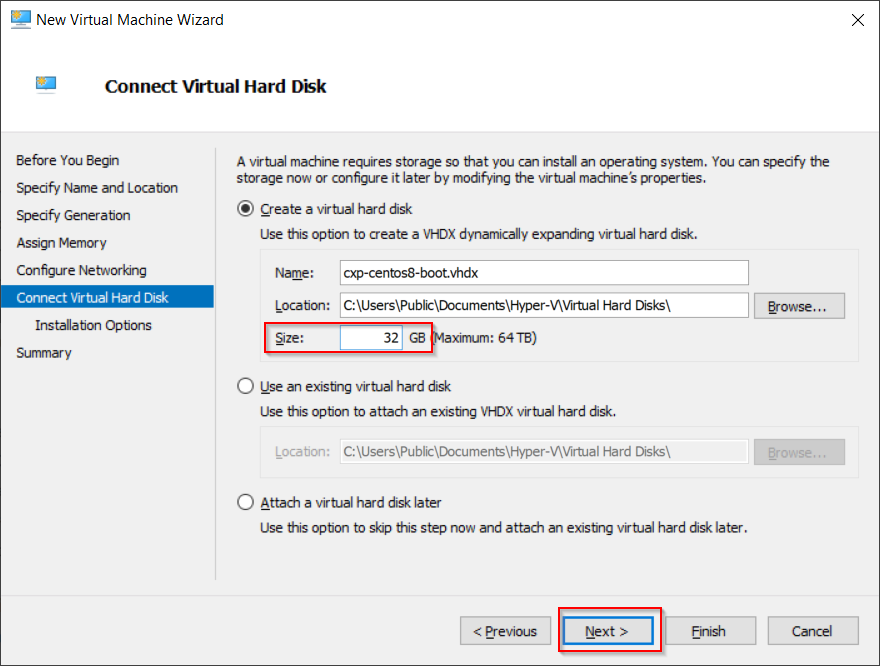

8\. Set virtual hard disk __Size__ to 32 GB (don't get below 20GB!) and push __Next__:

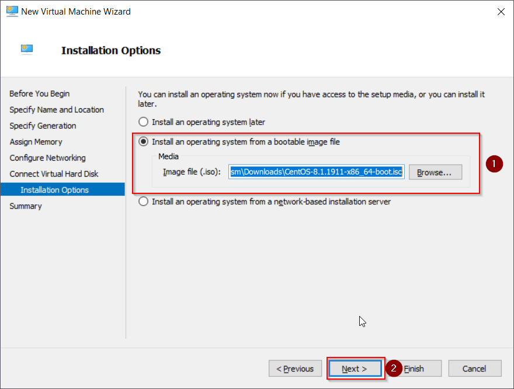

9\. Choose option __Install an operating system from a bootable image file__ and select ISO file `CentOS-8.1.1911-x86_64-dvd1.iso` you downloaded before.

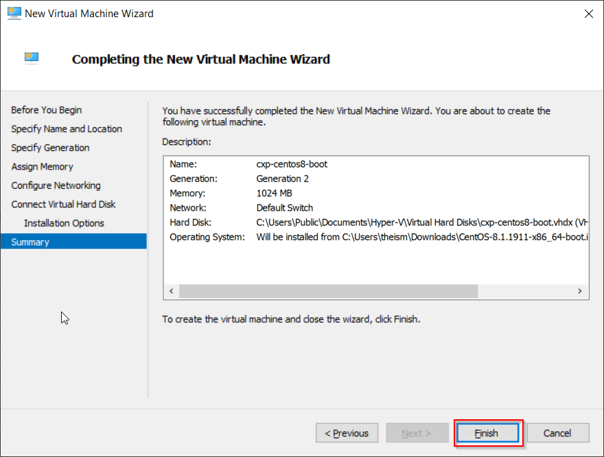

10\. Hit __Finish__ to finish the wizard. Unfortunately we have to change some VM settings first before we can start the VM.

11\. Select __Settings...__ from the VM menu on the right side.

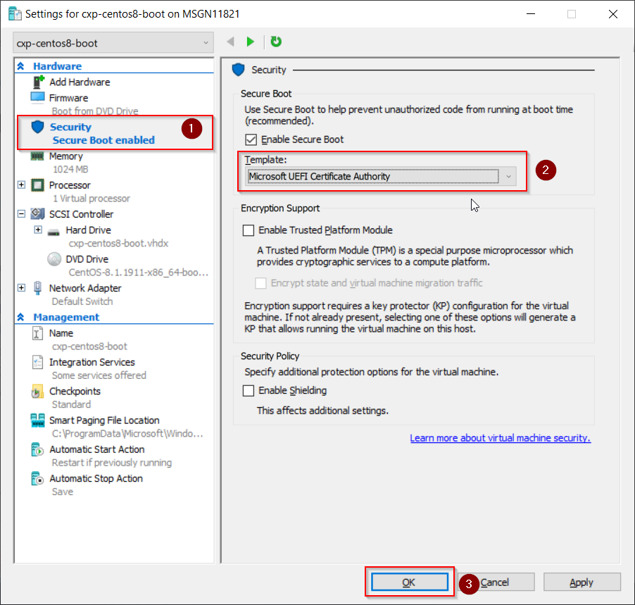

12\. Select __Security__ from left hand side tree menu, make sure __Enable Secure Boot__ is checked and select __Template__ option __Microsoft UEFI Certificate Authority__. 

!!! danger ""
    Doublecheck if you are using the Microsoft UEFI Certificate Authority. Otherwise, your VM will NOT START!

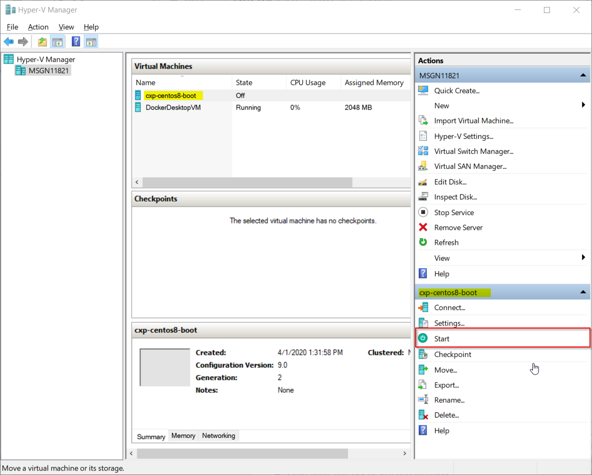
  
13\. Now we can start the VM using option __Start__ from the VM menu.

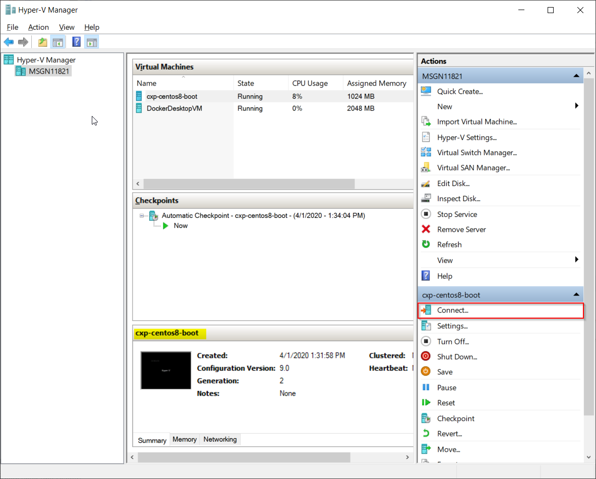

14\. The VM is up in a couple of seconds. As soon as the VM is up we are going to connect to it using option __Connect__ from the VM menu. Now comes the HARD part: clicking through [TODO: add link]().
