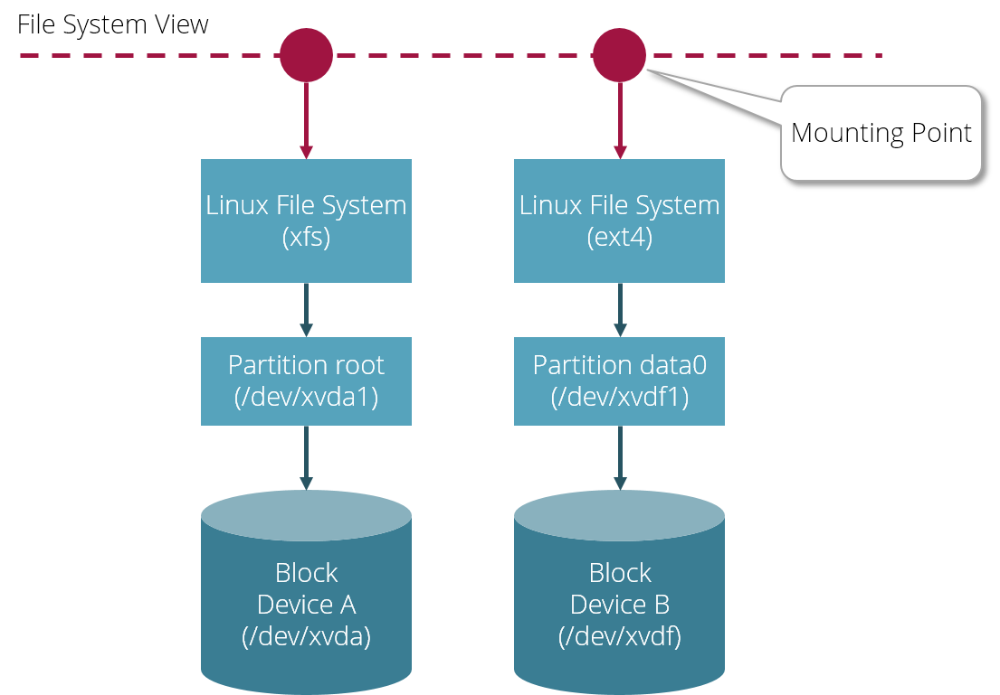

# Linux Storage Basics

## Overview

Linux comes with a strong file system abstraction which allows the support of various file system types,
partition types and block devices. All this complexity is hidden from system users and processes running on Linux 
which only see one homogenous file system with directories and files.

## Block Devices

A __block device__ represents raw block-oriented storage which could be a physical hard disk or any virtual disk attached 
to the system. Each block device has a specific size. A block device may be subdivided into various __partitions__. 

Each Linux system has at least one __root block device__ which contains the operating system in a __root__ partition.

## Partitions

Each block device is sub-devided into __partitions__. Each partition has a specific size. Partitions are managed in a 
__partition table__ of a particular type. The most common partition table type for contemporary Linux systems 
is [GPT](https://en.wikipedia.org/wiki/GUID_Partition_Table). 

## File Systems

In order to store directories and files in a partition, a partition needs to be formatted with a __file system__ of a 
specific type. Popular Linux file systems are [XFS](https://en.wikipedia.org/wiki/XFS) and [ext4](https://en.wikipedia.org/wiki/Ext4). 

## Mounting Points

Before you can access a file system it needs to be mounted to your Linux system at a specific __mounting point__. 
A mounting point is represented by a special directory which is visible to the Linux file system view. The relationship
between mounting points and mounted file systems is managed in a global configuration file `/etc/fstab`.