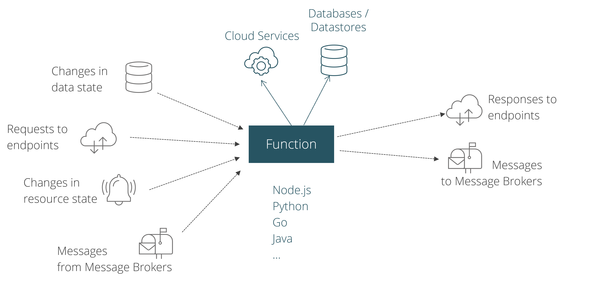

# Serverless Applications

Serverless applications consist of a set of functions

* which are invoked via events or messages from various event sources
* which invoke some cloud services or access some databases
* which reply with events or messages or do not reply at all.

Thus, serverless application tend to be event driven.

## Event sources

Event sources for functions may be:

* databases or datastores which notify a function about data state changes
* customers sending requests to endpoints (e.g. a REST API)
* monitoring services which notify a function about resource stage changes
* message brokers or event busses forwarding messages or events to a function

## Function

A `function` represents an executable unit of a serverless application.
In general, functions tend to be much smaller (only a couple of lines of code) than `microservices`.
Imagine a microservice which implements all operations of a REST API. 
In a serverless world, each operation of the REST API will most likely be implemented 
by a dedicated function.

A serverless platform allows you to write a function in various programming languages.
Nevertheless, you should be aware that your favourite programming language may not be the best choice for
serverless applications. For example, Java is not the perfect language for functions since JVMs do not boot very fast
causing unwanted cold-start latency and JVMs come with a higher footprint regarding CPU and RAM consumption compared 
to other programming languages like Javascript and Go.
