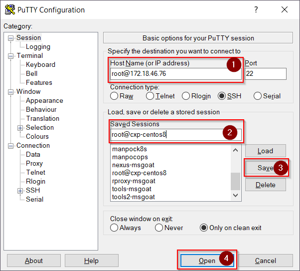
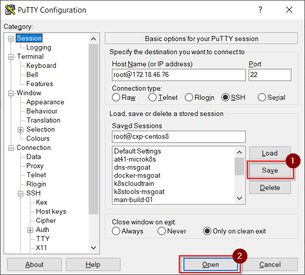

# Managing SSH Connections with PuTTY

## Adding a new connection (using username/password)

1\. Open PuTTY

2\. Enter __${userName}@${ipAddress|hostName}__ into __Host Name__. Enter a unique name 
for this session configuration into __Saved Sessions__. Press __Save__ to keep the session 
configuration (otherwise you will need to enter again and again!). 
Press __Open__ to open a connection to the Linux system. 
Acknowledge any warning about the remote host's authenticity. 
Now you should see PuTTYs terminal window:

# Adding a new connection (using SSH keys)

1\. Open PuTTY

2\. Enter __${userName}@${ipAddress|hostName}__ into __Host Name__. 
Enter a unique name for this session configuration into __Saved Sessions__. 
Expand node __SSH__ on the left hand tree menu to enter the SSH settings.

3\. Select node __Auth__ in the left hand tree menu to open the panel for the 
SSH authentication settings. Use the __Browse__ button to pick a private SSH key 
file in PuTTY format (*.ppk). 
Select root node __Session__ to return to PuTTYs main panel.

!!! Attention
    Do NOT press __Open__ before return to the main panel. You can open a connection this way but you will lose all session configuration since you haven't saved it yet!!!

