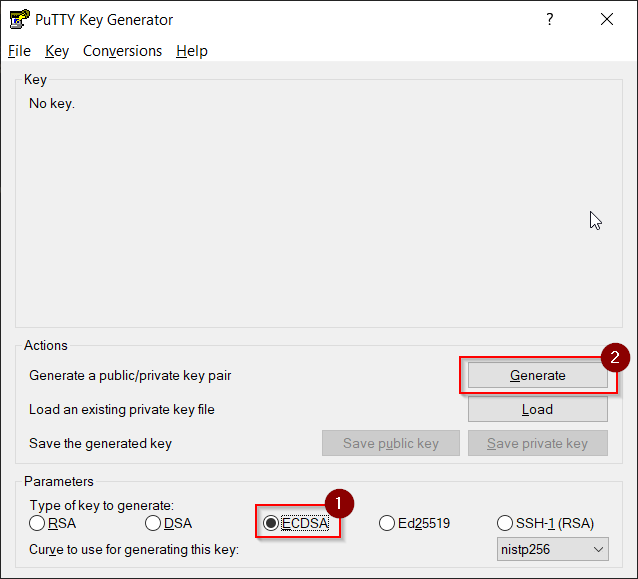
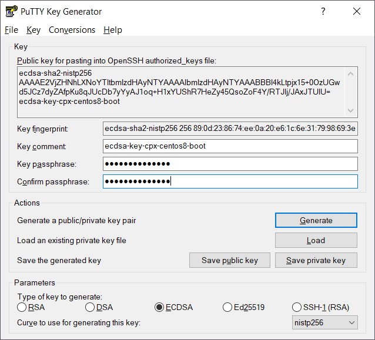

# Managing SSH keys with PuTTYGen

## Create a new SSH Key Pair

1\. Open PuTTYGen

2\. Select option __ECDSA__ and push __Generate__. 
Move the mouse as requested to generate some entropy.

3\. Enter a meaningful __Key comment__. 
Although it's not required to secure your private SSH key with a passphrase in __Key passphrase__ 
and __Confirm passphrase__, it's __STRONGLY__ recommended 
(otherwise anyone who has access to your private SSH key can use it!).

4\. Save the public SSH key and the private SSH key to your preferred SSH key file folder 
(which should be __.ssh__ in your __user profile folder__). 
Since PuTTY uses a proprietary key file format, it's a good idea to use suffix __-putty__ 
in the key file names. Use menu option __Conversions > Export OpenSSH key__ to export your 
private SSH key in OpenSSH format. Copy contents of textbox __Public key for pasting...__ 
into a textfile to export your public SSH key in OpenSSH format.

