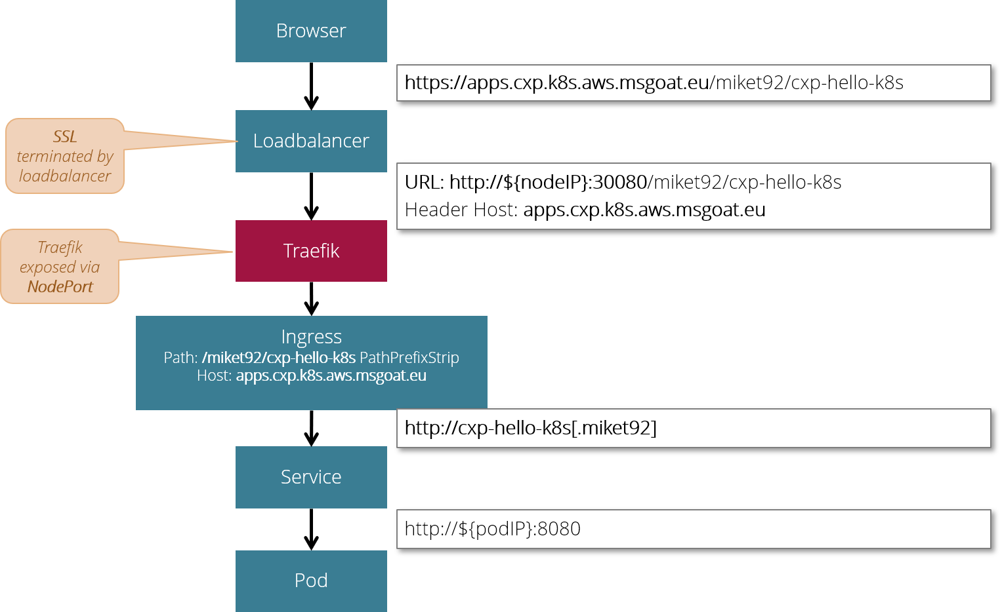

# Cluster Ingress

An ingress controller in Kubernetes acts a gateway or router into the cluster.

Popular choices for Kubernetes ingress controllers are:

* [NGinX](https://www.nginx.com/)
* [Traefik](https://containo.us/traefik/)

In our CXP cluster we are using NGinX as the default ingress controller.

## Overview

The following picture demonstrates the usual way, how requests are passed to a pod in a Kubernetes cluster:

A `browser` sends an HTTPS request to an application's URL __https://apps.cxp.k8s.aws.msgoat.eu/miket92/cxp-hello-k8s__.
Hostname __apps.cxp.k8s.aws.msgoat.eu__ references a particular loadbalancer in front of the Kubernetes cluster, path
component __miket92__ references a particular Kubernetes namespace hosting the application and path component __cxp-hello-k8s__
refers to a particular application running on Kubernetes.

A `loadbalancer` in front of the Kubernetes cluster receives this request and terminates the SSL connection. 
In our particular case the loadbalancer is an AWS Application Loadbalancer with a dedicated Route 53 Alias DNS record 
for domain name __apps.cxp.k8s.aws.msgoat.eu__ refrerring to it. 
The HTTPS listener of this particular loadbalancer has some particular rule to forward all inbound traffic with hostname 
__apps.cxp.k8s.aws.msgoat.eu__ to a target group, which contains all public nodes of our Kubernetes cluster. 
During this forward, schema https is replaced with schema http and the hostname is replaced by the IP address of a 
specific node picked from the target group and the portnumber of the node port is added to the URL. 
Thus, the original request URI is replaced by __http://${nodeIP}:30080/miket92/cxp-hello-k8s__ which points to a specific node
in the cluster.

`NGinX` as our ingress controller is exposed via Kubernetes node port 30080 to the outside world. 
A node port is exposed on any node of the cluster, even if NGinX is not running on that particular node.
Each node which receives the incoming request on its node port simply forwards the request to the underlying NGinX service.

The NGinX services uses the `ingress` objects in its internal route table to identify the actual recipient service of 
the received event and routes the request to the actual service. During this process, the request URI 
__http://${nodeIP}:30080/miket92/cxp-hello-k8s__ is replaced with the internal URI of the target service __http://cxp-hello-k8s.miket92__
and according to the __PathPrefixStrip__ directive the original path __/miket92/cxp-hello-k8s__ is stripped from the
request URI.

Finally the `service` managing a pod group dispatches the incoming request to a particular pod using the pods
virtual IP address and the pods container port number. Thus, request URI __http://cxp-hello-k8s.miket92__ is replaced
by something like __http://${podIP}:8080__

