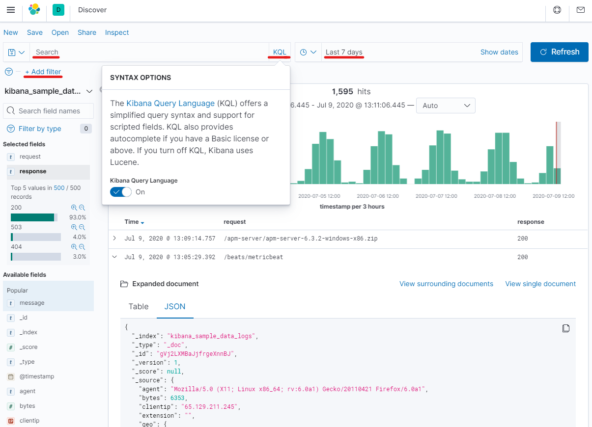
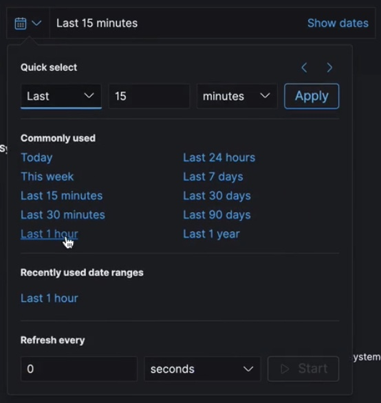
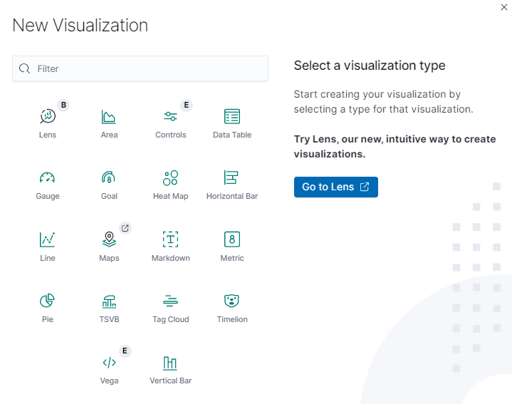
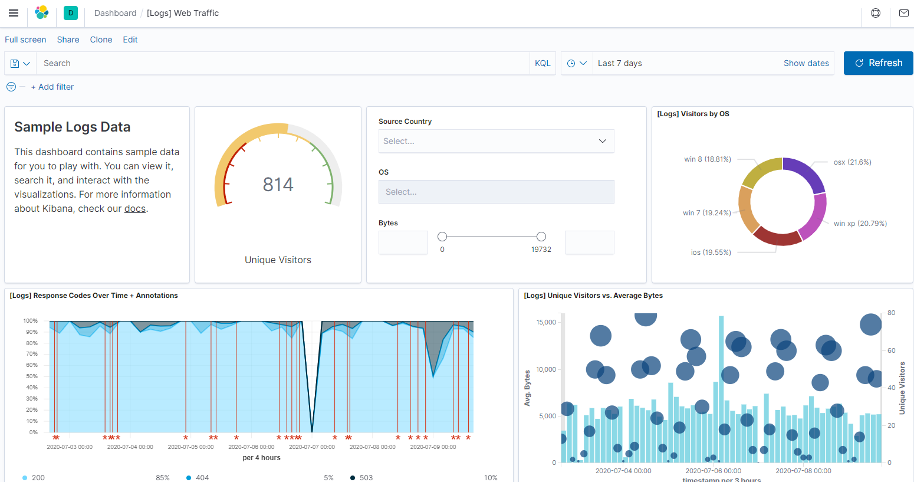
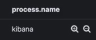
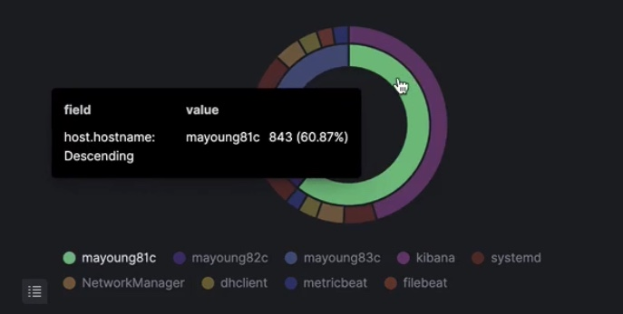
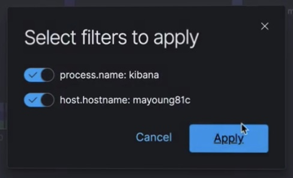
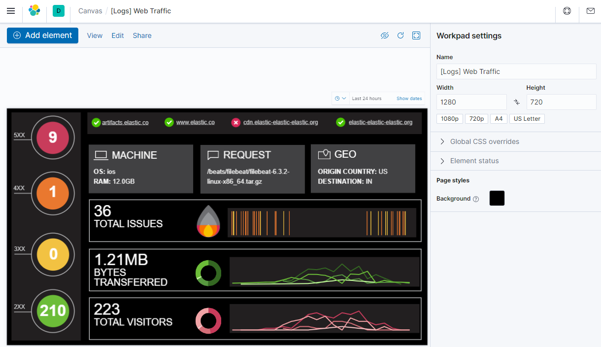
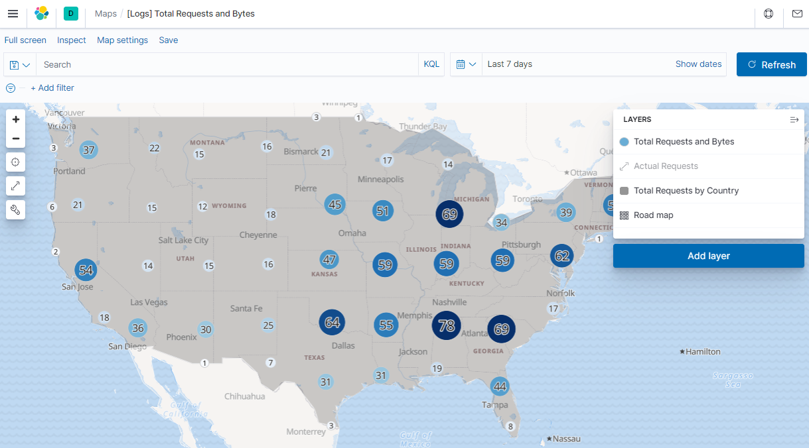

# Kibana

Kibana is an open-source frontend application (written in NodeJS) for visualizing indexed data in Elasticsearch and managing the Elastic Stack cluster.

!!! info "Local installation of Elastic Stack" 
    Highly recommended to install Elasticsearch and Kibana locally to test all the mentioned features with provided test data. You can find detailed installation instructions [here](https://www.elastic.co/de/start?iesrc=ctr) or just use the [Helm Charts](https://github.com/elastic/helm-charts).

## Features

Kibana is not just a window into your data, but into your entire Elastic stack. 

Core components of Kibana are:

* Discover: lets you look at the raw data by searching and filtering data from ElasticSearch in real time
* Visualise: lets you visualise the raw data using graphs, charts, data tables, maps, gauges and more. 
* Dashboard: combines all these individual components (searches and visualisations) into one bird eye view of the data.
  * Can be linked to each other
* Manage: troubleshoot, tune, configure, Kibana can manage your cluster
  * Monitor ElasticSearch and beats and even logstash and its pipelines
  * User access control and cluster security
* More applications built into Kibana (Machine Learning, Dev-Tools, ...)

The data can originate from multiple data sources (beats are client-side agents which send the logs/metrics data to the stack):

* Filebeat: log files
* Metricbeat: Telemetry data (CPU / memory usage)
* Heartbeat: Uptime monitoring (health check)
* ...

### Discover: Searching log data

There are several ways to search efficiently the indexed log data.

- Define the time range based on the `@timestamp` field (marks the point where the document has been indexed)
	

- Use filters to reduce the data to be searched in. Filters can be set on existing fields of the stored elasticsearch data.
- Use queries to identify / find the needed log messages. Since Kibana 6.3 the application offers two different ways of querying: [Kibana Query Language (KQL)](https://www.elastic.co/guide/en/kibana/7.8/kuery-query.html) or [Lucene](https://www.elastic.co/guide/en/kibana/current/lucene-query.html).
- Manage table columns to show the data which is needed

@see [Discover](https://www.elastic.co/guide/en/kibana/current/discover.html)

### Visualize log data

Kibana provides the visualization front-end for ElasticSearch. With visualization elements and dashbaords, the indexed data can be explored, aggregated and analyzed.

#### Visualization

You can create several different types of visualizations which can then be used in dashboards.

@see [Visualize](https://www.elastic.co/guide/en/kibana/current/visualize.html)

#### Dashboards

Dashboards combine different visualizations which can be used by operation to get a convenient overview of the status of an application.

To get started, one must first create the desired visualizations for the corresponding index pattern (Visualize section).
With those visualizations one can then build the Kibana dashboards by arranging and resizing them using drag & drop.

Use cases for dashboards are:

- Infrastructure logs
- Application metrics
- Security event metrics
- Business metrics

Having a dashboard, with a single gaze you can:

- Evaluate the success and error ratios
- Evaluate which endpoints have the most errors
- What kind of errors is your application throwing (e.g. aggregated HTTP status code / business error codes)

Logstash Filter can enrich the log data in-flight with additional request details. This gives one insights into the user base, e.g. for troubleshooting or marketing purposes):

- GeoIP: where do the users come from (map visualization)?
- User-Agent: which browsers / OS are most popular? mobile users?
- Session-ID: user top pages?

The dashbaords are interactive in terms that one can select visualizations in the dashboard to filter data semantically. The dashboard will refresh automatically and only shows the details of that chosen filter.

Examples:

- Filter for specific entries in a table, by zooming in to display only the data for that input  
  
- Filter for a specific category visualized using a pie-chart by selecting the related chart section  
  
  and confirm the filter  
  

@see [Dashboard](https://www.elastic.co/guide/en/kibana/current/dashboard.html)

#### Canvas

The Canvas feature gives the possibility to display the log data with different shapes, text and color for example for management overviews.

@see [Canvas](https://www.elastic.co/guide/en/kibana/current/canvas.html)

#### Maps

With the Kibana Maps feature you can visualize geographical data from your logs on a map (i.e. client request regions).

@see [Maps](https://www.elastic.co/guide/en/kibana/current/maps.html)

### Management of Elastic Stack cluster

Beside of the core functionality of Kibana there are some cluster management tools which can be used directly in the Kibana UI:

- Index management: Create index patterns and manage the lifecycle of indices
- User and role management: Create and manage users and roles within Kibana
- Upgrade Assistant: Helps to upgrade the underlying Elastic Stack cluster
- Import / Export objects: Objects like visualizations, searches, maps, dashboards etc. can be exported to use them in another Elastic Stack cluster

@see [Index Patterns](https://www.elastic.co/guide/en/kibana/current/index-patterns.html)
