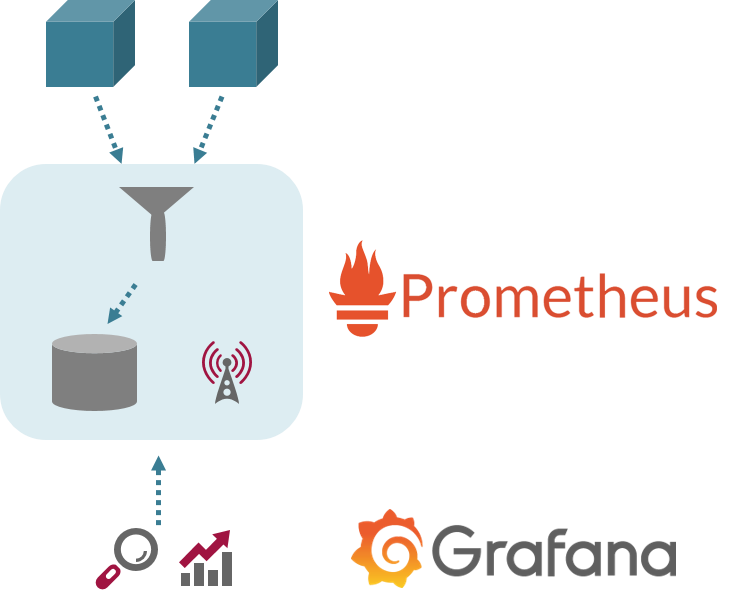
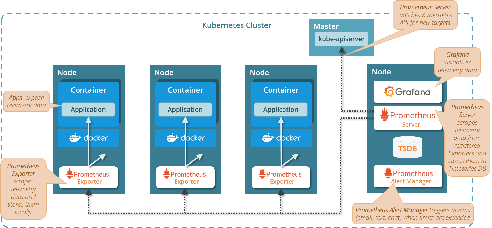

# Cluster Monitoring with Prometheus and Grafana

## Motivation

Deploying an application to the cloud is like shooting a drone to outer space!
Once you have deployed it, it may run in many replicas which are hard to located
and even harder to access. Imagine trying to locate an application on a cluster with thousand nodes!
  
Cluster monitoring helps you by collecting telemetry data about all applications and the cluster itself, storing it
in a central database, and making it available for analysis via a single source.

## Overview

A common monitoring stack consists of Prometheus and Grafana:

* [Prometheus](https://prometheus.io/) collects telemetry data from applications, containers, volumes and nodes and persists them in it’s own timeseries DB
* [Prometheus Alert Manager](https://prometheus.io/docs/alerting/latest/alertmanager/) triggers alarms if pre-defined limits are exceeded
* [Grafana](https://grafana.com/grafana/) 
visualizes telemetry data stored in Prometheus through dashboards and charts

## Drilling down: Prometheus and Grafana on Kubernetes

Nodes, applications and services expose telemetry data in Prometheus format through specific 
`Prometheus metrics endpoints`.

A set of `Prometheus exporters` periodically scrapes these metrics endpoints for
telemetry data and stores them locally.

The `Prometheus server` periodically collects all telemetry data from the exporters and 
stores it in a `Prometheus time series DB`. To get notifications about newly added or deleted
nodes and deployments, the Prometheus server watches the Kubernetes API for new targets.

`Grafana` accesses the telemetry data through the `Prometheus server` and visualizes it 
in dashboards with tables or charts. Besides a visualization of telemetry data, Grafana
supports alerting as well.

  